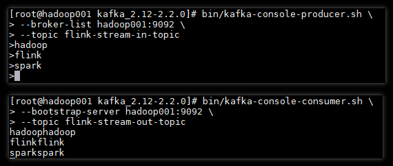
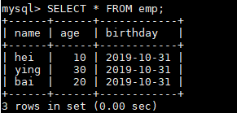

# Flink Sink
<nav>
<a href="#一Data-Sinks">一、Data Sinks</a><br/>
&nbsp;&nbsp;&nbsp;&nbsp;&nbsp;&nbsp;&nbsp;&nbsp;<a href="#11-writeAsText">1.1 writeAsText</a><br/>
&nbsp;&nbsp;&nbsp;&nbsp;&nbsp;&nbsp;&nbsp;&nbsp;<a href="#12-writeAsCsv">1.2 writeAsCsv</a><br/>
&nbsp;&nbsp;&nbsp;&nbsp;&nbsp;&nbsp;&nbsp;&nbsp;<a href="#13-print--printToErr">1.3 print  printToErr</a><br/>
&nbsp;&nbsp;&nbsp;&nbsp;&nbsp;&nbsp;&nbsp;&nbsp;<a href="#14-writeUsingOutputFormat">1.4 writeUsingOutputFormat</a><br/>
&nbsp;&nbsp;&nbsp;&nbsp;&nbsp;&nbsp;&nbsp;&nbsp;<a href="#15-writeToSocket">1.5 writeToSocket</a><br/>
<a href="#二Streaming-Connectors">二、Streaming Connectors</a><br/>
<a href="#三整合-Kafka-Sink">三、整合 Kafka Sink</a><br/>
&nbsp;&nbsp;&nbsp;&nbsp;&nbsp;&nbsp;&nbsp;&nbsp;<a href="#31-addSink">3.1 addSink</a><br/>
&nbsp;&nbsp;&nbsp;&nbsp;&nbsp;&nbsp;&nbsp;&nbsp;<a href="#32-创建输出主题">3.2 创建输出主题</a><br/>
&nbsp;&nbsp;&nbsp;&nbsp;&nbsp;&nbsp;&nbsp;&nbsp;<a href="#33-启动消费者">3.3 启动消费者</a><br/>
&nbsp;&nbsp;&nbsp;&nbsp;&nbsp;&nbsp;&nbsp;&nbsp;<a href="#34-测试结果">3.4 测试结果</a><br/>
<a href="#四自定义-Sink">四、自定义 Sink</a><br/>
&nbsp;&nbsp;&nbsp;&nbsp;&nbsp;&nbsp;&nbsp;&nbsp;<a href="#41-导入依赖">4.1 导入依赖</a><br/>
&nbsp;&nbsp;&nbsp;&nbsp;&nbsp;&nbsp;&nbsp;&nbsp;<a href="#42-自定义-Sink">4.2 自定义 Sink</a><br/>
&nbsp;&nbsp;&nbsp;&nbsp;&nbsp;&nbsp;&nbsp;&nbsp;<a href="#43-使用自定义-Sink">4.3 使用自定义 Sink</a><br/>
&nbsp;&nbsp;&nbsp;&nbsp;&nbsp;&nbsp;&nbsp;&nbsp;<a href="#44-测试结果">4.4 测试结果</a><br/>
</nav>


## 一、Data Sinks

在使用 Flink 进行数据处理时，数据经 Data Source 流入，然后通过系列 Transformations 的转化，最终可以通过 Sink 将计算结果进行输出，Flink Data Sinks 就是用于定义数据流最终的输出位置。Flink 提供了几个较为简单的 Sink API 用于日常的开发，具体如下：

### 1.1 writeAsText

`writeAsText` 用于将计算结果以文本的方式并行地写入到指定文件夹下，除了路径参数是必选外，该方法还可以通过指定第二个参数来定义输出模式，它有以下两个可选值：

+ **WriteMode.NO_OVERWRITE**：当指定路径上不存在任何文件时，才执行写出操作；
+ **WriteMode.OVERWRITE**：不论指定路径上是否存在文件，都执行写出操作；如果原来已有文件，则进行覆盖。

使用示例如下：

```java
 streamSource.writeAsText("D:\\out", FileSystem.WriteMode.OVERWRITE);
```

以上写出是以并行的方式写出到多个文件，如果想要将输出结果全部写出到一个文件，需要设置其并行度为 1：

```java
streamSource.writeAsText("D:\\out", FileSystem.WriteMode.OVERWRITE).setParallelism(1);
```

### 1.2 writeAsCsv

`writeAsCsv` 用于将计算结果以 CSV 的文件格式写出到指定目录，除了路径参数是必选外，该方法还支持传入输出模式，行分隔符，和字段分隔符三个额外的参数，其方法定义如下：

```java
writeAsCsv(String path, WriteMode writeMode, String rowDelimiter, String fieldDelimiter) 
```

### 1.3 print \ printToErr

`print \ printToErr` 是测试当中最常用的方式，用于将计算结果以标准输出流或错误输出流的方式打印到控制台上。

### 1.4 writeUsingOutputFormat

采用自定义的输出格式将计算结果写出，上面介绍的 `writeAsText` 和 `writeAsCsv` 其底层调用的都是该方法，源码如下：

```java
public DataStreamSink<T> writeAsText(String path, WriteMode writeMode) {
    TextOutputFormat<T> tof = new TextOutputFormat<>(new Path(path));
    tof.setWriteMode(writeMode);
    return writeUsingOutputFormat(tof);
}
```

### 1.5 writeToSocket

`writeToSocket` 用于将计算结果以指定的格式写出到 Socket 中，使用示例如下：

```shell
streamSource.writeToSocket("192.168.0.226", 9999, new SimpleStringSchema());
```


## 二、Streaming Connectors

除了上述 API 外，Flink 中还内置了系列的 Connectors 连接器，用于将计算结果输入到常用的存储系统或者消息中间件中，具体如下：

- Apache Kafka (支持 source 和 sink)
- Apache Cassandra (sink)
- Amazon Kinesis Streams (source/sink)
- Elasticsearch (sink)
- Hadoop FileSystem (sink)
- RabbitMQ (source/sink)
- Apache NiFi (source/sink)
- Google PubSub (source/sink)

除了内置的连接器外，你还可以通过 Apache Bahir 的连接器扩展 Flink。Apache Bahir 旨在为分布式数据分析系统 (如 Spark，Flink) 等提供功能上的扩展，当前其支持的与 Flink Sink 相关的连接器如下：

- Apache ActiveMQ (source/sink)
- Apache Flume (sink)
- Redis (sink)
- Akka (sink)

这里接着在 Data Sources 章节介绍的整合 Kafka Source 的基础上，将 Kafka Sink 也一并进行整合，具体步骤如下。


## 三、整合 Kafka Sink

### 3.1 addSink

Flink 提供了 addSink 方法用来调用自定义的 Sink 或者第三方的连接器，想要将计算结果写出到 Kafka，需要使用该方法来调用 Kafka 的生产者 FlinkKafkaProducer，具体代码如下：

```java
final StreamExecutionEnvironment env = StreamExecutionEnvironment.getExecutionEnvironment();

// 1.指定Kafka的相关配置属性
Properties properties = new Properties();
properties.setProperty("bootstrap.servers", "192.168.200.0:9092");

// 2.接收Kafka上的数据
DataStream<String> stream = env
    .addSource(new FlinkKafkaConsumer<>("flink-stream-in-topic", new SimpleStringSchema(), properties));

// 3.定义计算结果到 Kafka ProducerRecord 的转换
KafkaSerializationSchema<String> kafkaSerializationSchema = new KafkaSerializationSchema<String>() {
    @Override
    public ProducerRecord<byte[], byte[]> serialize(String element, @Nullable Long timestamp) {
        return new ProducerRecord<>("flink-stream-out-topic", element.getBytes());
    }
};
// 4. 定义Flink Kafka生产者
FlinkKafkaProducer<String> kafkaProducer = new FlinkKafkaProducer<>("flink-stream-out-topic",
                                                                    kafkaSerializationSchema,
                                                                    properties,
                                               FlinkKafkaProducer.Semantic.AT_LEAST_ONCE, 5);
// 5. 将接收到输入元素*2后写出到Kafka
stream.map((MapFunction<String, String>) value -> value + value).addSink(kafkaProducer);
env.execute("Flink Streaming");
```

### 3.2 创建输出主题

创建用于输出测试的主题：

```shell
bin/kafka-topics.sh --create \
                    --bootstrap-server hadoop001:9092 \
                    --replication-factor 1 \
                    --partitions 1  \
                    --topic flink-stream-out-topic

# 查看所有主题
 bin/kafka-topics.sh --list --bootstrap-server hadoop001:9092
```

### 3.3 启动消费者

启动一个 Kafka 消费者，用于查看 Flink 程序的输出情况：

```java
bin/kafka-console-consumer.sh --bootstrap-server hadoop001:9092 --topic flink-stream-out-topic
```

### 3.4 测试结果

在 Kafka 生产者上发送消息到 Flink 程序，观察 Flink 程序转换后的输出情况，具体如下：

<div align="center">  </div>


可以看到 Kafka 生成者发出的数据已经被 Flink 程序正常接收到，并经过转换后又输出到 Kafka 对应的 Topic 上。

## 四、自定义 Sink

除了使用内置的第三方连接器外，Flink 还支持使用自定义的 Sink 来满足多样化的输出需求。想要实现自定义的 Sink ，需要直接或者间接实现 SinkFunction 接口。通常情况下，我们都是实现其抽象类 RichSinkFunction，相比于 SinkFunction ，其提供了更多的与生命周期相关的方法。两者间的关系如下：

<div align="center">  </div>


这里我们以自定义一个 FlinkToMySQLSink 为例，将计算结果写出到 MySQL 数据库中，具体步骤如下：

### 4.1 导入依赖

首先需要导入 MySQL 相关的依赖：

```xml
<dependency>
    <groupId>mysql</groupId>
    <artifactId>mysql-connector-java</artifactId>
    <version>8.0.16</version>
</dependency>
```

### 4.2 自定义 Sink

继承自 RichSinkFunction，实现自定义的 Sink ：

```java
public class FlinkToMySQLSink extends RichSinkFunction<Employee> {

    private PreparedStatement stmt;
    private Connection conn;

    @Override
    public void open(Configuration parameters) throws Exception {
        Class.forName("com.mysql.cj.jdbc.Driver");
        conn = DriverManager.getConnection("jdbc:mysql://192.168.0.229:3306/employees" +
                                           "?characterEncoding=UTF-8&serverTimezone=UTC&useSSL=false", 
                                           "root", 
                                           "123456");
        String sql = "insert into emp(name, age, birthday) values(?, ?, ?)";
        stmt = conn.prepareStatement(sql);
    }

    @Override
    public void invoke(Employee value, Context context) throws Exception {
        stmt.setString(1, value.getName());
        stmt.setInt(2, value.getAge());
        stmt.setDate(3, value.getBirthday());
        stmt.executeUpdate();
    }

    @Override
    public void close() throws Exception {
        super.close();
        if (stmt != null) {
            stmt.close();
        }
        if (conn != null) {
            conn.close();
        }
    }

}
```

### 4.3 使用自定义 Sink

想要使用自定义的 Sink，同样是需要调用 addSink 方法，具体如下：

```java
final StreamExecutionEnvironment env = StreamExecutionEnvironment.getExecutionEnvironment();
Date date = new Date(System.currentTimeMillis());
DataStreamSource<Employee> streamSource = env.fromElements(
    new Employee("hei", 10, date),
    new Employee("bai", 20, date),
    new Employee("ying", 30, date));
streamSource.addSink(new FlinkToMySQLSink());
env.execute();
```

### 4.4 测试结果

启动程序，观察数据库写入情况：

<div align="center">  </div>


数据库成功写入，代表自定义 Sink 整合成功。

> 以上所有用例的源码见本仓库：[flink-kafka-integration]( https://github.com/heibaiying/BigData-Notes/tree/master/code/Flink/flink-kafka-integration)


## 参考资料

1. data-sinks： https://ci.apache.org/projects/flink/flink-docs-release-1.9/dev/datastream_api.html#data-sinks 
2. Streaming Connectors：https://ci.apache.org/projects/flink/flink-docs-release-1.9/dev/connectors/index.html
3. Apache Kafka Connector： https://ci.apache.org/projects/flink/flink-docs-release-1.9/dev/connectors/kafka.html 

