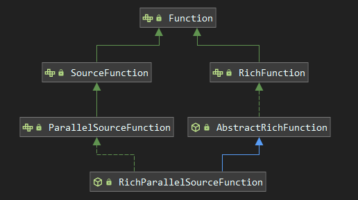
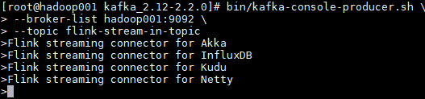
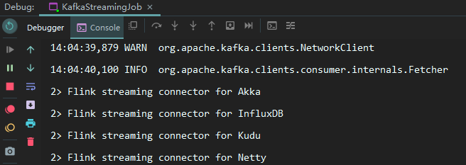

# Flink Data Source
<nav>
<a href="#一内置-Data-Source">一、内置 Data Source</a><br/>
&nbsp;&nbsp;&nbsp;&nbsp;&nbsp;&nbsp;&nbsp;&nbsp;<a href="#11-基于文件构建">1.1 基于文件构建</a><br/>
&nbsp;&nbsp;&nbsp;&nbsp;&nbsp;&nbsp;&nbsp;&nbsp;<a href="#12-基于集合构建">1.2 基于集合构建</a><br/>
&nbsp;&nbsp;&nbsp;&nbsp;&nbsp;&nbsp;&nbsp;&nbsp;<a href="#13--基于-Socket-构建">1.3  基于 Socket 构建</a><br/>
<a href="#二自定义-Data-Source">二、自定义 Data Source</a><br/>
&nbsp;&nbsp;&nbsp;&nbsp;&nbsp;&nbsp;&nbsp;&nbsp;<a href="#21-SourceFunction">2.1 SourceFunction</a><br/>
&nbsp;&nbsp;&nbsp;&nbsp;&nbsp;&nbsp;&nbsp;&nbsp;<a href="#22-ParallelSourceFunction-和-RichParallelSourceFunction">2.2 ParallelSourceFunction 和 RichParallelSourceFunction</a><br/>
<a href="#三Streaming-Connectors">三、Streaming Connectors</a><br/>
&nbsp;&nbsp;&nbsp;&nbsp;&nbsp;&nbsp;&nbsp;&nbsp;<a href="#31-内置连接器">3.1 内置连接器</a><br/>
&nbsp;&nbsp;&nbsp;&nbsp;&nbsp;&nbsp;&nbsp;&nbsp;<a href="#32-整合-Kakfa">3.2 整合 Kakfa</a><br/>
&nbsp;&nbsp;&nbsp;&nbsp;&nbsp;&nbsp;&nbsp;&nbsp;<a href="#33-整合测试">3.3 整合测试</a><br/>
</nav>


## 一、内置 Data Source

Flink Data Source 用于定义 Flink 程序的数据来源，Flink 官方提供了多种数据获取方法，用于帮助开发者简单快速地构建输入流，具体如下：

### 1.1 基于文件构建

**1. readTextFile(path)**：按照 TextInputFormat 格式读取文本文件，并将其内容以字符串的形式返回。示例如下：

```java
env.readTextFile(filePath).print();
```

**2. readFile(fileInputFormat, path)** ：按照指定格式读取文件。

**3. readFile(inputFormat, filePath, watchType, interval, typeInformation)**：按照指定格式周期性的读取文件。其中各个参数的含义如下：

+ **inputFormat**：数据流的输入格式。
+ **filePath**：文件路径，可以是本地文件系统上的路径，也可以是 HDFS 上的文件路径。
+ **watchType**：读取方式，它有两个可选值，分别是 `FileProcessingMode.PROCESS_ONCE` 和 `FileProcessingMode.PROCESS_CONTINUOUSLY`：前者表示对指定路径上的数据只读取一次，然后退出；后者表示对路径进行定期地扫描和读取。需要注意的是如果 watchType 被设置为 `PROCESS_CONTINUOUSLY`，那么当文件被修改时，其所有的内容 (包含原有的内容和新增的内容) 都将被重新处理，因此这会打破 Flink 的 *exactly-once* 语义。
+ **interval**：定期扫描的时间间隔。
+ **typeInformation**：输入流中元素的类型。

使用示例如下：

```java
final String filePath = "D:\\log4j.properties";
final StreamExecutionEnvironment env = StreamExecutionEnvironment.getExecutionEnvironment();
env.readFile(new TextInputFormat(new Path(filePath)),
             filePath,
             FileProcessingMode.PROCESS_ONCE,
             1,
             BasicTypeInfo.STRING_TYPE_INFO).print();
env.execute();
```

### 1.2 基于集合构建

**1. fromCollection(Collection)**：基于集合构建，集合中的所有元素必须是同一类型。示例如下：

```java
env.fromCollection(Arrays.asList(1,2,3,4,5)).print();
```

**2. fromElements(T ...)**： 基于元素构建，所有元素必须是同一类型。示例如下：

```java
env.fromElements(1,2,3,4,5).print();
```
**3. generateSequence(from, to)**：基于给定的序列区间进行构建。示例如下：

```java
env.generateSequence(0,100);
```

**4. fromCollection(Iterator, Class)**：基于迭代器进行构建。第一个参数用于定义迭代器，第二个参数用于定义输出元素的类型。使用示例如下：

```java
env.fromCollection(new CustomIterator(), BasicTypeInfo.INT_TYPE_INFO).print();
```

其中 CustomIterator 为自定义的迭代器，这里以产生 1 到 100 区间内的数据为例，源码如下。需要注意的是自定义迭代器除了要实现 Iterator 接口外，还必须要实现序列化接口 Serializable ，否则会抛出序列化失败的异常：

```java
import java.io.Serializable;
import java.util.Iterator;

public class CustomIterator implements Iterator<Integer>, Serializable {
    private Integer i = 0;

    @Override
    public boolean hasNext() {
        return i < 100;
    }

    @Override
    public Integer next() {
        i++;
        return i;
    }
}
```

**5. fromParallelCollection(SplittableIterator, Class)**：方法接收两个参数，第二个参数用于定义输出元素的类型，第一个参数 SplittableIterator 是迭代器的抽象基类，它用于将原始迭代器的值拆分到多个不相交的迭代器中。

### 1.3  基于 Socket 构建

Flink 提供了 socketTextStream 方法用于构建基于 Socket 的数据流，socketTextStream 方法有以下四个主要参数：

- **hostname**：主机名；
- **port**：端口号，设置为 0 时，表示端口号自动分配；
- **delimiter**：用于分隔每条记录的分隔符；
- **maxRetry**：当 Socket 临时关闭时，程序的最大重试间隔，单位为秒。设置为 0 时表示不进行重试；设置为负值则表示一直重试。示例如下：

```shell
 env.socketTextStream("192.168.0.229", 9999, "\n", 3).print();
```


## 二、自定义 Data Source

### 2.1 SourceFunction

除了内置的数据源外，用户还可以使用 `addSource` 方法来添加自定义的数据源。自定义的数据源必须要实现 SourceFunction 接口，这里以产生 [0 , 1000) 区间内的数据为例，代码如下：

```java
final StreamExecutionEnvironment env = StreamExecutionEnvironment.getExecutionEnvironment();

env.addSource(new SourceFunction<Long>() {
    
    private long count = 0L;
    private volatile boolean isRunning = true;

    public void run(SourceContext<Long> ctx) {
        while (isRunning && count < 1000) {
            // 通过collect将输入发送出去 
            ctx.collect(count);
            count++;
        }
    }

    public void cancel() {
        isRunning = false;
    }

}).print();
env.execute();
```

### 2.2 ParallelSourceFunction 和 RichParallelSourceFunction

上面通过 SourceFunction 实现的数据源是不具有并行度的，即不支持在得到的 DataStream 上调用 `setParallelism(n)` 方法，此时会抛出如下的异常：

```shell
Exception in thread "main" java.lang.IllegalArgumentException: Source: 1 is not a parallel source
```

如果你想要实现具有并行度的输入流，则需要实现 ParallelSourceFunction 或 RichParallelSourceFunction 接口，其与 SourceFunction 的关系如下图： 

<div align="center">  </div>
ParallelSourceFunction 直接继承自 ParallelSourceFunction，具有并行度的功能。RichParallelSourceFunction 则继承自 AbstractRichFunction，同时实现了 ParallelSourceFunction 接口，所以其除了具有并行度的功能外，还提供了额外的与生命周期相关的方法，如 open() ，closen() 。

## 三、Streaming Connectors

### 3.1 内置连接器

除了自定义数据源外， Flink 还内置了多种连接器，用于满足大多数的数据收集场景。当前内置连接器的支持情况如下：

- Apache Kafka (支持 source 和 sink)
- Apache Cassandra (sink)
- Amazon Kinesis Streams (source/sink)
- Elasticsearch (sink)
- Hadoop FileSystem (sink)
- RabbitMQ (source/sink)
- Apache NiFi (source/sink)
- Twitter Streaming API (source)
- Google PubSub (source/sink)

除了上述的连接器外，你还可以通过 Apache Bahir 的连接器扩展 Flink。Apache Bahir 旨在为分布式数据分析系统 (如 Spark，Flink) 等提供功能上的扩展，当前其支持的与 Flink 相关的连接器如下：

- Apache ActiveMQ (source/sink)
- Apache Flume (sink)
- Redis (sink)
- Akka (sink)
- Netty (source)

随着 Flink 的不断发展，可以预见到其会支持越来越多类型的连接器，关于连接器的后续发展情况，可以查看其官方文档：[Streaming Connectors]( https://ci.apache.org/projects/flink/flink-docs-release-1.9/dev/connectors/index.html) 。在所有 DataSource 连接器中，使用的广泛的就是 Kafka，所以这里我们以其为例，来介绍 Connectors 的整合步骤。

### 3.2 整合 Kakfa

#### 1. 导入依赖

整合 Kafka 时，一定要注意所使用的 Kafka 的版本，不同版本间所需的 Maven 依赖和开发时所调用的类均不相同，具体如下：

| Maven 依赖                      | Flink 版本 | Consumer and Producer 类的名称                   | Kafka 版本 |
| :------------------------------ | :--------- | :----------------------------------------------- | :--------- |
| flink-connector-kafka-0.8_2.11  | 1.0.0 +    | FlinkKafkaConsumer08 <br/>FlinkKafkaProducer08   | 0.8.x      |
| flink-connector-kafka-0.9_2.11  | 1.0.0 +    | FlinkKafkaConsumer09<br/> FlinkKafkaProducer09   | 0.9.x      |
| flink-connector-kafka-0.10_2.11 | 1.2.0 +    | FlinkKafkaConsumer010 <br/>FlinkKafkaProducer010 | 0.10.x     |
| flink-connector-kafka-0.11_2.11 | 1.4.0 +    | FlinkKafkaConsumer011 <br/>FlinkKafkaProducer011 | 0.11.x     |
| flink-connector-kafka_2.11      | 1.7.0 +    | FlinkKafkaConsumer <br/>FlinkKafkaProducer       | >= 1.0.0   |

这里我使用的 Kafka 版本为 kafka_2.12-2.2.0，添加的依赖如下：

```xml
<dependency>
    <groupId>org.apache.flink</groupId>
    <artifactId>flink-connector-kafka_2.11</artifactId>
    <version>1.9.0</version>
</dependency>
```

#### 2. 代码开发

这里以最简单的场景为例，接收 Kafka 上的数据并打印，代码如下：

```java
final StreamExecutionEnvironment env = StreamExecutionEnvironment.getExecutionEnvironment();
Properties properties = new Properties();
// 指定Kafka的连接位置
properties.setProperty("bootstrap.servers", "hadoop001:9092");
// 指定监听的主题，并定义Kafka字节消息到Flink对象之间的转换规则
DataStream<String> stream = env
    .addSource(new FlinkKafkaConsumer<>("flink-stream-in-topic", new SimpleStringSchema(), properties));
stream.print();
env.execute("Flink Streaming");
```

### 3.3 整合测试

#### 1. 启动 Kakfa

Kafka 的运行依赖于 zookeeper，需要预先启动，可以启动 Kafka 内置的 zookeeper，也可以启动自己安装的：

```shell
# zookeeper启动命令
bin/zkServer.sh start

# 内置zookeeper启动命令
bin/zookeeper-server-start.sh config/zookeeper.properties
```

启动单节点 kafka 用于测试：

```shell
# bin/kafka-server-start.sh config/server.properties
```

#### 2. 创建 Topic

```shell
# 创建用于测试主题
bin/kafka-topics.sh --create \
                    --bootstrap-server hadoop001:9092 \
                    --replication-factor 1 \
                    --partitions 1  \
                    --topic flink-stream-in-topic

# 查看所有主题
 bin/kafka-topics.sh --list --bootstrap-server hadoop001:9092
```

#### 3. 启动 Producer

这里 启动一个 Kafka 生产者，用于发送测试数据：

```shell
bin/kafka-console-producer.sh --broker-list hadoop001:9092 --topic flink-stream-in-topic
```

#### 4. 测试结果

在 Producer 上输入任意测试数据，之后观察程序控制台的输出：

<div align="center">  </div>
程序控制台的输出如下：

<div align="center">  </div>
可以看到已经成功接收并打印出相关的数据。


## 参考资料

1. data-sources：https://ci.apache.org/projects/flink/flink-docs-release-1.9/dev/datastream_api.html#data-sources 
2. Streaming Connectors：https://ci.apache.org/projects/flink/flink-docs-release-1.9/dev/connectors/index.html
3. Apache Kafka Connector： https://ci.apache.org/projects/flink/flink-docs-release-1.9/dev/connectors/kafka.html 
