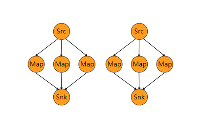

# Flink Transformation
<nav>
<a href="#一Transformations-分类">一、Transformations 分类</a><br/>
<a href="#二DataStream-Transformations">二、DataStream Transformations</a><br/>
&nbsp;&nbsp;&nbsp;&nbsp;&nbsp;&nbsp;&nbsp;&nbsp;<a href="#21-Map-[DataStream-→-DataStream]">2.1 Map [DataStream → DataStream] </a><br/>
&nbsp;&nbsp;&nbsp;&nbsp;&nbsp;&nbsp;&nbsp;&nbsp;<a href="#22-FlatMap-[DataStream-→-DataStream]">2.2 FlatMap [DataStream → DataStream]</a><br/>
&nbsp;&nbsp;&nbsp;&nbsp;&nbsp;&nbsp;&nbsp;&nbsp;<a href="#23-Filter-[DataStream-→-DataStream]">2.3 Filter [DataStream → DataStream]</a><br/>
&nbsp;&nbsp;&nbsp;&nbsp;&nbsp;&nbsp;&nbsp;&nbsp;<a href="#24-KeyBy-和-Reduce">2.4 KeyBy 和 Reduce</a><br/>
&nbsp;&nbsp;&nbsp;&nbsp;&nbsp;&nbsp;&nbsp;&nbsp;<a href="#25-Aggregations-[KeyedStream-→-DataStream]">2.5 Aggregations [KeyedStream → DataStream]</a><br/>
&nbsp;&nbsp;&nbsp;&nbsp;&nbsp;&nbsp;&nbsp;&nbsp;<a href="#26-Union-[DataStream*-→-DataStream]">2.6 Union [DataStream* → DataStream]</a><br/>
&nbsp;&nbsp;&nbsp;&nbsp;&nbsp;&nbsp;&nbsp;&nbsp;<a href="#27-Connect-[DataStreamDataStream-→-ConnectedStreams]">2.7 Connect [DataStream,DataStream → ConnectedStreams]</a><br/>
&nbsp;&nbsp;&nbsp;&nbsp;&nbsp;&nbsp;&nbsp;&nbsp;<a href="#28-Split-和-Select">2.8 Split 和 Select</a><br/>
&nbsp;&nbsp;&nbsp;&nbsp;&nbsp;&nbsp;&nbsp;&nbsp;<a href="#29-project-[DataStream-→-DataStream]">2.9 project [DataStream → DataStream]</a><br/>
<a href="#三物理分区">三、物理分区</a><br/>
&nbsp;&nbsp;&nbsp;&nbsp;&nbsp;&nbsp;&nbsp;&nbsp;<a href="#31-Random-partitioning-[DataStream-→-DataStream]">3.1 Random partitioning [DataStream → DataStream]</a><br/>
&nbsp;&nbsp;&nbsp;&nbsp;&nbsp;&nbsp;&nbsp;&nbsp;<a href="#32-Rebalancing-[DataStream-→-DataStream]">3.2 Rebalancing [DataStream → DataStream]</a><br/>
&nbsp;&nbsp;&nbsp;&nbsp;&nbsp;&nbsp;&nbsp;&nbsp;<a href="#33-Rescaling-[DataStream-→-DataStream]">3.3 Rescaling [DataStream → DataStream]</a><br/>
&nbsp;&nbsp;&nbsp;&nbsp;&nbsp;&nbsp;&nbsp;&nbsp;<a href="#34-Broadcasting-[DataStream-→-DataStream]">3.4 Broadcasting [DataStream → DataStream]</a><br/>
&nbsp;&nbsp;&nbsp;&nbsp;&nbsp;&nbsp;&nbsp;&nbsp;<a href="#35-Custom-partitioning-[DataStream-→-DataStream]">3.5 Custom partitioning [DataStream → DataStream]</a><br/>
<a href="#四任务链和资源组">四、任务链和资源组</a><br/>
&nbsp;&nbsp;&nbsp;&nbsp;&nbsp;&nbsp;&nbsp;&nbsp;<a href="#41-startNewChain">4.1 startNewChain</a><br/>
&nbsp;&nbsp;&nbsp;&nbsp;&nbsp;&nbsp;&nbsp;&nbsp;<a href="#42-disableChaining">4.2 disableChaining</a><br/>
&nbsp;&nbsp;&nbsp;&nbsp;&nbsp;&nbsp;&nbsp;&nbsp;<a href="#43-slotSharingGroup">4.3 slotSharingGroup</a><br/>
</nav>


## 一、Transformations 分类

Flink 的 Transformations 操作主要用于将一个和多个 DataStream 按需转换成新的 DataStream。它主要分为以下三类：

- **DataStream Transformations**：进行数据流相关转换操作；
- **Physical partitioning**：物理分区。Flink 提供的底层 API ，允许用户定义数据的分区规则；
- **Task chaining and resource groups**：任务链和资源组。允许用户进行任务链和资源组的细粒度的控制。

以下分别对其主要 API 进行介绍：

## 二、DataStream Transformations

### 2.1 Map [DataStream → DataStream] 

对一个 DataStream 中的每个元素都执行特定的转换操作：

```java
DataStream<Integer> integerDataStream = env.fromElements(1, 2, 3, 4, 5);
integerDataStream.map((MapFunction<Integer, Object>) value -> value * 2).print();
// 输出 2,4,6,8,10
```

### 2.2 FlatMap [DataStream → DataStream]

FlatMap 与 Map 类似，但是 FlatMap 中的一个输入元素可以被映射成一个或者多个输出元素，示例如下：

```java
String string01 = "one one one two two";
String string02 = "third third third four";
DataStream<String> stringDataStream = env.fromElements(string01, string02);
stringDataStream.flatMap(new FlatMapFunction<String, String>() {
    @Override
    public void flatMap(String value, Collector<String> out) throws Exception {
        for (String s : value.split(" ")) {
            out.collect(s);
        }
    }
}).print();
// 输出每一个独立的单词，为节省排版，这里去掉换行，后文亦同
one one one two two third third third four
```

### 2.3 Filter [DataStream → DataStream]

用于过滤符合条件的数据：

```java
env.fromElements(1, 2, 3, 4, 5).filter(x -> x > 3).print();
```

### 2.4 KeyBy 和 Reduce

- **KeyBy [DataStream → KeyedStream]** ：用于将相同 Key 值的数据分到相同的分区中；
- **Reduce [KeyedStream → DataStream]** ：用于对数据执行归约计算。

如下例子将数据按照 key 值分区后，滚动进行求和计算：

```java
DataStream<Tuple2<String, Integer>> tuple2DataStream = env.fromElements(new Tuple2<>("a", 1),
                                                                        new Tuple2<>("a", 2), 
                                                                        new Tuple2<>("b", 3), 
                                                                        new Tuple2<>("b", 5));
KeyedStream<Tuple2<String, Integer>, Tuple> keyedStream = tuple2DataStream.keyBy(0);
keyedStream.reduce((ReduceFunction<Tuple2<String, Integer>>) (value1, value2) ->
                   new Tuple2<>(value1.f0, value1.f1 + value2.f1)).print();

// 持续进行求和计算，输出：
(a,1)
(a,3)
(b,3)
(b,8)
```

KeyBy 操作存在以下两个限制：

- KeyBy 操作用于用户自定义的 POJOs 类型时，该自定义类型必须重写 hashCode 方法；
- KeyBy 操作不能用于数组类型。

### 2.5 Aggregations [KeyedStream → DataStream]

Aggregations 是官方提供的聚合算子，封装了常用的聚合操作，如上利用 Reduce 进行求和的操作也可以利用 Aggregations 中的 sum 算子重写为下面的形式：

```java
tuple2DataStream.keyBy(0).sum(1).print();
```

除了 sum 外，Flink 还提供了 min , max , minBy，maxBy 等常用聚合算子：

```java
// 滚动计算指定key的最小值，可以通过index或者fieldName来指定key
keyedStream.min(0);
keyedStream.min("key");
// 滚动计算指定key的最大值
keyedStream.max(0);
keyedStream.max("key");
// 滚动计算指定key的最小值，并返回其对应的元素
keyedStream.minBy(0);
keyedStream.minBy("key");
// 滚动计算指定key的最大值，并返回其对应的元素
keyedStream.maxBy(0);
keyedStream.maxBy("key");

```

### 2.6 Union [DataStream* → DataStream]

用于连接两个或者多个元素类型相同的 DataStream 。当然一个 DataStream 也可以与其本生进行连接，此时该 DataStream 中的每个元素都会被获取两次：

```shell
DataStreamSource<Tuple2<String, Integer>> streamSource01 = env.fromElements(new Tuple2<>("a", 1), 
                                                                            new Tuple2<>("a", 2));
DataStreamSource<Tuple2<String, Integer>> streamSource02 = env.fromElements(new Tuple2<>("b", 1), 
                                                                            new Tuple2<>("b", 2));
streamSource01.union(streamSource02);
streamSource01.union(streamSource01,streamSource02);
```

### 2.7 Connect [DataStream,DataStream → ConnectedStreams]

Connect 操作用于连接两个或者多个类型不同的 DataStream ，其返回的类型是 ConnectedStreams ，此时被连接的多个 DataStreams 可以共享彼此之间的数据状态。但是需要注意的是由于不同 DataStream 之间的数据类型是不同的，如果想要进行后续的计算操作，还需要通过 CoMap 或 CoFlatMap 将 ConnectedStreams  转换回 DataStream：

```java
DataStreamSource<Tuple2<String, Integer>> streamSource01 = env.fromElements(new Tuple2<>("a", 3), 
                                                                            new Tuple2<>("b", 5));
DataStreamSource<Integer> streamSource02 = env.fromElements(2, 3, 9);
// 使用connect进行连接
ConnectedStreams<Tuple2<String, Integer>, Integer> connect = streamSource01.connect(streamSource02);
connect.map(new CoMapFunction<Tuple2<String, Integer>, Integer, Integer>() {
    @Override
    public Integer map1(Tuple2<String, Integer> value) throws Exception {
        return value.f1;
    }

    @Override
    public Integer map2(Integer value) throws Exception {
        return value;
    }
}).map(x -> x * 100).print();

// 输出：
300 500 200 900 300
```

### 2.8 Split 和 Select

- **Split [DataStream → SplitStream]**：用于将一个 DataStream 按照指定规则进行拆分为多个 DataStream，需要注意的是这里进行的是逻辑拆分，即 Split 只是将数据贴上不同的类型标签，但最终返回的仍然只是一个 SplitStream；
- **Select [SplitStream → DataStream]**：想要从逻辑拆分的 SplitStream 中获取真实的不同类型的 DataStream，需要使用 Select 算子，示例如下：

```java
DataStreamSource<Integer> streamSource = env.fromElements(1, 2, 3, 4, 5, 6, 7, 8);
// 标记
SplitStream<Integer> split = streamSource.split(new OutputSelector<Integer>() {
    @Override
    public Iterable<String> select(Integer value) {
        List<String> output = new ArrayList<String>();
        output.add(value % 2 == 0 ? "even" : "odd");
        return output;
    }
});
// 获取偶数数据集
split.select("even").print();
// 输出 2,4,6,8
```

### 2.9 project [DataStream → DataStream]

project 主要用于获取 tuples 中的指定字段集，示例如下：

```java
DataStreamSource<Tuple3<String, Integer, String>> streamSource = env.fromElements(
                                                                         new Tuple3<>("li", 22, "2018-09-23"),
                                                                         new Tuple3<>("ming", 33, "2020-09-23"));
streamSource.project(0,2).print();

// 输出
(li,2018-09-23)
(ming,2020-09-23)
```

## 三、物理分区

物理分区 (Physical partitioning) 是 Flink 提供的底层的 API，允许用户采用内置的分区规则或者自定义的分区规则来对数据进行分区，从而避免数据在某些分区上过于倾斜，常用的分区规则如下：

### 3.1 Random partitioning [DataStream → DataStream]

随机分区 (Random partitioning) 用于随机的将数据分布到所有下游分区中，通过 shuffle 方法来进行实现：

```java
dataStream.shuffle();
```

### 3.2 Rebalancing [DataStream → DataStream]

Rebalancing 采用轮询的方式将数据进行分区，其适合于存在数据倾斜的场景下，通过 rebalance 方法进行实现：  

```java
dataStream.rebalance();
```

### 3.3 Rescaling [DataStream → DataStream]

当采用 Rebalancing 进行分区平衡时，其实现的是全局性的负载均衡，数据会通过网络传输到其他节点上并完成分区数据的均衡。 而 Rescaling 则是低配版本的 rebalance，它不需要额外的网络开销，它只会对上下游的算子之间进行重新均衡，通过 rescale 方法进行实现：

```java
dataStream.rescale();
```

ReScale 这个单词具有重新缩放的意义，其对应的操作也是如此，具体如下：如果上游 operation 并行度为 2，而下游的 operation 并行度为 6，则其中 1 个上游的 operation 会将元素分发到 3 个下游 operation，另 1 个上游 operation 则会将元素分发到另外 3 个下游 operation。反之亦然，如果上游的 operation 并行度为 6，而下游 operation 并行度为 2，则其中 3 个上游 operation 会将元素分发到 1 个下游 operation，另 3 个上游 operation 会将元素分发到另外 1 个下游operation：

<div align="center">  </div>


### 3.4 Broadcasting [DataStream → DataStream]

将数据分发到所有分区上。通常用于小数据集与大数据集进行关联的情况下，此时可以将小数据集广播到所有分区上，避免频繁的跨分区关联，通过 broadcast 方法进行实现：

```java
dataStream.broadcast();
```

### 3.5 Custom partitioning [DataStream → DataStream]

Flink 运行用户采用自定义的分区规则来实现分区，此时需要通过实现 Partitioner 接口来自定义分区规则，并指定对应的分区键，示例如下：

```java
 DataStreamSource<Tuple2<String, Integer>> streamSource = env.fromElements(new Tuple2<>("Hadoop", 1),
                new Tuple2<>("Spark", 1),
                new Tuple2<>("Flink-streaming", 2),
                new Tuple2<>("Flink-batch", 4),
                new Tuple2<>("Storm", 4),
                new Tuple2<>("HBase", 3));
streamSource.partitionCustom(new Partitioner<String>() {
    @Override
    public int partition(String key, int numPartitions) {
        // 将第一个字段包含flink的Tuple2分配到同一个分区
        return key.toLowerCase().contains("flink") ? 0 : 1;
    }
}, 0).print();


// 输出如下：
1> (Flink-streaming,2)
1> (Flink-batch,4)
2> (Hadoop,1)
2> (Spark,1)
2> (Storm,4)
2> (HBase,3)
```


## 四、任务链和资源组

任务链和资源组 ( Task chaining and resource groups ) 也是 Flink 提供的底层 API，用于控制任务链和资源分配。默认情况下，如果操作允许 (例如相邻的两次 map 操作) ，则 Flink 会尝试将它们在同一个线程内进行，从而可以获取更好的性能。但是 Flink 也允许用户自己来控制这些行为，这就是任务链和资源组 API：

### 4.1 startNewChain

startNewChain 用于基于当前 operation 开启一个新的任务链。如下所示，基于第一个 map 开启一个新的任务链，此时前一个 map 和 后一个 map 将处于同一个新的任务链中，但它们与 filter 操作则分别处于不同的任务链中：

```java
someStream.filter(...).map(...).startNewChain().map(...);
```

### 4.2 disableChaining

 disableChaining 操作用于禁止将其他操作与当前操作放置于同一个任务链中，示例如下：

```java
someStream.map(...).disableChaining();
```

### 4.3 slotSharingGroup

slot 是任务管理器  (TaskManager) 所拥有资源的固定子集，每个操作 (operation) 的子任务 (sub task) 都需要获取 slot 来执行计算，但每个操作所需要资源的大小都是不相同的，为了更好地利用资源，Flink 允许不同操作的子任务被部署到同一 slot 中。slotSharingGroup 用于设置操作的 slot 共享组 (slot sharing group) ，Flink 会将具有相同 slot 共享组的操作放到同一个 slot 中 。示例如下：

```java
someStream.filter(...).slotSharingGroup("slotSharingGroupName");
```


## 参考资料

Flink Operators： https://ci.apache.org/projects/flink/flink-docs-release-1.9/dev/stream/operators/ 
