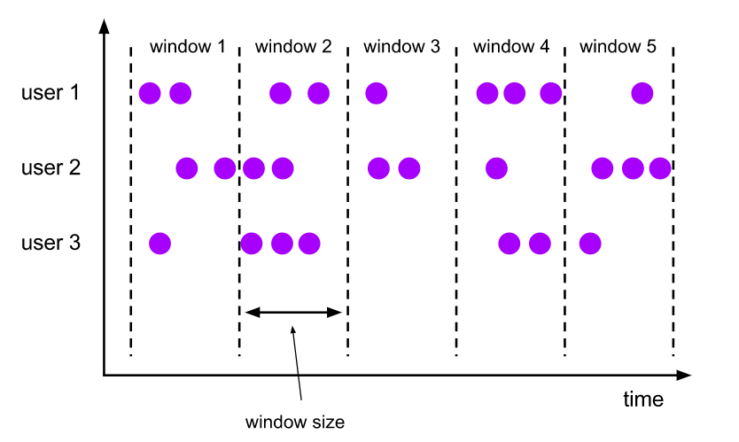
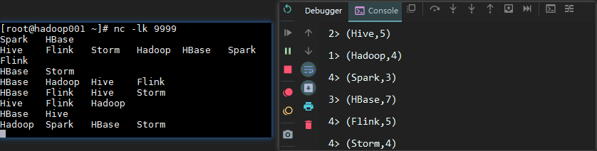
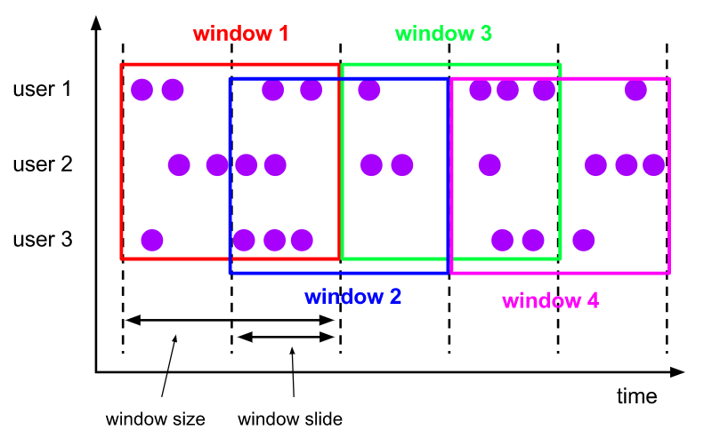
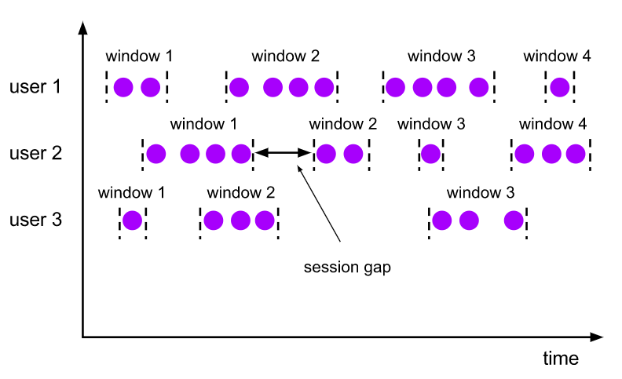
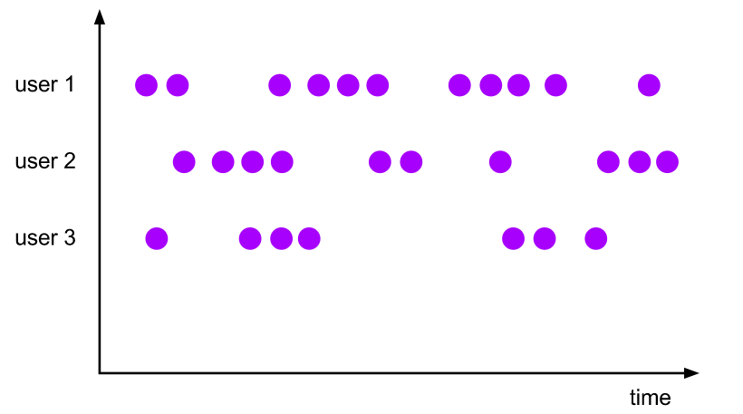

# Flink Windows
<nav>
<a href="#一窗口概念">一、窗口概念</a><br/>
<a href="#二Time-Windows">二、Time Windows</a><br/>
&nbsp;&nbsp;&nbsp;&nbsp;&nbsp;&nbsp;&nbsp;&nbsp;<a href="#21-Tumbling-Windows">2.1 Tumbling Windows</a><br/>
&nbsp;&nbsp;&nbsp;&nbsp;&nbsp;&nbsp;&nbsp;&nbsp;<a href="#22-Sliding-Windows">2.2 Sliding Windows</a><br/>
&nbsp;&nbsp;&nbsp;&nbsp;&nbsp;&nbsp;&nbsp;&nbsp;<a href="#23-Session-Windows">2.3 Session Windows</a><br/>
&nbsp;&nbsp;&nbsp;&nbsp;&nbsp;&nbsp;&nbsp;&nbsp;<a href="#24-Global-Windows">2.4 Global Windows</a><br/>
<a href="#三Count-Windows">三、Count Windows</a><br/>
</nav>


## 一、窗口概念

在大多数场景下，我们需要统计的数据流都是无界的，因此我们无法等待整个数据流终止后才进行统计。通常情况下，我们只需要对某个时间范围或者数量范围内的数据进行统计分析：如每隔五分钟统计一次过去一小时内所有商品的点击量；或者每发生1000次点击后，都去统计一下每个商品点击率的占比。在 Flink 中，我们使用窗口 (Window) 来实现这类功能。按照统计维度的不同，Flink 中的窗口可以分为 时间窗口 (Time Windows) 和 计数窗口 (Count Windows) 。

## 二、Time Windows

Time Windows 用于以时间为维度来进行数据聚合，具体分为以下四类：

### 2.1 Tumbling Windows

滚动窗口 (Tumbling Windows) 是指彼此之间没有重叠的窗口。例如：每隔1小时统计过去1小时内的商品点击量，那么 1 天就只能分为 24 个窗口，每个窗口彼此之间是不存在重叠的，具体如下：

<div align="center">  </div>


这里我们以词频统计为例，给出一个具体的用例，代码如下：

```java
final StreamExecutionEnvironment env = StreamExecutionEnvironment.getExecutionEnvironment();
// 接收socket上的数据输入
DataStreamSource<String> streamSource = env.socketTextStream("hadoop001", 9999, "\n", 3);
streamSource.flatMap(new FlatMapFunction<String, Tuple2<String, Long>>() {
    @Override
    public void flatMap(String value, Collector<Tuple2<String, Long>> out) throws Exception {
        String[] words = value.split("\t");
        for (String word : words) {
            out.collect(new Tuple2<>(word, 1L));
        }
    }
}).keyBy(0).timeWindow(Time.seconds(3)).sum(1).print(); //每隔3秒统计一次每个单词出现的数量
env.execute("Flink Streaming");
```

测试结果如下：

<div align="center">  </div>


### 2.2 Sliding Windows

滑动窗口用于滚动进行聚合分析，例如：每隔 6 分钟统计一次过去一小时内所有商品的点击量，那么统计窗口彼此之间就是存在重叠的，即 1天可以分为 240 个窗口。图示如下：

<div align="center">  </div>


可以看到 window 1 - 4 这四个窗口彼此之间都存在着时间相等的重叠部分。想要实现滑动窗口，只需要在使用 timeWindow 方法时额外传递第二个参数作为滚动时间即可，具体如下：

```java
// 每隔3秒统计一次过去1分钟内的数据
timeWindow(Time.minutes(1),Time.seconds(3))
```

### 2.3 Session Windows

当用户在进行持续浏览时，可能每时每刻都会有点击数据，例如在活动区间内，用户可能频繁的将某类商品加入和移除购物车，而你只想知道用户本次浏览最终的购物车情况，此时就可以在用户持有的会话结束后再进行统计。想要实现这类统计，可以通过 Session Windows 来进行实现。

<div align="center">  </div>


具体的实现代码如下：

```java
// 以处理时间为衡量标准，如果10秒内没有任何数据输入，就认为会话已经关闭，此时触发统计
window(ProcessingTimeSessionWindows.withGap(Time.seconds(10)))
// 以事件时间为衡量标准    
window(EventTimeSessionWindows.withGap(Time.seconds(10)))
```

### 2.4 Global Windows

最后一个窗口是全局窗口， 全局窗口会将所有 key 相同的元素分配到同一个窗口中，其通常配合触发器 (trigger) 进行使用。如果没有相应触发器，则计算将不会被执行。

<div align="center">  </div>


这里继续以上面词频统计的案例为例，示例代码如下：

```java
// 当单词累计出现的次数每达到10次时，则触发计算，计算整个窗口内该单词出现的总数
window(GlobalWindows.create()).trigger(CountTrigger.of(10)).sum(1).print();
```

## 三、Count Windows

Count Windows 用于以数量为维度来进行数据聚合，同样也分为滚动窗口和滑动窗口，实现方式也和时间窗口完全一致，只是调用的 API 不同，具体如下：

```java
// 滚动计数窗口，每1000次点击则计算一次
countWindow(1000)
// 滑动计数窗口，每10次点击发生后，则计算过去1000次点击的情况
countWindow(1000,10)
```

实际上计数窗口内部就是调用的我们上一部分介绍的全局窗口来实现的，其源码如下：

```java
public WindowedStream<T, KEY, GlobalWindow> countWindow(long size) {
    return window(GlobalWindows.create()).trigger(PurgingTrigger.of(CountTrigger.of(size)));
}


public WindowedStream<T, KEY, GlobalWindow> countWindow(long size, long slide) {
    return window(GlobalWindows.create())
        .evictor(CountEvictor.of(size))
        .trigger(CountTrigger.of(slide));
}
```


## 参考资料

Flink Windows： https://ci.apache.org/projects/flink/flink-docs-release-1.9/dev/stream/operators/windows.html 
