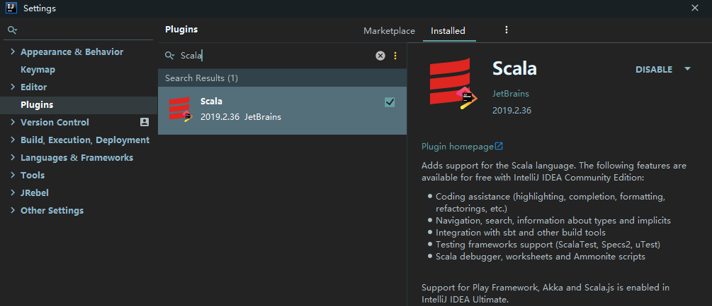
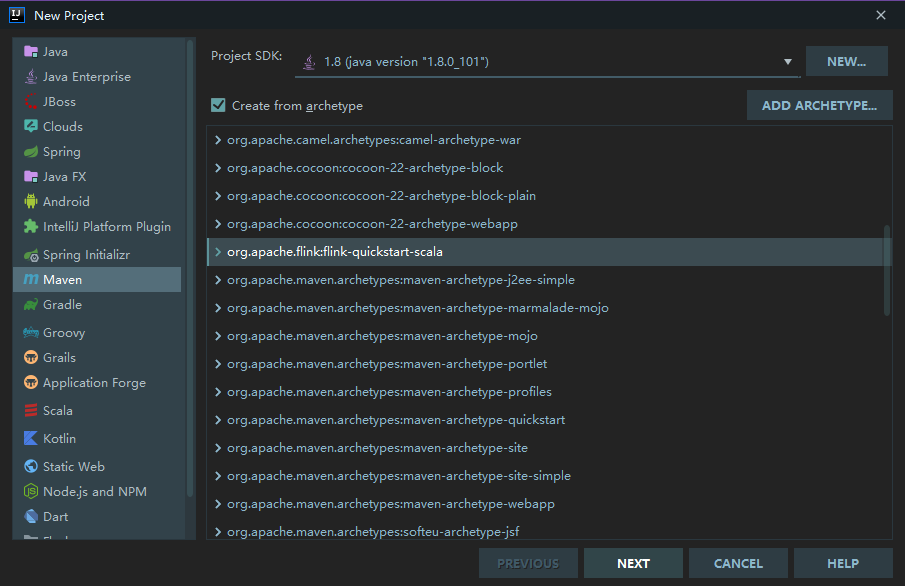
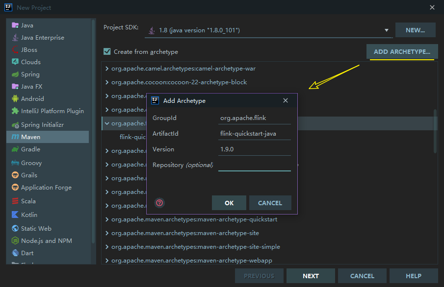
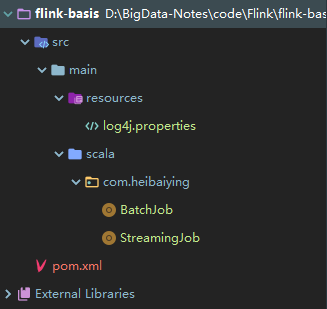
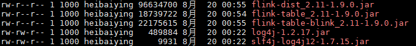
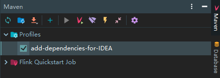
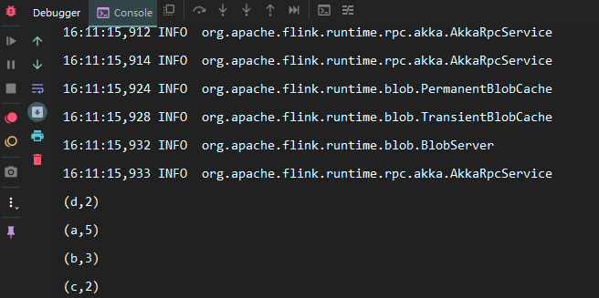
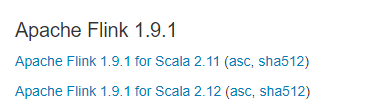
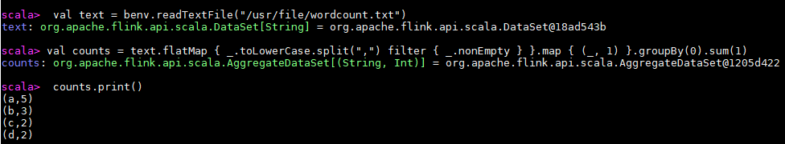

# Flink 开发环境搭建

<nav>
<a href="#一安装-Scala-插件">一、安装 Scala 插件</a><br/>
<a href="#二Flink-项目初始化">二、Flink 项目初始化</a><br/>
&nbsp;&nbsp;&nbsp;&nbsp;&nbsp;&nbsp;&nbsp;&nbsp;<a href="#21-使用官方脚本构建">2.1 使用官方脚本构建</a><br/>
&nbsp;&nbsp;&nbsp;&nbsp;&nbsp;&nbsp;&nbsp;&nbsp;<a href="#22-使用-IDEA-构建">2.2 使用 IDEA 构建</a><br/>
<a href="#三项目结构">三、项目结构</a><br/>
&nbsp;&nbsp;&nbsp;&nbsp;&nbsp;&nbsp;&nbsp;&nbsp;<a href="#31-项目结构">3.1 项目结构</a><br/>
&nbsp;&nbsp;&nbsp;&nbsp;&nbsp;&nbsp;&nbsp;&nbsp;<a href="#32-主要依赖">3.2 主要依赖</a><br/>
<a href="#四词频统计案例">四、词频统计案例</a><br/>
&nbsp;&nbsp;&nbsp;&nbsp;&nbsp;&nbsp;&nbsp;&nbsp;<a href="#41-批处理示例">4.1 批处理示例</a><br/>
&nbsp;&nbsp;&nbsp;&nbsp;&nbsp;&nbsp;&nbsp;&nbsp;<a href="#42-流处理示例">4.2 流处理示例</a><br/>
<a href="#五使用-Scala-Shell">五、使用 Scala Shell</a><br/>
</nav>


## 一、安装 Scala 插件

Flink 分别提供了基于 Java 语言和 Scala 语言的 API ，如果想要使用 Scala 语言来开发 Flink 程序，可以通过在 IDEA 中安装 Scala 插件来提供语法提示，代码高亮等功能。打开 IDEA , 依次点击 `File => settings => plugins` 打开插件安装页面，搜索 Scala 插件并进行安装，安装完成后，重启 IDEA 即可生效。  

<div align="center">  </div>

## 二、Flink 项目初始化

### 2.1 使用官方脚本构建

Flink 官方支持使用 Maven 和 Gradle 两种构建工具来构建基于 Java 语言的 Flink 项目；支持使用 SBT 和 Maven 两种构建工具来构建基于 Scala 语言的 Flink 项目。 这里以 Maven 为例进行说明，因为其可以同时支持 Java 语言和 Scala 语言项目的构建。需要注意的是 Flink 1.9 只支持 Maven 3.0.4 以上的版本，Maven 安装完成后，可以通过以下两种方式来构建项目：

**1. 直接基于 Maven Archetype 构建**

直接使用下面的 mvn 语句来进行构建，然后根据交互信息的提示，依次输入 groupId , artifactId 以及包名等信息后等待初始化的完成： 

```bash
$ mvn archetype:generate                               \
      -DarchetypeGroupId=org.apache.flink              \
      -DarchetypeArtifactId=flink-quickstart-java      \
      -DarchetypeVersion=1.9.0
```

> 注：如果想要创建基于 Scala 语言的项目，只需要将 flink-quickstart-java 换成 flink-quickstart-scala 即可，后文亦同。

**2. 使用官方脚本快速构建**

为了更方便的初始化项目，官方提供了快速构建脚本，可以直接通过以下命令来进行调用：

```shell
$ curl https://flink.apache.org/q/quickstart.sh | bash -s 1.9.0
```

该方式其实也是通过执行 maven archetype 命令来进行初始化，其脚本内容如下：

```shell
PACKAGE=quickstart

mvn archetype:generate \
  -DarchetypeGroupId=org.apache.flink \
  -DarchetypeArtifactId=flink-quickstart-java \
  -DarchetypeVersion=${1:-1.8.0} \
  -DgroupId=org.myorg.quickstart \
  -DartifactId=$PACKAGE	\
  -Dversion=0.1 \
  -Dpackage=org.myorg.quickstart \
  -DinteractiveMode=false
```

可以看到相比于第一种方式，该种方式只是直接指定好了 groupId ，artifactId ，version 等信息而已。

### 2.2 使用 IDEA 构建

如果你使用的是开发工具是 IDEA ，可以直接在项目创建页面选择 Maven Flink Archetype 进行项目初始化：

<div align="center">  </div>

如果你的 IDEA 没有上述 Archetype， 可以通过点击右上角的 `ADD ARCHETYPE` ，来进行添加，依次填入所需信息，这些信息都可以从上述的 `archetype:generate ` 语句中获取。点击  `OK` 保存后，该 Archetype 就会一直存在于你的 IDEA 中，之后每次创建项目时，只需要直接选择该 Archetype 即可：

<div align="center">  </div>

选中 Flink Archetype ，然后点击 `NEXT` 按钮，之后的所有步骤都和正常的 Maven 工程相同。

## 三、项目结构

### 3.1 项目结构

创建完成后的自动生成的项目结构如下：

<div align="center">  </div>

其中 BatchJob 为批处理的样例代码，源码如下：

```scala
import org.apache.flink.api.scala._

object BatchJob {
  def main(args: Array[String]) {
    val env = ExecutionEnvironment.getExecutionEnvironment
      ....
    env.execute("Flink Batch Scala API Skeleton")
  }
}
```

getExecutionEnvironment 代表获取批处理的执行环境，如果是本地运行则获取到的就是本地的执行环境；如果在集群上运行，得到的就是集群的执行环境。如果想要获取流处理的执行环境，则只需要将 `ExecutionEnvironment` 替换为 `StreamExecutionEnvironment`， 对应的代码样例在 StreamingJob 中：

```scala
import org.apache.flink.streaming.api.scala._

object StreamingJob {
  def main(args: Array[String]) {
    val env = StreamExecutionEnvironment.getExecutionEnvironment
      ...
    env.execute("Flink Streaming Scala API Skeleton")
  }
}

```

需要注意的是对于流处理项目 `env.execute()` 这句代码是必须的，否则流处理程序就不会被执行，但是对于批处理项目则是可选的。

### 3.2 主要依赖

基于 Maven 骨架创建的项目主要提供了以下核心依赖：其中 `flink-scala` 用于支持开发批处理程序 ；`flink-streaming-scala` 用于支持开发流处理程序 ；`scala-library` 用于提供 Scala 语言所需要的类库。如果在使用 Maven 骨架创建时选择的是 Java 语言，则默认提供的则是 `flink-java` 和 `flink-streaming-java` 依赖。

```xml
<!-- Apache Flink dependencies -->
<!-- These dependencies are provided, because they should not be packaged into the JAR file. -->
<dependency>
    <groupId>org.apache.flink</groupId>
    <artifactId>flink-scala_${scala.binary.version}</artifactId>
    <version>${flink.version}</version>
    <scope>provided</scope>
</dependency>
<dependency>
    <groupId>org.apache.flink</groupId>
    <artifactId>flink-streaming-scala_${scala.binary.version}</artifactId>
    <version>${flink.version}</version>
    <scope>provided</scope>
</dependency>

<!-- Scala Library, provided by Flink as well. -->
<dependency>
    <groupId>org.scala-lang</groupId>
    <artifactId>scala-library</artifactId>
    <version>${scala.version}</version>
    <scope>provided</scope>
</dependency>
```

需要特别注意的以上依赖的 `scope` 标签全部被标识为 provided ，这意味着这些依赖都不会被打入最终的 JAR 包。因为 Flink 的安装包中已经提供了这些依赖，位于其 lib 目录下，名为  `flink-dist_*.jar`  ，它包含了 Flink 的所有核心类和依赖：

<div align="center">  </div>
 
 `scope` 标签被标识为 provided 会导致你在 IDEA 中启动项目时会抛出 ClassNotFoundException 异常。基于这个原因，在使用 IDEA 创建项目时还自动生成了以下 profile 配置：

```xml
<!-- This profile helps to make things run out of the box in IntelliJ -->
<!-- Its adds Flink's core classes to the runtime class path. -->
<!-- Otherwise they are missing in IntelliJ, because the dependency is 'provided' -->
<profiles>
    <profile>
        <id>add-dependencies-for-IDEA</id>

        <activation>
            <property>
                <name>idea.version</name>
            </property>
        </activation>

        <dependencies>
            <dependency>
                <groupId>org.apache.flink</groupId>
                <artifactId>flink-scala_${scala.binary.version}</artifactId>
                <version>${flink.version}</version>
                <scope>compile</scope>
            </dependency>
            <dependency>
                <groupId>org.apache.flink</groupId>
                <artifactId>flink-streaming-scala_${scala.binary.version}</artifactId>
                <version>${flink.version}</version>
                <scope>compile</scope>
            </dependency>
            <dependency>
                <groupId>org.scala-lang</groupId>
                <artifactId>scala-library</artifactId>
                <version>${scala.version}</version>
                <scope>compile</scope>
            </dependency>
        </dependencies>
    </profile>
</profiles>
```

在 id 为 `add-dependencies-for-IDEA` 的 profile 中，所有的核心依赖都被标识为 compile，此时你可以无需改动任何代码，只需要在 IDEA 的 Maven 面板中勾选该 profile，即可直接在 IDEA 中运行 Flink 项目：

<div align="center">  </div>

## 四、词频统计案例

项目创建完成后，可以先书写一个简单的词频统计的案例来尝试运行 Flink 项目，以下以 Scala 语言为例，分别介绍流处理程序和批处理程序的编程示例：

### 4.1 批处理示例

```scala
import org.apache.flink.api.scala._

object WordCountBatch {

  def main(args: Array[String]): Unit = {
    val benv = ExecutionEnvironment.getExecutionEnvironment
    val dataSet = benv.readTextFile("D:\\wordcount.txt")
    dataSet.flatMap { _.toLowerCase.split(",")}
            .filter (_.nonEmpty)
            .map { (_, 1) }
            .groupBy(0)
            .sum(1)
            .print()
  }
}
```

其中 `wordcount.txt` 中的内容如下：

```shell
a,a,a,a,a
b,b,b
c,c
d,d
```

本机不需要配置其他任何的 Flink 环境，直接运行 Main 方法即可，结果如下：

<div align="center">  </div>

### 4.2 流处理示例

```scala
import org.apache.flink.streaming.api.scala._
import org.apache.flink.streaming.api.windowing.time.Time

object WordCountStreaming {

  def main(args: Array[String]): Unit = {

    val senv = StreamExecutionEnvironment.getExecutionEnvironment

    val dataStream: DataStream[String] = senv.socketTextStream("192.168.0.229", 9999, '\n')
    dataStream.flatMap { line => line.toLowerCase.split(",") }
              .filter(_.nonEmpty)
              .map { word => (word, 1) }
              .keyBy(0)
              .timeWindow(Time.seconds(3))
              .sum(1)
              .print()
    senv.execute("Streaming WordCount")
  }
}
```

这里以监听指定端口号上的内容为例，使用以下命令来开启端口服务：

```shell
nc -lk 9999
```

之后输入测试数据即可观察到流处理程序的处理情况。

## 五、使用 Scala Shell

对于日常的 Demo 项目，如果你不想频繁地启动 IDEA 来观察测试结果，可以像 Spark 一样，直接使用 Scala Shell 来运行程序，这对于日常的学习来说，效果更加直观，也更省时。Flink 安装包的下载地址如下：

```shell
https://flink.apache.org/downloads.html
```

Flink 大多数版本都提供有 Scala 2.11 和 Scala 2.12 两个版本的安装包可供下载：

<div align="center">  </div>

下载完成后进行解压即可，Scala Shell 位于安装目录的 bin 目录下，直接使用以下命令即可以本地模式启动：

```shell
./start-scala-shell.sh local
```

命令行启动完成后，其已经提供了批处理 （benv 和 btenv）和流处理（senv 和 stenv）的运行环境，可以直接运行 Scala Flink 程序，示例如下：

<div align="center">  </div>

最后解释一个常见的异常：这里我使用的 Flink 版本为 1.9.1，启动时会抛出如下异常。这里因为按照官方的说明，目前所有 Scala 2.12 版本的安装包暂时都不支持 Scala Shell，所以如果想要使用 Scala Shell，只能选择 Scala 2.11 版本的安装包。 

```shell
[root@hadoop001 bin]# ./start-scala-shell.sh local
错误: 找不到或无法加载主类 org.apache.flink.api.scala.FlinkShell
```


