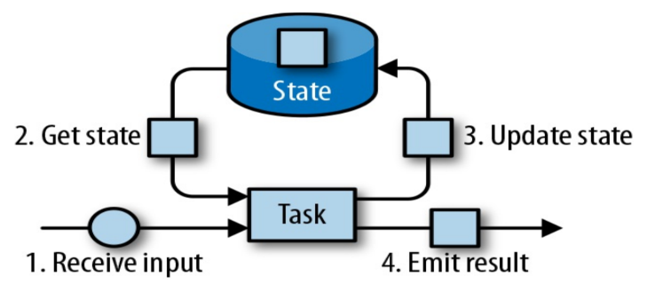
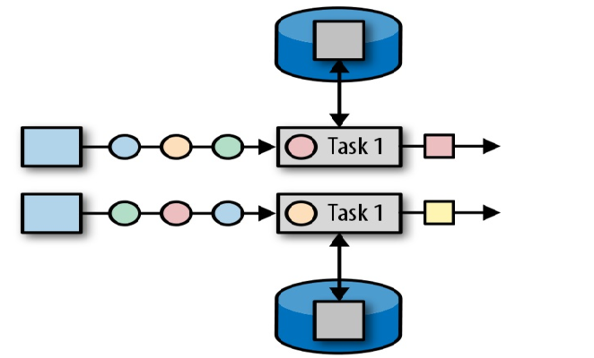
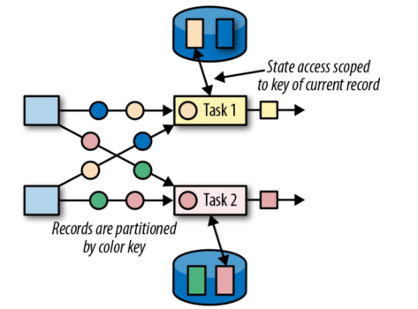
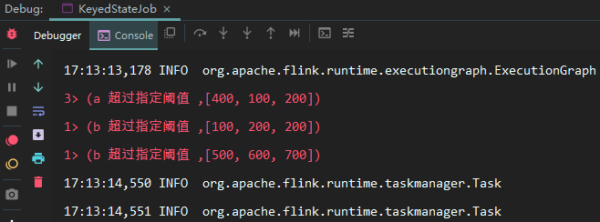
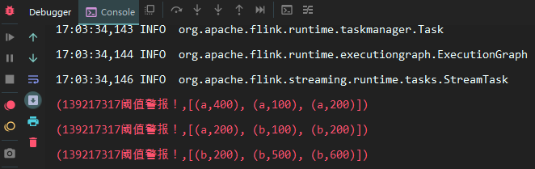
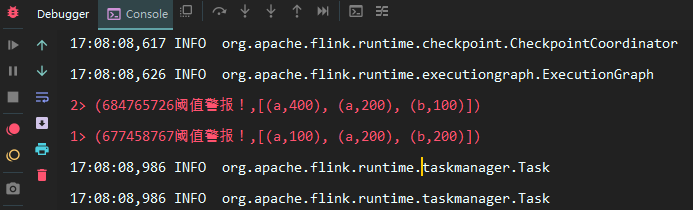
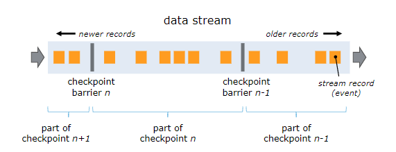
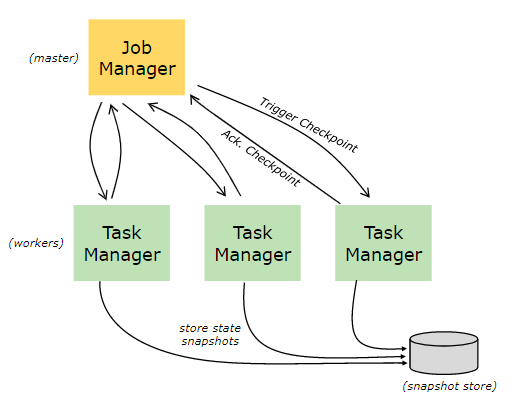

# Flink 状态管理
<nav>
<a href="#一状态分类">一、状态分类</a><br/>
&nbsp;&nbsp;&nbsp;&nbsp;&nbsp;&nbsp;&nbsp;&nbsp;<a href="#21-算子状态">2.1 算子状态</a><br/>
&nbsp;&nbsp;&nbsp;&nbsp;&nbsp;&nbsp;&nbsp;&nbsp;<a href="#22-键控状态">2.2 键控状态</a><br/>
<a href="#二状态编程">二、状态编程</a><br/>
&nbsp;&nbsp;&nbsp;&nbsp;&nbsp;&nbsp;&nbsp;&nbsp;<a href="#21-键控状态">2.1 键控状态</a><br/>
&nbsp;&nbsp;&nbsp;&nbsp;&nbsp;&nbsp;&nbsp;&nbsp;<a href="#22-状态有效期">2.2 状态有效期</a><br/>
&nbsp;&nbsp;&nbsp;&nbsp;&nbsp;&nbsp;&nbsp;&nbsp;<a href="#23-算子状态">2.3 算子状态</a><br/>
<a href="#三检查点机制">三、检查点机制</a><br/>
&nbsp;&nbsp;&nbsp;&nbsp;&nbsp;&nbsp;&nbsp;&nbsp;<a href="#31-CheckPoints">3.1 CheckPoints</a><br/>
&nbsp;&nbsp;&nbsp;&nbsp;&nbsp;&nbsp;&nbsp;&nbsp;<a href="#32-开启检查点">3.2 开启检查点</a><br/>
&nbsp;&nbsp;&nbsp;&nbsp;&nbsp;&nbsp;&nbsp;&nbsp;<a href="#33-保存点机制">3.3 保存点机制</a><br/>
<a href="#四状态后端">四、状态后端</a><br/>
&nbsp;&nbsp;&nbsp;&nbsp;&nbsp;&nbsp;&nbsp;&nbsp;<a href="#41-状态管理器分类">4.1 状态管理器分类</a><br/>
&nbsp;&nbsp;&nbsp;&nbsp;&nbsp;&nbsp;&nbsp;&nbsp;<a href="#42-配置方式">4.2 配置方式</a><br/>
</nav>


## 一、状态分类

相对于其他流计算框架，Flink 一个比较重要的特性就是其支持有状态计算。即你可以将中间的计算结果进行保存，并提供给后续的计算使用：

<div align="center">  </div>


具体而言，Flink 又将状态 (State) 分为 Keyed State 与 Operator State：

### 2.1 算子状态

算子状态 (Operator State)：顾名思义，状态是和算子进行绑定的，一个算子的状态不能被其他算子所访问到。官方文档上对 Operator State 的解释是：*each operator state is bound to one parallel operator instance*，所以更为确切的说一个算子状态是与一个并发的算子实例所绑定的，即假设算子的并行度是 2，那么其应有两个对应的算子状态：

<div align="center">  </div>


### 2.2 键控状态

键控状态 (Keyed State) ：是一种特殊的算子状态，即状态是根据 key 值进行区分的，Flink 会为每类键值维护一个状态实例。如下图所示，每个颜色代表不同 key 值，对应四个不同的状态实例。需要注意的是键控状态只能在 `KeyedStream` 上进行使用，我们可以通过 `stream.keyBy(...)` 来得到 `KeyedStream` 。

<div align="center">  </div>


## 二、状态编程

### 2.1 键控状态

Flink 提供了以下数据格式来管理和存储键控状态 (Keyed State)：

- **ValueState**：存储单值类型的状态。可以使用  `update(T)` 进行更新，并通过 `T value()` 进行检索。 
- **ListState**：存储列表类型的状态。可以使用 `add(T)` 或 `addAll(List)` 添加元素；并通过 `get()` 获得整个列表。
- **ReducingState**：用于存储经过 ReduceFunction 计算后的结果，使用 `add(T)` 增加元素。
- **AggregatingState**：用于存储经过 AggregatingState 计算后的结果，使用 `add(IN)` 添加元素。
- **FoldingState**：已被标识为废弃，会在未来版本中移除，官方推荐使用 `AggregatingState` 代替。
-  **MapState**：维护 Map 类型的状态。

以上所有增删改查方法不必硬记，在使用时通过语法提示来调用即可。这里给出一个具体的使用示例：假设我们正在开发一个监控系统，当监控数据超过阈值一定次数后，需要发出报警信息。这里之所以要达到一定次数，是因为由于偶发原因，偶尔一次超过阈值并不能代表什么，故需要达到一定次数后才触发报警，这就需要使用到 Flink 的状态编程。相关代码如下：

```java
public class ThresholdWarning extends 
    RichFlatMapFunction<Tuple2<String, Long>, Tuple2<String, List<Long>>> {

    // 通过ListState来存储非正常数据的状态
    private transient ListState<Long> abnormalData;
    // 需要监控的阈值
    private Long threshold;
    // 触发报警的次数
    private Integer numberOfTimes;

    ThresholdWarning(Long threshold, Integer numberOfTimes) {
        this.threshold = threshold;
        this.numberOfTimes = numberOfTimes;
    }

    @Override
    public void open(Configuration parameters) {
        // 通过状态名称(句柄)获取状态实例，如果不存在则会自动创建
        abnormalData = getRuntimeContext().getListState(
            new ListStateDescriptor<>("abnormalData", Long.class));
    }

    @Override
    public void flatMap(Tuple2<String, Long> value, Collector<Tuple2<String, List<Long>>> out)
        throws Exception {
        Long inputValue = value.f1;
        // 如果输入值超过阈值，则记录该次不正常的数据信息
        if (inputValue >= threshold) {
            abnormalData.add(inputValue);
        }
        ArrayList<Long> list = Lists.newArrayList(abnormalData.get().iterator());
        // 如果不正常的数据出现达到一定次数，则输出报警信息
        if (list.size() >= numberOfTimes) {
            out.collect(Tuple2.of(value.f0 + " 超过指定阈值 ", list));
            // 报警信息输出后，清空状态
            abnormalData.clear();
        }
    }
}
```

调用自定义的状态监控，这里我们使用 a，b 来代表不同类型的监控数据，分别对其数据进行监控：

```java
final StreamExecutionEnvironment env = StreamExecutionEnvironment.getExecutionEnvironment();
DataStreamSource<Tuple2<String, Long>> tuple2DataStreamSource = env.fromElements(
    Tuple2.of("a", 50L), Tuple2.of("a", 80L), Tuple2.of("a", 400L),
    Tuple2.of("a", 100L), Tuple2.of("a", 200L), Tuple2.of("a", 200L),
    Tuple2.of("b", 100L), Tuple2.of("b", 200L), Tuple2.of("b", 200L),
    Tuple2.of("b", 500L), Tuple2.of("b", 600L), Tuple2.of("b", 700L));
tuple2DataStreamSource
    .keyBy(0)
    .flatMap(new ThresholdWarning(100L, 3))  // 超过100的阈值3次后就进行报警
    .printToErr();
env.execute("Managed Keyed State");
```

输出如下结果如下：

<div align="center">  </div>


### 2.2 状态有效期

以上任何类型的 keyed state 都支持配置有效期 (TTL) ，示例如下：

```java
StateTtlConfig ttlConfig = StateTtlConfig
    // 设置有效期为 10 秒
    .newBuilder(Time.seconds(10))  
    // 设置有效期更新规则，这里设置为当创建和写入时，都重置其有效期到规定的10秒
    .setUpdateType(StateTtlConfig.UpdateType.OnCreateAndWrite) 
    /*设置只要值过期就不可见，另外一个可选值是ReturnExpiredIfNotCleanedUp，
     代表即使值过期了，但如果还没有被物理删除，就是可见的*/
    .setStateVisibility(StateTtlConfig.StateVisibility.NeverReturnExpired)
    .build();
ListStateDescriptor<Long> descriptor = new ListStateDescriptor<>("abnormalData", Long.class);
descriptor.enableTimeToLive(ttlConfig);
```

### 2.3 算子状态

相比于键控状态，算子状态目前支持的存储类型只有以下三种：

- **ListState**：存储列表类型的状态。
- **UnionListState**：存储列表类型的状态，与 ListState 的区别在于：如果并行度发生变化，ListState 会将该算子的所有并发的状态实例进行汇总，然后均分给新的 Task；而 UnionListState 只是将所有并发的状态实例汇总起来，具体的划分行为则由用户进行定义。
- **BroadcastState**：用于广播的算子状态。

这里我们继续沿用上面的例子，假设此时我们不需要区分监控数据的类型，只要有监控数据超过阈值并达到指定的次数后，就进行报警，代码如下：

```java
public class ThresholdWarning extends RichFlatMapFunction<Tuple2<String, Long>, 
Tuple2<String, List<Tuple2<String, Long>>>> implements CheckpointedFunction {

    // 非正常数据
    private List<Tuple2<String, Long>> bufferedData;
    // checkPointedState
    private transient ListState<Tuple2<String, Long>> checkPointedState;
    // 需要监控的阈值
    private Long threshold;
    // 次数
    private Integer numberOfTimes;

    ThresholdWarning(Long threshold, Integer numberOfTimes) {
        this.threshold = threshold;
        this.numberOfTimes = numberOfTimes;
        this.bufferedData = new ArrayList<>();
    }

    @Override
    public void initializeState(FunctionInitializationContext context) throws Exception {
        // 注意这里获取的是OperatorStateStore
        checkPointedState = context.getOperatorStateStore().
            getListState(new ListStateDescriptor<>("abnormalData",
                TypeInformation.of(new TypeHint<Tuple2<String, Long>>() {
                })));
        // 如果发生重启，则需要从快照中将状态进行恢复
        if (context.isRestored()) {
            for (Tuple2<String, Long> element : checkPointedState.get()) {
                bufferedData.add(element);
            }
        }
    }

    @Override
    public void flatMap(Tuple2<String, Long> value, 
                        Collector<Tuple2<String, List<Tuple2<String, Long>>>> out) {
        Long inputValue = value.f1;
        // 超过阈值则进行记录
        if (inputValue >= threshold) {
            bufferedData.add(value);
        }
        // 超过指定次数则输出报警信息
        if (bufferedData.size() >= numberOfTimes) {
             // 顺便输出状态实例的hashcode
             out.collect(Tuple2.of(checkPointedState.hashCode() + "阈值警报！", bufferedData));
            bufferedData.clear();
        }
    }

    @Override
    public void snapshotState(FunctionSnapshotContext context) throws Exception {
        // 在进行快照时，将数据存储到checkPointedState
        checkPointedState.clear();
        for (Tuple2<String, Long> element : bufferedData) {
            checkPointedState.add(element);
        }
    }
}
```

调用自定义算子状态，这里需要将并行度设置为 1：

```java
final StreamExecutionEnvironment env = StreamExecutionEnvironment.getExecutionEnvironment();
// 开启检查点机制
env.enableCheckpointing(1000);
// 设置并行度为1
DataStreamSource<Tuple2<String, Long>> tuple2DataStreamSource = env.setParallelism(1).fromElements(
    Tuple2.of("a", 50L), Tuple2.of("a", 80L), Tuple2.of("a", 400L),
    Tuple2.of("a", 100L), Tuple2.of("a", 200L), Tuple2.of("a", 200L),
    Tuple2.of("b", 100L), Tuple2.of("b", 200L), Tuple2.of("b", 200L),
    Tuple2.of("b", 500L), Tuple2.of("b", 600L), Tuple2.of("b", 700L));
tuple2DataStreamSource
    .flatMap(new ThresholdWarning(100L, 3))
    .printToErr();
env.execute("Managed Keyed State");
}
```

此时输出如下：

<div align="center">  </div>


在上面的调用代码中，我们将程序的并行度设置为 1，可以看到三次输出中状态实例的 hashcode 全是一致的，证明它们都同一个状态实例。假设将并行度设置为 2，此时输出如下：

<div align="center">  </div>


可以看到此时两次输出中状态实例的 hashcode 是不一致的，代表它们不是同一个状态实例，这也就是上文提到的，一个算子状态是与一个并发的算子实例所绑定的。同时这里只输出两次，是因为在并发处理的情况下，线程 1 可能拿到 5 个非正常值，线程 2 可能拿到 4 个非正常值，因为要大于 3 次才能输出，所以在这种情况下就会出现只输出两条记录的情况，所以需要将程序的并行度设置为 1。

## 三、检查点机制

### 3.1 CheckPoints

为了使 Flink 的状态具有良好的容错性，Flink 提供了检查点机制 (CheckPoints)  。通过检查点机制，Flink 定期在数据流上生成 checkpoint barrier ，当某个算子收到 barrier 时，即会基于当前状态生成一份快照，然后再将该 barrier 传递到下游算子，下游算子接收到该 barrier 后，也基于当前状态生成一份快照，依次传递直至到最后的 Sink 算子上。当出现异常后，Flink 就可以根据最近的一次的快照数据将所有算子恢复到先前的状态。

<div align="center">  </div>


### 3.2 开启检查点

默认情况下，检查点机制是关闭的，需要在程序中进行开启：

```java
// 开启检查点机制，并指定状态检查点之间的时间间隔
env.enableCheckpointing(1000); 

// 其他可选配置如下：
// 设置语义
env.getCheckpointConfig().setCheckpointingMode(CheckpointingMode.EXACTLY_ONCE);
// 设置两个检查点之间的最小时间间隔
env.getCheckpointConfig().setMinPauseBetweenCheckpoints(500);
// 设置执行Checkpoint操作时的超时时间
env.getCheckpointConfig().setCheckpointTimeout(60000);
// 设置最大并发执行的检查点的数量
env.getCheckpointConfig().setMaxConcurrentCheckpoints(1);
// 将检查点持久化到外部存储
env.getCheckpointConfig().enableExternalizedCheckpoints(
    ExternalizedCheckpointCleanup.RETAIN_ON_CANCELLATION);
// 如果有更近的保存点时，是否将作业回退到该检查点
env.getCheckpointConfig().setPreferCheckpointForRecovery(true);
```

### 3.3 保存点机制

保存点机制 (Savepoints) 是检查点机制的一种特殊的实现，它允许你通过手工的方式来触发 Checkpoint，并将结果持久化存储到指定路径中，主要用于避免 Flink 集群在重启或升级时导致状态丢失。示例如下：

```shell
# 触发指定id的作业的Savepoint，并将结果存储到指定目录下
bin/flink savepoint :jobId [:targetDirectory]
```

更多命令和配置可以参考官方文档：[savepoints]( https://ci.apache.org/projects/flink/flink-docs-release-1.9/zh/ops/state/savepoints.html )

## 四、状态后端

### 4.1 状态管理器分类

默认情况下，所有的状态都存储在 JVM 的堆内存中，在状态数据过多的情况下，这种方式很有可能导致内存溢出，因此 Flink 该提供了其它方式来存储状态数据，这些存储方式统一称为状态后端 (或状态管理器)：

<div align="center">  </div>


主要有以下三种：

#### 1. MemoryStateBackend

默认的方式，即基于 JVM 的堆内存进行存储，主要适用于本地开发和调试。

#### 2. FsStateBackend

基于文件系统进行存储，可以是本地文件系统，也可以是 HDFS 等分布式文件系统。 需要注意而是虽然选择使用了 FsStateBackend ，但正在进行的数据仍然是存储在 TaskManager 的内存中的，只有在 checkpoint 时，才会将状态快照写入到指定文件系统上。

#### 3. RocksDBStateBackend

RocksDBStateBackend 是 Flink 内置的第三方状态管理器，采用嵌入式的 key-value 型数据库 RocksDB 来存储正在进行的数据。等到 checkpoint 时，再将其中的数据持久化到指定的文件系统中，所以采用 RocksDBStateBackend 时也需要配置持久化存储的文件系统。之所以这样做是因为 RocksDB 作为嵌入式数据库安全性比较低，但比起全文件系统的方式，其读取速率更快；比起全内存的方式，其存储空间更大，因此它是一种比较均衡的方案。

### 4.2 配置方式

Flink 支持使用两种方式来配置后端管理器：

**第一种方式**：基于代码方式进行配置，只对当前作业生效：

```java
// 配置 FsStateBackend
env.setStateBackend(new FsStateBackend("hdfs://namenode:40010/flink/checkpoints"));
// 配置 RocksDBStateBackend
env.setStateBackend(new RocksDBStateBackend("hdfs://namenode:40010/flink/checkpoints"));
```

配置 RocksDBStateBackend 时，需要额外导入下面的依赖：

```xml
<dependency>
    <groupId>org.apache.flink</groupId>
    <artifactId>flink-statebackend-rocksdb_2.11</artifactId>
    <version>1.9.0</version>
</dependency>
```

**第二种方式**：基于 `flink-conf.yaml` 配置文件的方式进行配置，对所有部署在该集群上的作业都生效：

```yaml
state.backend: filesystem
state.checkpoints.dir: hdfs://namenode:40010/flink/checkpoints
```


> 注：本篇文章所有示例代码下载地址：[flink-state-management]( https://github.com/heibaiying/BigData-Notes/tree/master/code/Flink/flink-state-management)


## 参考资料

+ [Working with State](https://ci.apache.org/projects/flink/flink-docs-release-1.9/dev/stream/state/state.html)
+ [Checkpointing](https://ci.apache.org/projects/flink/flink-docs-release-1.9/dev/stream/state/checkpointing.html)
+ [Savepoints](https://ci.apache.org/projects/flink/flink-docs-release-1.9/ops/state/savepoints.html#savepoints)
+ [State Backends](https://ci.apache.org/projects/flink/flink-docs-release-1.9/ops/state/state_backends.html)
+ Fabian Hueske , Vasiliki Kalavri . 《Stream Processing with Apache Flink》.  O'Reilly Media .  2019-4-30 


