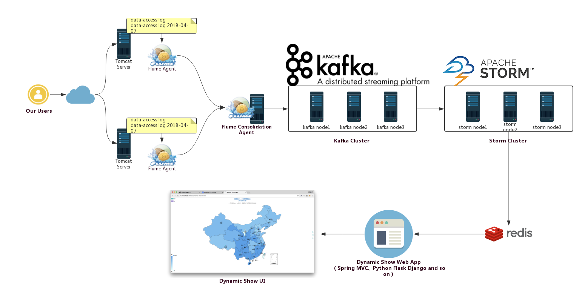
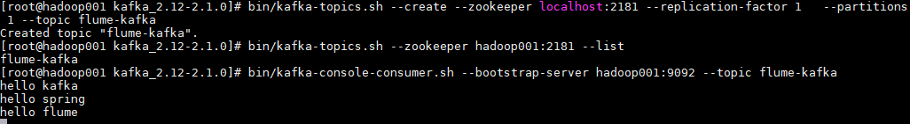

# Flume 整合 Kafka

<nav>
<a href="#一背景">一、背景</a><br/>
<a href="#二整合流程">二、整合流程</a><br/>
&nbsp;&nbsp;&nbsp;&nbsp;&nbsp;&nbsp;&nbsp;&nbsp;<a href="#1-启动Zookeeper和Kafka">1. 启动Zookeeper和Kafka</a><br/>
&nbsp;&nbsp;&nbsp;&nbsp;&nbsp;&nbsp;&nbsp;&nbsp;<a href="#2-创建主题">2. 创建主题</a><br/>
&nbsp;&nbsp;&nbsp;&nbsp;&nbsp;&nbsp;&nbsp;&nbsp;<a href="#3-启动kafka消费者">3. 启动kafka消费者</a><br/>
&nbsp;&nbsp;&nbsp;&nbsp;&nbsp;&nbsp;&nbsp;&nbsp;<a href="#4-配置Flume">4. 配置Flume</a><br/>
&nbsp;&nbsp;&nbsp;&nbsp;&nbsp;&nbsp;&nbsp;&nbsp;<a href="#5-启动Flume">5. 启动Flume</a><br/>
&nbsp;&nbsp;&nbsp;&nbsp;&nbsp;&nbsp;&nbsp;&nbsp;<a href="#6-测试">6. 测试</a><br/>
</nav>

## 一、背景

先说一下，为什么要使用 Flume + Kafka？

以实时流处理项目为例，由于采集的数据量可能存在峰值和峰谷，假设是一个电商项目，那么峰值通常出现在秒杀时，这时如果直接将 Flume 聚合后的数据输入到 Storm 等分布式计算框架中，可能就会超过集群的处理能力，这时采用 Kafka 就可以起到削峰的作用。Kafka 天生为大数据场景而设计，具有高吞吐的特性，能很好地抗住峰值数据的冲击。

<div align="center">  </div>


## 二、整合流程

Flume 发送数据到 Kafka 上主要是通过 `KafkaSink` 来实现的，主要步骤如下：

### 1. 启动Zookeeper和Kafka

这里启动一个单节点的 Kafka 作为测试：

```shell
# 启动Zookeeper
zkServer.sh start

# 启动kafka
bin/kafka-server-start.sh config/server.properties
```

### 2. 创建主题

创建一个主题 `flume-kafka`，之后 Flume 收集到的数据都会发到这个主题上：

```shell
# 创建主题
bin/kafka-topics.sh --create \
--zookeeper hadoop001:2181 \
--replication-factor 1   \
--partitions 1 --topic flume-kafka

# 查看创建的主题
bin/kafka-topics.sh --zookeeper hadoop001:2181 --list
```


### 3. 启动kafka消费者

启动一个消费者，监听我们刚才创建的 `flume-kafka` 主题：

```shell
# bin/kafka-console-consumer.sh --bootstrap-server hadoop001:9092 --topic flume-kafka
```


### 4. 配置Flume

新建配置文件 `exec-memory-kafka.properties`，文件内容如下。这里我们监听一个名为 `kafka.log` 的文件，当文件内容有变化时，将新增加的内容发送到 Kafka 的 `flume-kafka` 主题上。

```properties
a1.sources = s1
a1.channels = c1
a1.sinks = k1                                                                                         

a1.sources.s1.type=exec
a1.sources.s1.command=tail -F /tmp/kafka.log
a1.sources.s1.channels=c1 

#设置Kafka接收器
a1.sinks.k1.type= org.apache.flume.sink.kafka.KafkaSink
#设置Kafka地址
a1.sinks.k1.brokerList=hadoop001:9092
#设置发送到Kafka上的主题
a1.sinks.k1.topic=flume-kafka
#设置序列化方式
a1.sinks.k1.serializer.class=kafka.serializer.StringEncoder
a1.sinks.k1.channel=c1     

a1.channels.c1.type=memory
a1.channels.c1.capacity=10000
a1.channels.c1.transactionCapacity=100   
```


### 5. 启动Flume

```shell
flume-ng agent \
--conf conf \
--conf-file /usr/app/apache-flume-1.6.0-cdh5.15.2-bin/examples/exec-memory-kafka.properties \
--name a1 -Dflume.root.logger=INFO,console
```


### 6. 测试

向监听的 `/tmp/kafka.log     ` 文件中追加内容，查看 Kafka 消费者的输出：

<div align="center">  </div>

可以看到 `flume-kafka` 主题的消费端已经收到了对应的消息：

<div align="center">  </div>
