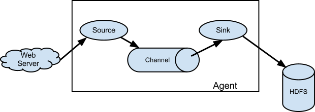
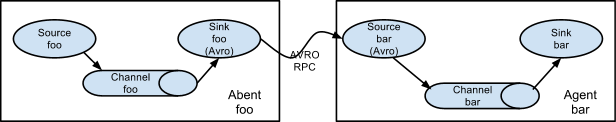
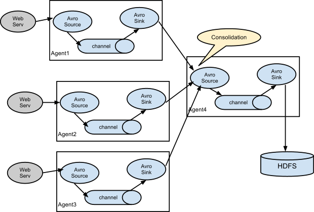
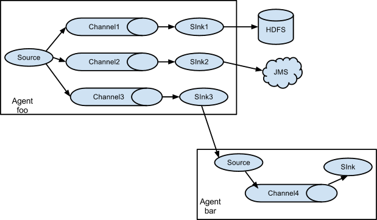
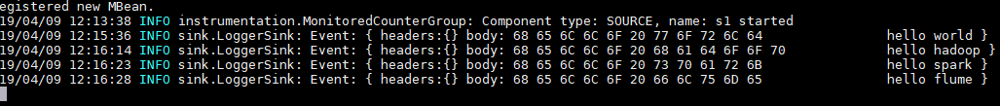
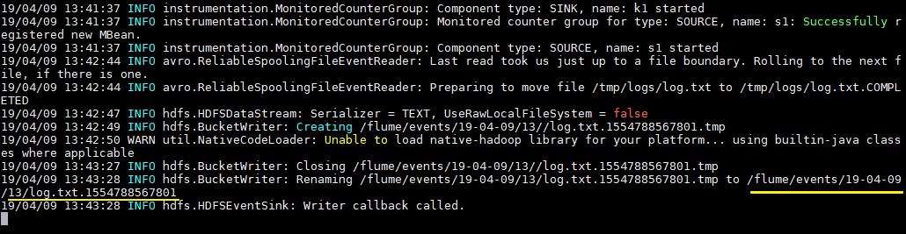
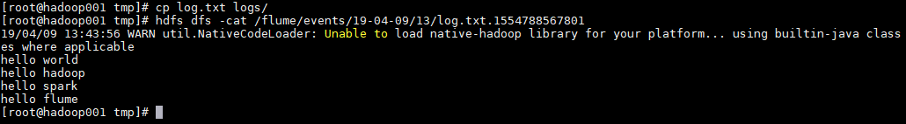
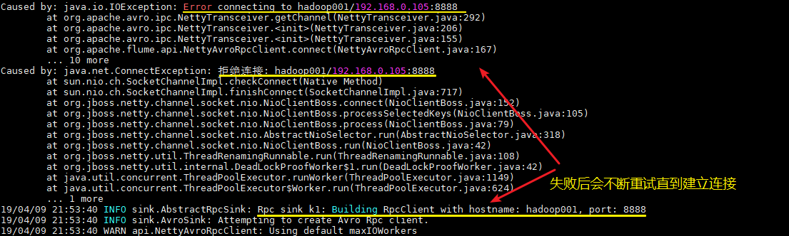
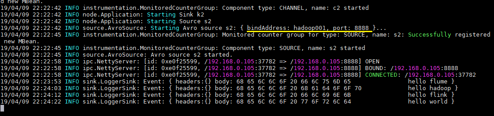

# Flume 简介及基本使用

<nav>
<a href="#一Flume简介">一、Flume简介</a><br/>
<a href="#二Flume架构和基本概念">二、Flume架构和基本概念</a><br/>
&nbsp;&nbsp;&nbsp;&nbsp;<a href="#21-基本架构">2.1 基本架构</a><br/>
&nbsp;&nbsp;&nbsp;&nbsp;<a href="#22-基本概念">2.2 基本概念</a><br/>
&nbsp;&nbsp;&nbsp;&nbsp;<a href="#23-组件种类">2.3 组件种类</a><br/>
<a href="#三Flume架构模式">三、Flume架构模式</a><br/>
<a href="#四Flume配置格式">四、Flume配置格式</a><br/>
<a href="#五Flume的安装部署">五、Flume安装部署</a><br/>
<a href="#六Flume使用案例">六、Flume使用案例</a><br/>
</nav>


## 一、Flume简介

Apache Flume 是一个分布式，高可用的数据收集系统。它可以从不同的数据源收集数据，经过聚合后发送到存储系统中，通常用于日志数据的收集。Flume 分为 NG 和 OG (1.0 之前) 两个版本，NG 在 OG 的基础上进行了完全的重构，是目前使用最为广泛的版本。下面的介绍均以 NG 为基础。

## 二、Flume架构和基本概念

下图为 Flume 的基本架构图：


<div align="center">  </div>

### 2.1 基本架构

外部数据源以特定格式向 Flume 发送 `events` (事件)，当 `source` 接收到 `events` 时，它将其存储到一个或多个 `channel`，`channe` 会一直保存 `events` 直到它被 `sink` 所消费。`sink` 的主要功能从 `channel` 中读取 `events`，并将其存入外部存储系统或转发到下一个 `source`，成功后再从 `channel` 中移除 `events`。


### 2.2 基本概念

**1. Event**

`Event` 是 Flume NG 数据传输的基本单元。类似于 JMS 和消息系统中的消息。一个 `Event` 由标题和正文组成：前者是键/值映射，后者是任意字节数组。

**2. Source** 

数据收集组件，从外部数据源收集数据，并存储到 Channel 中。

**3. Channel**

`Channel` 是源和接收器之间的管道，用于临时存储数据。可以是内存或持久化的文件系统：

+ `Memory Channel` : 使用内存，优点是速度快，但数据可能会丢失 (如突然宕机)；
+ `File Channel` : 使用持久化的文件系统，优点是能保证数据不丢失，但是速度慢。

**4. Sink**

`Sink` 的主要功能从 `Channel` 中读取 `Event`，并将其存入外部存储系统或将其转发到下一个 `Source`，成功后再从 `Channel` 中移除 `Event`。

**5. Agent**

是一个独立的 (JVM) 进程，包含 `Source`、 `Channel`、 `Sink` 等组件。


### 2.3 组件种类

Flume 中的每一个组件都提供了丰富的类型，适用于不同场景：

- Source 类型 ：内置了几十种类型，如 `Avro Source`，`Thrift Source`，`Kafka Source`，`JMS Source`；

- Sink 类型 ：`HDFS Sink`，`Hive Sink`，`HBaseSinks`，`Avro Sink` 等；

- Channel 类型 ：`Memory Channel`，`JDBC Channel`，`Kafka Channel`，`File Channel` 等。

对于 Flume 的使用，除非有特别的需求，否则通过组合内置的各种类型的 Source，Sink 和 Channel 就能满足大多数的需求。在 [Flume 官网](http://flume.apache.org/releases/content/1.9.0/FlumeUserGuide.html) 上对所有类型组件的配置参数均以表格的方式做了详尽的介绍，并附有配置样例；同时不同版本的参数可能略有所不同，所以使用时建议选取官网对应版本的 User Guide 作为主要参考资料。

   

## 三、Flume架构模式

Flume 支持多种架构模式，分别介绍如下

### 3.1 multi-agent flow


<div align="center">  </div>

<br/>

Flume 支持跨越多个 Agent 的数据传递，这要求前一个 Agent 的 Sink 和下一个 Agent 的 Source 都必须是 `Avro` 类型，Sink 指向 Source 所在主机名 (或 IP 地址) 和端口（详细配置见下文案例三）。

### 3.2 Consolidation

<div align="center">  </div>


<br/>

日志收集中常常存在大量的客户端（比如分布式 web 服务），Flume 支持使用多个 Agent 分别收集日志，然后通过一个或者多个 Agent 聚合后再存储到文件系统中。

### 3.3 Multiplexing the flow

<div align="center">  </div>

Flume 支持从一个 Source 向多个 Channel，也就是向多个 Sink 传递事件，这个操作称之为 `Fan Out`(扇出)。默认情况下 `Fan Out` 是向所有的 Channel 复制 `Event`，即所有 Channel 收到的数据都是相同的。同时 Flume 也支持在 `Source` 上自定义一个复用选择器 (multiplexing selector) 来实现自定义的路由规则。


## 四、Flume配置格式

Flume 配置通常需要以下两个步骤：

1. 分别定义好 Agent 的 Sources，Sinks，Channels，然后将 Sources 和 Sinks 与通道进行绑定。需要注意的是一个 Source 可以配置多个 Channel，但一个 Sink 只能配置一个 Channel。基本格式如下：

```shell
<Agent>.sources = <Source>
<Agent>.sinks = <Sink>
<Agent>.channels = <Channel1> <Channel2>

# set channel for source
<Agent>.sources.<Source>.channels = <Channel1> <Channel2> ...

# set channel for sink
<Agent>.sinks.<Sink>.channel = <Channel1>
```

2. 分别定义 Source，Sink，Channel 的具体属性。基本格式如下：

```shell

<Agent>.sources.<Source>.<someProperty> = <someValue>

# properties for channels
<Agent>.channel.<Channel>.<someProperty> = <someValue>

# properties for sinks
<Agent>.sources.<Sink>.<someProperty> = <someValue>
```


## 五、Flume的安装部署

为方便大家后期查阅，本仓库中所有软件的安装均单独成篇，Flume 的安装见：

[Linux 环境下 Flume 的安装部署](https://github.com/heibaiying/BigData-Notes/blob/master/notes/installation/Linux%E4%B8%8BFlume%E7%9A%84%E5%AE%89%E8%A3%85.md)


## 六、Flume使用案例

介绍几个 Flume 的使用案例：

+ 案例一：使用 Flume 监听文件内容变动，将新增加的内容输出到控制台。
+ 案例二：使用 Flume 监听指定目录，将目录下新增加的文件存储到 HDFS。
+ 案例三：使用 Avro 将本服务器收集到的日志数据发送到另外一台服务器。

### 6.1 案例一

需求： 监听文件内容变动，将新增加的内容输出到控制台。

实现： 主要使用 `Exec Source` 配合 `tail` 命令实现。

#### 1. 配置

新建配置文件 `exec-memory-logger.properties`,其内容如下：

```properties
#指定agent的sources,sinks,channels
a1.sources = s1  
a1.sinks = k1  
a1.channels = c1  
   
#配置sources属性
a1.sources.s1.type = exec
a1.sources.s1.command = tail -F /tmp/log.txt
a1.sources.s1.shell = /bin/bash -c

#将sources与channels进行绑定
a1.sources.s1.channels = c1
   
#配置sink 
a1.sinks.k1.type = logger

#将sinks与channels进行绑定  
a1.sinks.k1.channel = c1  
   
#配置channel类型
a1.channels.c1.type = memory
```

#### 2. 启动　

```shell
flume-ng agent \
--conf conf \
--conf-file /usr/app/apache-flume-1.6.0-cdh5.15.2-bin/examples/exec-memory-logger.properties \
--name a1 \
-Dflume.root.logger=INFO,console
```

#### 3. 测试

向文件中追加数据：

<div align="center">  </div>

控制台的显示：

<div align="center">  </div>


### 6.2 案例二

需求： 监听指定目录，将目录下新增加的文件存储到 HDFS。

实现：使用 `Spooling Directory Source` 和 `HDFS Sink`。

#### 1. 配置

```properties
#指定agent的sources,sinks,channels
a1.sources = s1  
a1.sinks = k1  
a1.channels = c1  
   
#配置sources属性
a1.sources.s1.type =spooldir  
a1.sources.s1.spoolDir =/tmp/logs
a1.sources.s1.basenameHeader = true
a1.sources.s1.basenameHeaderKey = fileName 
#将sources与channels进行绑定  
a1.sources.s1.channels =c1 

   
#配置sink 
a1.sinks.k1.type = hdfs
a1.sinks.k1.hdfs.path = /flume/events/%y-%m-%d/%H/
a1.sinks.k1.hdfs.filePrefix = %{fileName}
#生成的文件类型，默认是Sequencefile，可用DataStream，则为普通文本
a1.sinks.k1.hdfs.fileType = DataStream  
a1.sinks.k1.hdfs.useLocalTimeStamp = true
#将sinks与channels进行绑定  
a1.sinks.k1.channel = c1
   
#配置channel类型
a1.channels.c1.type = memory
```

#### 2. 启动

```shell
flume-ng agent \
--conf conf \
--conf-file /usr/app/apache-flume-1.6.0-cdh5.15.2-bin/examples/spooling-memory-hdfs.properties \
--name a1 -Dflume.root.logger=INFO,console
```

#### 3. 测试

拷贝任意文件到监听目录下，可以从日志看到文件上传到 HDFS 的路径：

```shell
# cp log.txt logs/
```

<div align="center">  </div>

查看上传到 HDFS 上的文件内容与本地是否一致：

```shell
# hdfs dfs -cat /flume/events/19-04-09/13/log.txt.1554788567801
```

<div align="center">  </div>


### 6.3 案例三

需求： 将本服务器收集到的数据发送到另外一台服务器。

实现：使用 `avro sources` 和 `avro Sink` 实现。

#### 1. 配置日志收集Flume

新建配置 `netcat-memory-avro.properties`，监听文件内容变化，然后将新的文件内容通过 `avro sink` 发送到 hadoop001 这台服务器的 8888 端口：

```properties
#指定agent的sources,sinks,channels
a1.sources = s1
a1.sinks = k1
a1.channels = c1

#配置sources属性
a1.sources.s1.type = exec
a1.sources.s1.command = tail -F /tmp/log.txt
a1.sources.s1.shell = /bin/bash -c
a1.sources.s1.channels = c1

#配置sink
a1.sinks.k1.type = avro
a1.sinks.k1.hostname = hadoop001
a1.sinks.k1.port = 8888
a1.sinks.k1.batch-size = 1
a1.sinks.k1.channel = c1

#配置channel类型
a1.channels.c1.type = memory
a1.channels.c1.capacity = 1000
a1.channels.c1.transactionCapacity = 100
```

#### 2. 配置日志聚合Flume

使用 `avro source` 监听 hadoop001 服务器的 8888 端口，将获取到内容输出到控制台：

```properties
#指定agent的sources,sinks,channels
a2.sources = s2
a2.sinks = k2
a2.channels = c2

#配置sources属性
a2.sources.s2.type = avro
a2.sources.s2.bind = hadoop001
a2.sources.s2.port = 8888

#将sources与channels进行绑定
a2.sources.s2.channels = c2

#配置sink
a2.sinks.k2.type = logger

#将sinks与channels进行绑定
a2.sinks.k2.channel = c2

#配置channel类型
a2.channels.c2.type = memory
a2.channels.c2.capacity = 1000
a2.channels.c2.transactionCapacity = 100
```

#### 3. 启动

启动日志聚集 Flume：

```shell
flume-ng agent \
--conf conf \
--conf-file /usr/app/apache-flume-1.6.0-cdh5.15.2-bin/examples/avro-memory-logger.properties \
--name a2 -Dflume.root.logger=INFO,console
```

在启动日志收集 Flume:

```shell
flume-ng agent \
--conf conf \
--conf-file /usr/app/apache-flume-1.6.0-cdh5.15.2-bin/examples/netcat-memory-avro.properties \
--name a1 -Dflume.root.logger=INFO,console
```

这里建议按以上顺序启动，原因是 `avro.source` 会先与端口进行绑定，这样 `avro sink` 连接时才不会报无法连接的异常。但是即使不按顺序启动也是没关系的，`sink` 会一直重试，直至建立好连接。

<div align="center">  </div>

#### 4.测试

向文件 `tmp/log.txt` 中追加内容：

<div align="center">  </div>

可以看到已经从 8888 端口监听到内容，并成功输出到控制台：

<div align="center">  </div>
