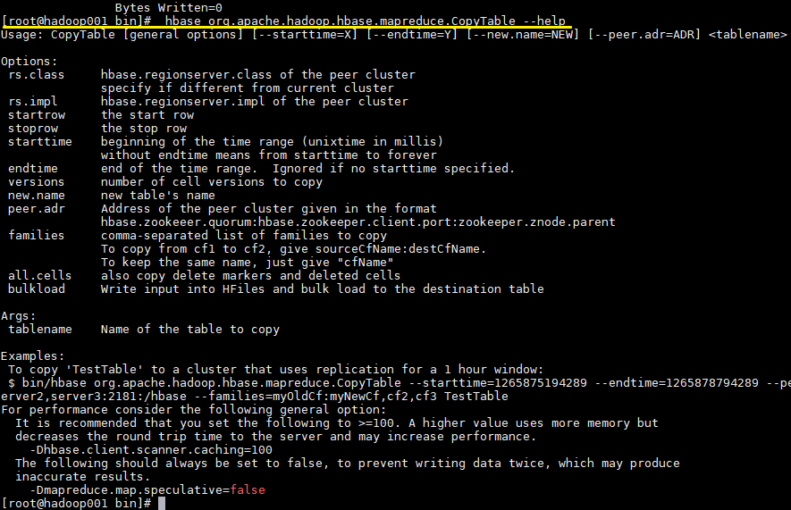

# Hbase容灾与备份

<nav>
<a href="#一前言">一、前言</a><br/>
<a href="#二CopyTable">二、CopyTable</a><br/>
&nbsp;&nbsp;&nbsp;&nbsp;<a href="#21-简介">2.1 简介</a><br/>
&nbsp;&nbsp;&nbsp;&nbsp;<a href="#22-命令格式">2.2 命令格式</a><br/>
&nbsp;&nbsp;&nbsp;&nbsp;<a href="#23-常用命令">2.3 常用命令</a><br/>
&nbsp;&nbsp;&nbsp;&nbsp;<a href="#24-更多参数">2.4 更多参数</a><br/>
<a href="#三ExportImport">三、Export/Import</a><br/>
&nbsp;&nbsp;&nbsp;&nbsp;<a href="#31-简介">3.1 简介</a><br/>
&nbsp;&nbsp;&nbsp;&nbsp;<a href="#32-命令格式">3.2 命令格式</a><br/>
&nbsp;&nbsp;&nbsp;&nbsp;<a href="#33-常用命令">3.3 常用命令</a><br/>
<a href="#四Snapshot">四、Snapshot</a><br/>
&nbsp;&nbsp;&nbsp;&nbsp;<a href="#41-简介">4.1 简介</a><br/>
&nbsp;&nbsp;&nbsp;&nbsp;<a href="#42-配置">4.2 配置</a><br/>
&nbsp;&nbsp;&nbsp;&nbsp;<a href="#43-常用命令">4.3 常用命令</a><br/>
</nav>

## 一、前言

本文主要介绍 Hbase 常用的三种简单的容灾备份方案，即**CopyTable**、**Export**/**Import**、**Snapshot**。分别介绍如下：


## 二、CopyTable

### 2.1 简介

**CopyTable**可以将现有表的数据复制到新表中，具有以下特点：

- 支持时间区间 、row 区间 、改变表名称 、改变列族名称 、以及是否 Copy 已被删除的数据等功能；
- 执行命令前，需先创建与原表结构相同的新表；
- `CopyTable` 的操作是基于 HBase Client API 进行的，即采用 `scan` 进行查询, 采用 `put` 进行写入。

### 2.2 命令格式

```shell
Usage: CopyTable [general options] [--starttime=X] [--endtime=Y] [--new.name=NEW] [--peer.adr=ADR] <tablename>
```

### 2.3 常用命令

1. 同集群下 CopyTable

```shell
hbase org.apache.hadoop.hbase.mapreduce.CopyTable --new.name=tableCopy  tableOrig
```

2. 不同集群下 CopyTable

```shell
# 两表名称相同的情况
hbase org.apache.hadoop.hbase.mapreduce.CopyTable \
--peer.adr=dstClusterZK:2181:/hbase tableOrig

# 也可以指新的表名
hbase org.apache.hadoop.hbase.mapreduce.CopyTable \
--peer.adr=dstClusterZK:2181:/hbase \
--new.name=tableCopy tableOrig
```


3. 下面是一个官方给的比较完整的例子，指定开始和结束时间，集群地址，以及只复制指定的列族：

```shell
hbase org.apache.hadoop.hbase.mapreduce.CopyTable \
--starttime=1265875194289 \
--endtime=1265878794289 \
--peer.adr=server1,server2,server3:2181:/hbase \
--families=myOldCf:myNewCf,cf2,cf3 TestTable
```

### 2.4 更多参数

可以通过 `--help` 查看更多支持的参数

```shell
# hbase org.apache.hadoop.hbase.mapreduce.CopyTable --help
```

<div align="center">  </div>


## 三、Export/Import

### 3.1 简介

- `Export` 支持导出数据到 HDFS, `Import` 支持从 HDFS 导入数据。`Export` 还支持指定导出数据的开始时间和结束时间，因此可以用于增量备份。
- `Export` 导出与 `CopyTable` 一样，依赖 HBase 的 `scan` 操作

### 3.2 命令格式

```shell
# Export
hbase org.apache.hadoop.hbase.mapreduce.Export <tablename> <outputdir> [<versions> [<starttime> [<endtime>]]]

# Inport
hbase org.apache.hadoop.hbase.mapreduce.Import <tablename> <inputdir>
```

+ 导出的 `outputdir` 目录可以不用预先创建，程序会自动创建。导出完成后，导出文件的所有权将由执行导出命令的用户所拥有。
+ 默认情况下，仅导出给定 `Cell` 的最新版本，而不管历史版本。要导出多个版本，需要将 `<versions>` 参数替换为所需的版本数。

### 3.3 常用命令

1. 导出命令

```shell
hbase org.apache.hadoop.hbase.mapreduce.Export tableName  hdfs 路径/tableName.db
```

2. 导入命令

```
hbase org.apache.hadoop.hbase.mapreduce.Import tableName  hdfs 路径/tableName.db
```


## 四、Snapshot

### 4.1 简介

HBase 的快照 (Snapshot) 功能允许您获取表的副本 (包括内容和元数据)，并且性能开销很小。因为快照存储的仅仅是表的元数据和 HFiles 的信息。快照的 `clone` 操作会从该快照创建新表，快照的 `restore` 操作会将表的内容还原到快照节点。`clone` 和 `restore` 操作不需要复制任何数据，因为底层 HFiles(包含 HBase 表数据的文件) 不会被修改，修改的只是表的元数据信息。

### 4.2 配置

HBase 快照功能默认没有开启，如果要开启快照，需要在 `hbase-site.xml` 文件中添加如下配置项：

```xml
<property>
    <name>hbase.snapshot.enabled</name>
    <value>true</value>
</property>
```


### 4.3 常用命令

快照的所有命令都需要在 Hbase Shell 交互式命令行中执行。

#### 1. Take a Snapshot

```shell
# 拍摄快照
hbase> snapshot '表名', '快照名'
```

默认情况下拍摄快照之前会在内存中执行数据刷新。以保证内存中的数据包含在快照中。但是如果你不希望包含内存中的数据，则可以使用 `SKIP_FLUSH` 选项禁止刷新。

```shell
# 禁止内存刷新
hbase> snapshot  '表名', '快照名', {SKIP_FLUSH => true}
```

#### 2. Listing Snapshots

```shell
# 获取快照列表
hbase> list_snapshots
```

#### 3. Deleting Snapshots

```shell
# 删除快照
hbase> delete_snapshot '快照名'
```

#### 4. Clone a table from snapshot

```shell
# 从现有的快照创建一张新表
hbase>  clone_snapshot '快照名', '新表名'
```

#### 5. Restore a snapshot

将表恢复到快照节点，恢复操作需要先禁用表

```shell
hbase> disable '表名'
hbase> restore_snapshot '快照名'
```

这里需要注意的是：是如果 HBase 配置了基于 Replication 的主从复制，由于 Replication 在日志级别工作，而快照在文件系统级别工作，因此在还原之后，会出现副本与主服务器处于不同的状态的情况。这时候可以先停止同步，所有服务器还原到一致的数据点后再重新建立同步。


## 参考资料

1. [Online Apache HBase Backups with CopyTable](https://blog.cloudera.com/blog/2012/06/online-hbase-backups-with-copytable-2/)
2. [Apache HBase ™ Reference Guide](http://hbase.apache.org/book.htm)
