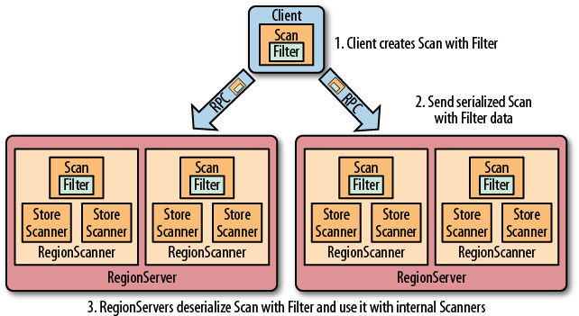
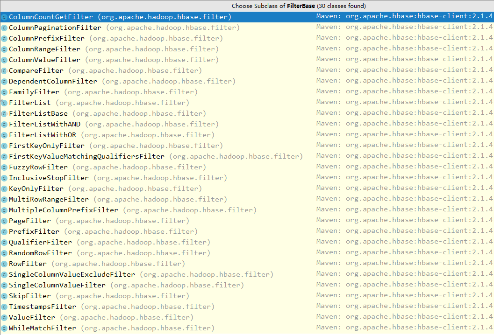
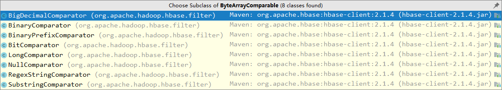
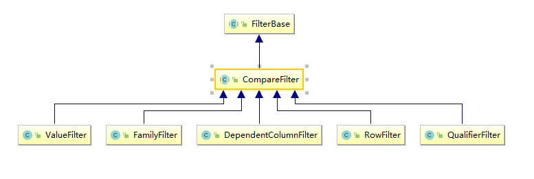

# Hbase 过滤器详解

<nav>
<a href="#一HBase过滤器简介">一、HBase过滤器简介</a><br/>
<a href="#二过滤器基础">二、过滤器基础</a><br/>
&nbsp;&nbsp;&nbsp;&nbsp;&nbsp;&nbsp;&nbsp;&nbsp;<a href="#21--Filter接口和FilterBase抽象类">2.1  Filter接口和FilterBase抽象类</a><br/>
&nbsp;&nbsp;&nbsp;&nbsp;&nbsp;&nbsp;&nbsp;&nbsp;<a href="#22-过滤器分类">2.2 过滤器分类</a><br/>
<a href="#三比较过滤器">三、比较过滤器</a><br/>
&nbsp;&nbsp;&nbsp;&nbsp;&nbsp;&nbsp;&nbsp;&nbsp;<a href="#31-比较运算符">3.1 比较运算符</a><br/>
&nbsp;&nbsp;&nbsp;&nbsp;&nbsp;&nbsp;&nbsp;&nbsp;<a href="#32-比较器">3.2 比较器</a><br/>
&nbsp;&nbsp;&nbsp;&nbsp;&nbsp;&nbsp;&nbsp;&nbsp;<a href="#33-比较过滤器种类">3.3 比较过滤器种类</a><br/>
&nbsp;&nbsp;&nbsp;&nbsp;&nbsp;&nbsp;&nbsp;&nbsp;<a href="#34-DependentColumnFilter">3.4 DependentColumnFilter </a><br/>
<a href="#四专用过滤器">四、专用过滤器</a><br/>
&nbsp;&nbsp;&nbsp;&nbsp;&nbsp;&nbsp;&nbsp;&nbsp;<a href="#41-单列列值过滤器-SingleColumnValueFilter">4.1 单列列值过滤器 (SingleColumnValueFilter)</a><br/>
&nbsp;&nbsp;&nbsp;&nbsp;&nbsp;&nbsp;&nbsp;&nbsp;<a href="#42-单列列值排除器-SingleColumnValueExcludeFilter">4.2 单列列值排除器 (SingleColumnValueExcludeFilter) </a><br/>
&nbsp;&nbsp;&nbsp;&nbsp;&nbsp;&nbsp;&nbsp;&nbsp;<a href="#43-行键前缀过滤器-PrefixFilter">4.3 行键前缀过滤器 (PrefixFilter)</a><br/>
&nbsp;&nbsp;&nbsp;&nbsp;&nbsp;&nbsp;&nbsp;&nbsp;<a href="#44-列名前缀过滤器-ColumnPrefixFilter">4.4 列名前缀过滤器 (ColumnPrefixFilter)</a><br/>
&nbsp;&nbsp;&nbsp;&nbsp;&nbsp;&nbsp;&nbsp;&nbsp;<a href="#45-分页过滤器-PageFilter">4.5 分页过滤器 (PageFilter)</a><br/>
&nbsp;&nbsp;&nbsp;&nbsp;&nbsp;&nbsp;&nbsp;&nbsp;<a href="#46-时间戳过滤器-TimestampsFilter">4.6 时间戳过滤器 (TimestampsFilter)</a><br/>
&nbsp;&nbsp;&nbsp;&nbsp;&nbsp;&nbsp;&nbsp;&nbsp;<a href="#47-首次行键过滤器-FirstKeyOnlyFilter">4.7 首次行键过滤器 (FirstKeyOnlyFilter)</a><br/>
<a href="#五包装过滤器">五、包装过滤器</a><br/>
&nbsp;&nbsp;&nbsp;&nbsp;&nbsp;&nbsp;&nbsp;&nbsp;<a href="#51-SkipFilter过滤器">5.1 SkipFilter过滤器</a><br/>
&nbsp;&nbsp;&nbsp;&nbsp;&nbsp;&nbsp;&nbsp;&nbsp;<a href="#52-WhileMatchFilter过滤器">5.2 WhileMatchFilter过滤器</a><br/>
<a href="#六FilterList">六、FilterList</a><br/>
</nav>


## 一、HBase过滤器简介

Hbase 提供了种类丰富的过滤器（filter）来提高数据处理的效率，用户可以通过内置或自定义的过滤器来对数据进行过滤，所有的过滤器都在服务端生效，即谓词下推（predicate push down）。这样可以保证过滤掉的数据不会被传送到客户端，从而减轻网络传输和客户端处理的压力。

<div align="center">  </div>


## 二、过滤器基础

### 2.1  Filter接口和FilterBase抽象类

Filter 接口中定义了过滤器的基本方法，FilterBase 抽象类实现了 Filter 接口。所有内置的过滤器则直接或者间接继承自 FilterBase 抽象类。用户只需要将定义好的过滤器通过 `setFilter` 方法传递给 `Scan` 或 `put` 的实例即可。

```java
setFilter(Filter filter)
```

```java
 // Scan 中定义的 setFilter
 @Override
  public Scan setFilter(Filter filter) {
    super.setFilter(filter);
    return this;
  }
```

```java
  // Get 中定义的 setFilter
 @Override
  public Get setFilter(Filter filter) {
    super.setFilter(filter);
    return this;
  }
```

FilterBase 的所有子类过滤器如下：<div align="center">  </div>

> 说明：上图基于当前时间点（2019.4）最新的 Hbase-2.1.4 ，下文所有说明均基于此版本。


### 2.2 过滤器分类

HBase 内置过滤器可以分为三类：分别是比较过滤器，专用过滤器和包装过滤器。分别在下面的三个小节中做详细的介绍。


## 三、比较过滤器

所有比较过滤器均继承自 `CompareFilter`。创建一个比较过滤器需要两个参数，分别是**比较运算符**和**比较器实例**。

```java
 public CompareFilter(final CompareOp compareOp,final ByteArrayComparable comparator) {
    this.compareOp = compareOp;
    this.comparator = comparator;
  }
```

### 3.1 比较运算符

- LESS (<)
- LESS_OR_EQUAL (<=)
- EQUAL (=)
- NOT_EQUAL (!=)
- GREATER_OR_EQUAL (>=)
- GREATER (>)
- NO_OP (排除所有符合条件的值)

比较运算符均定义在枚举类 `CompareOperator` 中

```java
@InterfaceAudience.Public
public enum CompareOperator {
  LESS,
  LESS_OR_EQUAL,
  EQUAL,
  NOT_EQUAL,
  GREATER_OR_EQUAL,
  GREATER,
  NO_OP,
}
```

> 注意：在 1.x 版本的 HBase 中，比较运算符定义在 `CompareFilter.CompareOp` 枚举类中，但在 2.0 之后这个类就被标识为 @deprecated ，并会在 3.0 移除。所以 2.0 之后版本的 HBase 需要使用 `CompareOperator` 这个枚举类。
>

### 3.2 比较器

所有比较器均继承自 `ByteArrayComparable` 抽象类，常用的有以下几种：

<div align="center">  </div>

- **BinaryComparator**  : 使用 `Bytes.compareTo(byte []，byte [])` 按字典序比较指定的字节数组。
- **BinaryPrefixComparator** : 按字典序与指定的字节数组进行比较，但只比较到这个字节数组的长度。
- **RegexStringComparator** :  使用给定的正则表达式与指定的字节数组进行比较。仅支持 `EQUAL` 和 `NOT_EQUAL` 操作。
- **SubStringComparator** : 测试给定的子字符串是否出现在指定的字节数组中，比较不区分大小写。仅支持 `EQUAL` 和 `NOT_EQUAL` 操作。
- **NullComparator** ：判断给定的值是否为空。
- **BitComparator** ：按位进行比较。

`BinaryPrefixComparator` 和 `BinaryComparator` 的区别不是很好理解，这里举例说明一下：

在进行 `EQUAL` 的比较时，如果比较器传入的是 `abcd` 的字节数组，但是待比较数据是 `abcdefgh`：

+ 如果使用的是 `BinaryPrefixComparator` 比较器，则比较以 `abcd` 字节数组的长度为准，即 `efgh` 不会参与比较，这时候认为 `abcd` 与 `abcdefgh` 是满足 `EQUAL` 条件的；
+ 如果使用的是 `BinaryComparator` 比较器，则认为其是不相等的。

### 3.3 比较过滤器种类

比较过滤器共有五个（Hbase 1.x 版本和 2.x 版本相同），见下图：

<div align="center">  </div>

+ **RowFilter** ：基于行键来过滤数据；
+ **FamilyFilterr** ：基于列族来过滤数据；
+ **QualifierFilterr** ：基于列限定符（列名）来过滤数据；
+ **ValueFilterr** ：基于单元格 (cell) 的值来过滤数据；
+ **DependentColumnFilter** ：指定一个参考列来过滤其他列的过滤器，过滤的原则是基于参考列的时间戳来进行筛选 。

前四种过滤器的使用方法相同，均只要传递比较运算符和运算器实例即可构建，然后通过 `setFilter` 方法传递给 `scan`：

```java
 Filter filter  = new RowFilter(CompareOperator.LESS_OR_EQUAL,
                                new BinaryComparator(Bytes.toBytes("xxx")));
  scan.setFilter(filter);    
```

`DependentColumnFilter` 的使用稍微复杂一点，这里单独做下说明。

### 3.4 DependentColumnFilter 

可以把 `DependentColumnFilter` 理解为**一个 valueFilter 和一个时间戳过滤器的组合**。`DependentColumnFilter` 有三个带参构造器，这里选择一个参数最全的进行说明：

```java
DependentColumnFilter(final byte [] family, final byte[] qualifier,
                               final boolean dropDependentColumn, final CompareOperator op,
                               final ByteArrayComparable valueComparator)
```

+ **family**  ：列族
+ **qualifier** ：列限定符（列名）
+ **dropDependentColumn** ：决定参考列是否被包含在返回结果内，为 true 时表示参考列被返回，为 false 时表示被丢弃
+ **op** ：比较运算符
+ **valueComparator** ：比较器

这里举例进行说明：

```java
DependentColumnFilter dependentColumnFilter = new DependentColumnFilter( 
    Bytes.toBytes("student"),
    Bytes.toBytes("name"),
    false,
    CompareOperator.EQUAL, 
    new BinaryPrefixComparator(Bytes.toBytes("xiaolan")));
```

+ 首先会去查找 `student:name` 中值以 `xiaolan` 开头的所有数据获得 ` 参考数据集 `，这一步等同于 valueFilter 过滤器；

+ 其次再用参考数据集中所有数据的时间戳去检索其他列，获得时间戳相同的其他列的数据作为 ` 结果数据集 `，这一步等同于时间戳过滤器；

+ 最后如果 `dropDependentColumn` 为 true，则返回 ` 参考数据集 `+` 结果数据集 `，若为 false，则抛弃参考数据集，只返回 ` 结果数据集 `。


## 四、专用过滤器

专用过滤器通常直接继承自 `FilterBase`，适用于范围更小的筛选规则。

### 4.1 单列列值过滤器 (SingleColumnValueFilter)

基于某列（参考列）的值决定某行数据是否被过滤。其实例有以下方法：

+ **setFilterIfMissing(boolean filterIfMissing)** ：默认值为 false，即如果该行数据不包含参考列，其依然被包含在最后的结果中；设置为 true 时，则不包含；
+ **setLatestVersionOnly(boolean latestVersionOnly)** ：默认为 true，即只检索参考列的最新版本数据；设置为 false，则检索所有版本数据。

```shell
SingleColumnValueFilter singleColumnValueFilter = new SingleColumnValueFilter(
                "student".getBytes(), 
                "name".getBytes(), 
                CompareOperator.EQUAL, 
                new SubstringComparator("xiaolan"));
singleColumnValueFilter.setFilterIfMissing(true);
scan.setFilter(singleColumnValueFilter);
```

### 4.2 单列列值排除器 (SingleColumnValueExcludeFilter) 

`SingleColumnValueExcludeFilter` 继承自上面的 `SingleColumnValueFilter`，过滤行为与其相反。

### 4.3 行键前缀过滤器 (PrefixFilter)

基于 RowKey 值决定某行数据是否被过滤。

```java
PrefixFilter prefixFilter = new PrefixFilter(Bytes.toBytes("xxx"));
scan.setFilter(prefixFilter);
```

### 4.4 列名前缀过滤器 (ColumnPrefixFilter)

基于列限定符（列名）决定某行数据是否被过滤。

```java
ColumnPrefixFilter columnPrefixFilter = new ColumnPrefixFilter(Bytes.toBytes("xxx"));
 scan.setFilter(columnPrefixFilter);
```

### 4.5 分页过滤器 (PageFilter)

可以使用这个过滤器实现对结果按行进行分页，创建 PageFilter 实例的时候需要传入每页的行数。

```java
public PageFilter(final long pageSize) {
    Preconditions.checkArgument(pageSize >= 0, "must be positive %s", pageSize);
    this.pageSize = pageSize;
  }
```

下面的代码体现了客户端实现分页查询的主要逻辑，这里对其进行一下解释说明：

客户端进行分页查询，需要传递 `startRow`(起始 RowKey)，知道起始 `startRow` 后，就可以返回对应的 pageSize 行数据。这里唯一的问题就是，对于第一次查询，显然 `startRow` 就是表格的第一行数据，但是之后第二次、第三次查询我们并不知道 `startRow`，只能知道上一次查询的最后一条数据的 RowKey（简单称之为 `lastRow`）。

我们不能将 `lastRow` 作为新一次查询的 `startRow` 传入，因为 scan 的查询区间是[startRow，endRow) ，即前开后闭区间，这样 `startRow` 在新的查询也会被返回，这条数据就重复了。

同时在不使用第三方数据库存储 RowKey 的情况下，我们是无法通过知道 `lastRow` 的下一个 RowKey 的，因为 RowKey 的设计可能是连续的也有可能是不连续的。

由于 Hbase 的 RowKey 是按照字典序进行排序的。这种情况下，就可以在 `lastRow` 后面加上 `0` ，作为 `startRow` 传入，因为按照字典序的规则，某个值加上 `0` 后的新值，在字典序上一定是这个值的下一个值，对于 HBase 来说下一个 RowKey 在字典序上一定也是等于或者大于这个新值的。

所以最后传入 `lastRow`+`0`，如果等于这个值的 RowKey 存在就从这个值开始 scan,否则从字典序的下一个 RowKey 开始 scan。

> 25 个字母以及数字字符，字典排序如下:
>
> `'0' < '1' < '2' < ... < '9' < 'a' < 'b' < ... < 'z'`

分页查询主要实现逻辑：

```java
byte[] POSTFIX = new byte[] { 0x00 };
Filter filter = new PageFilter(15);

int totalRows = 0;
byte[] lastRow = null;
while (true) {
    Scan scan = new Scan();
    scan.setFilter(filter);
    if (lastRow != null) {
        // 如果不是首行 则 lastRow + 0
        byte[] startRow = Bytes.add(lastRow, POSTFIX);
        System.out.println("start row: " +
                           Bytes.toStringBinary(startRow));
        scan.withStartRow(startRow);
    }
    ResultScanner scanner = table.getScanner(scan);
    int localRows = 0;
    Result result;
    while ((result = scanner.next()) != null) {
        System.out.println(localRows++ + ": " + result);
        totalRows++;
        lastRow = result.getRow();
    }
    scanner.close();
    //最后一页，查询结束  
    if (localRows == 0) break;
}
System.out.println("total rows: " + totalRows);
```

>需要注意的是在多台 Regin Services 上执行分页过滤的时候，由于并行执行的过滤器不能共享它们的状态和边界，所以有可能每个过滤器都会在完成扫描前获取了 PageCount 行的结果，这种情况下会返回比分页条数更多的数据，分页过滤器就有失效的可能。


### 4.6 时间戳过滤器 (TimestampsFilter)

```java
List<Long> list = new ArrayList<>();
list.add(1554975573000L);
TimestampsFilter timestampsFilter = new TimestampsFilter(list);
scan.setFilter(timestampsFilter);
```

### 4.7 首次行键过滤器 (FirstKeyOnlyFilter)

`FirstKeyOnlyFilter` 只扫描每行的第一列，扫描完第一列后就结束对当前行的扫描，并跳转到下一行。相比于全表扫描，其性能更好，通常用于行数统计的场景，因为如果某一行存在，则行中必然至少有一列。

```java
FirstKeyOnlyFilter firstKeyOnlyFilter = new FirstKeyOnlyFilter();
scan.set(firstKeyOnlyFilter);
```

## 五、包装过滤器

包装过滤器就是通过包装其他过滤器以实现某些拓展的功能。

### 5.1 SkipFilter过滤器

`SkipFilter` 包装一个过滤器，当被包装的过滤器遇到一个需要过滤的 KeyValue 实例时，则拓展过滤整行数据。下面是一个使用示例：

```java
// 定义 ValueFilter 过滤器
Filter filter1 = new ValueFilter(CompareOperator.NOT_EQUAL,
      new BinaryComparator(Bytes.toBytes("xxx")));
// 使用 SkipFilter 进行包装
Filter filter2 = new SkipFilter(filter1);
```


### 5.2 WhileMatchFilter过滤器

`WhileMatchFilter` 包装一个过滤器，当被包装的过滤器遇到一个需要过滤的 KeyValue 实例时，`WhileMatchFilter` 则结束本次扫描，返回已经扫描到的结果。下面是其使用示例：

```java
Filter filter1 = new RowFilter(CompareOperator.NOT_EQUAL,
                               new BinaryComparator(Bytes.toBytes("rowKey4")));

Scan scan = new Scan();
scan.setFilter(filter1);
ResultScanner scanner1 = table.getScanner(scan);
for (Result result : scanner1) {
    for (Cell cell : result.listCells()) {
        System.out.println(cell);
    }
}
scanner1.close();

System.out.println("--------------------");

// 使用 WhileMatchFilter 进行包装
Filter filter2 = new WhileMatchFilter(filter1);

scan.setFilter(filter2);
ResultScanner scanner2 = table.getScanner(scan);
for (Result result : scanner1) {
    for (Cell cell : result.listCells()) {
        System.out.println(cell);
    }
}
scanner2.close();
```

```properties
rowKey0/student:name/1555035006994/Put/vlen=8/seqid=0
rowKey1/student:name/1555035007019/Put/vlen=8/seqid=0
rowKey2/student:name/1555035007025/Put/vlen=8/seqid=0
rowKey3/student:name/1555035007037/Put/vlen=8/seqid=0
rowKey5/student:name/1555035007051/Put/vlen=8/seqid=0
rowKey6/student:name/1555035007057/Put/vlen=8/seqid=0
rowKey7/student:name/1555035007062/Put/vlen=8/seqid=0
rowKey8/student:name/1555035007068/Put/vlen=8/seqid=0
rowKey9/student:name/1555035007073/Put/vlen=8/seqid=0
--------------------
rowKey0/student:name/1555035006994/Put/vlen=8/seqid=0
rowKey1/student:name/1555035007019/Put/vlen=8/seqid=0
rowKey2/student:name/1555035007025/Put/vlen=8/seqid=0
rowKey3/student:name/1555035007037/Put/vlen=8/seqid=0
```

可以看到被包装后，只返回了 `rowKey4` 之前的数据。

## 六、FilterList

以上都是讲解单个过滤器的作用，当需要多个过滤器共同作用于一次查询的时候，就需要使用 `FilterList`。`FilterList` 支持通过构造器或者 `addFilter` 方法传入多个过滤器。

```java
// 构造器传入
public FilterList(final Operator operator, final List<Filter> filters)
public FilterList(final List<Filter> filters)
public FilterList(final Filter... filters)

// 方法传入
 public void addFilter(List<Filter> filters)
 public void addFilter(Filter filter)
```

多个过滤器组合的结果由 `operator` 参数定义 ，其可选参数定义在 `Operator` 枚举类中。只有 `MUST_PASS_ALL` 和 `MUST_PASS_ONE` 两个可选的值：

+ **MUST_PASS_ALL** ：相当于 AND，必须所有的过滤器都通过才认为通过；
+ **MUST_PASS_ONE** ：相当于 OR，只有要一个过滤器通过则认为通过。

```java
@InterfaceAudience.Public
  public enum Operator {
    /** !AND */
    MUST_PASS_ALL,
    /** !OR */
    MUST_PASS_ONE
  }
```

使用示例如下：

```java
List<Filter> filters = new ArrayList<Filter>();

Filter filter1 = new RowFilter(CompareOperator.GREATER_OR_EQUAL,
                               new BinaryComparator(Bytes.toBytes("XXX")));
filters.add(filter1);

Filter filter2 = new RowFilter(CompareOperator.LESS_OR_EQUAL,
                               new BinaryComparator(Bytes.toBytes("YYY")));
filters.add(filter2);

Filter filter3 = new QualifierFilter(CompareOperator.EQUAL,
                                     new RegexStringComparator("ZZZ"));
filters.add(filter3);

FilterList filterList = new FilterList(filters);

Scan scan = new Scan();
scan.setFilter(filterList);
```


## 参考资料

[HBase: The Definitive Guide _>  Chapter 4. Client API: Advanced Features](https://www.oreilly.com/library/view/hbase-the-definitive/9781449314682/ch04.html)
