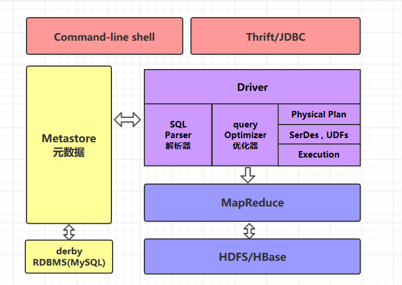
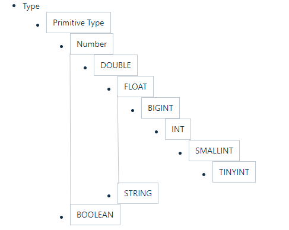

# Hive简介及核心概念

<nav>
<a href="#一简介">一、简介</a><br/>
<a href="#二Hive的体系架构">二、Hive的体系架构</a><br/>
<a href="#三数据类型">三、数据类型</a><br/>
&nbsp;&nbsp;&nbsp;&nbsp;&nbsp;&nbsp;&nbsp;&nbsp;<a href="#31-基本数据类型">3.1 基本数据类型</a><br/>
&nbsp;&nbsp;&nbsp;&nbsp;&nbsp;&nbsp;&nbsp;&nbsp;<a href="#32-隐式转换">3.2 隐式转换</a><br/>
&nbsp;&nbsp;&nbsp;&nbsp;&nbsp;&nbsp;&nbsp;&nbsp;<a href="#33-复杂类型">3.3 复杂类型</a><br/>
<a href="#四内容格式">四、内容格式</a><br/>
<a href="#五存储格式">五、存储格式</a><br/>
<a href="#六内部表和外部表">六、内部表和外部表</a><br/>
</nav>


## 一、简介

Hive 是一个构建在 Hadoop 之上的数据仓库，它可以将结构化的数据文件映射成表，并提供类 SQL 查询功能，用于查询的 SQL 语句会被转化为 MapReduce 作业，然后提交到 Hadoop 上运行。

**特点**：

1. 简单、容易上手 (提供了类似 sql 的查询语言 hql)，使得精通 sql 但是不了解 Java 编程的人也能很好地进行大数据分析；
3. 灵活性高，可以自定义用户函数 (UDF) 和存储格式；
4. 为超大的数据集设计的计算和存储能力，集群扩展容易;
5. 统一的元数据管理，可与 presto／impala／sparksql 等共享数据；
5. 执行延迟高，不适合做数据的实时处理，但适合做海量数据的离线处理。


## 二、Hive的体系架构

<div align="center">  </div>

### 2.1 command-line shell & thrift/jdbc

可以用 command-line shell 和 thrift／jdbc 两种方式来操作数据：

+ **command-line shell**：通过 hive 命令行的的方式来操作数据；
+ **thrift／jdbc**：通过 thrift 协议按照标准的 JDBC 的方式操作数据。

### 2.2 Metastore

在 Hive 中，表名、表结构、字段名、字段类型、表的分隔符等统一被称为元数据。所有的元数据默认存储在 Hive 内置的 derby 数据库中，但由于 derby 只能有一个实例，也就是说不能有多个命令行客户端同时访问，所以在实际生产环境中，通常使用 MySQL 代替 derby。

Hive 进行的是统一的元数据管理，就是说你在 Hive 上创建了一张表，然后在 presto／impala／sparksql 中都是可以直接使用的，它们会从 Metastore 中获取统一的元数据信息，同样的你在 presto／impala／sparksql 中创建一张表，在 Hive 中也可以直接使用。

### 2.3 HQL的执行流程

Hive 在执行一条 HQL 的时候，会经过以下步骤：

1. 语法解析：Antlr 定义 SQL 的语法规则，完成 SQL 词法，语法解析，将 SQL 转化为抽象 语法树 AST Tree；
2. 语义解析：遍历 AST Tree，抽象出查询的基本组成单元 QueryBlock；
3. 生成逻辑执行计划：遍历 QueryBlock，翻译为执行操作树 OperatorTree；
4. 优化逻辑执行计划：逻辑层优化器进行 OperatorTree 变换，合并不必要的 ReduceSinkOperator，减少 shuffle 数据量；
5. 生成物理执行计划：遍历 OperatorTree，翻译为 MapReduce 任务；
6. 优化物理执行计划：物理层优化器进行 MapReduce 任务的变换，生成最终的执行计划。

> 关于 Hive SQL 的详细执行流程可以参考美团技术团队的文章：[Hive SQL 的编译过程](https://tech.meituan.com/2014/02/12/hive-sql-to-mapreduce.html)


## 三、数据类型

### 3.1 基本数据类型

Hive 表中的列支持以下基本数据类型：

| 大类                                    | 类型                                                         |
| --------------------------------------- | ------------------------------------------------------------ |
| **Integers（整型）**                    | TINYINT—1 字节的有符号整数 <br/>SMALLINT—2 字节的有符号整数<br/> INT—4 字节的有符号整数<br/> BIGINT—8 字节的有符号整数 |
| **Boolean（布尔型）**                   | BOOLEAN—TRUE/FALSE                                           |
| **Floating point numbers（浮点型）**    | FLOAT— 单精度浮点型 <br/>DOUBLE—双精度浮点型                 |
| **Fixed point numbers（定点数）**       | DECIMAL—用户自定义精度定点数，比如 DECIMAL(7,2)               |
| **String types（字符串）**              | STRING—指定字符集的字符序列<br/> VARCHAR—具有最大长度限制的字符序列 <br/>CHAR—固定长度的字符序列 |
| **Date and time types（日期时间类型）** | TIMESTAMP —  时间戳 <br/>TIMESTAMP WITH LOCAL TIME ZONE — 时间戳，纳秒精度<br/> DATE—日期类型 |
| **Binary types（二进制类型）**          | BINARY—字节序列                                              |

> TIMESTAMP 和 TIMESTAMP WITH LOCAL TIME ZONE 的区别如下：
>
> - **TIMESTAMP WITH LOCAL TIME ZONE**：用户提交时间给数据库时，会被转换成数据库所在的时区来保存。查询时则按照查询客户端的不同，转换为查询客户端所在时区的时间。
> - **TIMESTAMP** ：提交什么时间就保存什么时间，查询时也不做任何转换。

### 3.2 隐式转换

Hive 中基本数据类型遵循以下的层次结构，按照这个层次结构，子类型到祖先类型允许隐式转换。例如 INT 类型的数据允许隐式转换为 BIGINT 类型。额外注意的是：按照类型层次结构允许将 STRING 类型隐式转换为 DOUBLE 类型。

<div align="center">  </div>


### 3.3 复杂类型

| 类型       | 描述                                                         | 示例                                   |
| ---------- | ------------------------------------------------------------ | -------------------------------------- |
| **STRUCT** | 类似于对象，是字段的集合，字段的类型可以不同，可以使用 ` 名称.字段名 ` 方式进行访问 | STRUCT ('xiaoming', 12 , '2018-12-12') |
| **MAP**    | 键值对的集合，可以使用 ` 名称[key]` 的方式访问对应的值          | map('a', 1, 'b', 2)                    |
| **ARRAY**  | 数组是一组具有相同类型和名称的变量的集合，可以使用 ` 名称[index]` 访问对应的值 | ARRAY('a', 'b', 'c', 'd')              |


### 3.4 示例

如下给出一个基本数据类型和复杂数据类型的使用示例：

```sql
CREATE TABLE students(
  name      STRING,   -- 姓名
  age       INT,      -- 年龄
  subject   ARRAY<STRING>,   --学科
  score     MAP<STRING,FLOAT>,  --各个学科考试成绩
  address   STRUCT<houseNumber:int, street:STRING, city:STRING, province：STRING>  --家庭居住地址
) ROW FORMAT DELIMITED FIELDS TERMINATED BY "\t";
```


## 四、内容格式

当数据存储在文本文件中，必须按照一定格式区别行和列，如使用逗号作为分隔符的 CSV 文件 (Comma-Separated Values) 或者使用制表符作为分隔值的 TSV 文件 (Tab-Separated Values)。但此时也存在一个缺点，就是正常的文件内容中也可能出现逗号或者制表符。

所以 Hive 默认使用了几个平时很少出现的字符，这些字符一般不会作为内容出现在文件中。Hive 默认的行和列分隔符如下表所示。

| 分隔符          | 描述                                                         |
| --------------- | ------------------------------------------------------------ |
| **\n**          | 对于文本文件来说，每行是一条记录，所以可以使用换行符来分割记录 |
| **^A (Ctrl+A)** | 分割字段 (列)，在 CREATE TABLE 语句中也可以使用八进制编码 `\001` 来表示 |
| **^B**          | 用于分割 ARRAY 或者 STRUCT 中的元素，或者用于 MAP 中键值对之间的分割，<br/>在 CREATE TABLE 语句中也可以使用八进制编码 `\002` 表示 |
| **^C**          | 用于 MAP 中键和值之间的分割，在 CREATE TABLE 语句中也可以使用八进制编码 `\003` 表示 |

使用示例如下：

```sql
CREATE TABLE page_view(viewTime INT, userid BIGINT)
 ROW FORMAT DELIMITED
   FIELDS TERMINATED BY '\001'
   COLLECTION ITEMS TERMINATED BY '\002'
   MAP KEYS TERMINATED BY '\003'
 STORED AS SEQUENCEFILE;
```


## 五、存储格式

### 5.1 支持的存储格式

Hive 会在 HDFS 为每个数据库上创建一个目录，数据库中的表是该目录的子目录，表中的数据会以文件的形式存储在对应的表目录下。Hive 支持以下几种文件存储格式：

| 格式             | 说明                                                         |
| ---------------- | ------------------------------------------------------------ |
| **TextFile**     | 存储为纯文本文件。 这是 Hive 默认的文件存储格式。这种存储方式数据不做压缩，磁盘开销大，数据解析开销大。 |
| **SequenceFile** | SequenceFile 是 Hadoop API 提供的一种二进制文件，它将数据以<key,value>的形式序列化到文件中。这种二进制文件内部使用 Hadoop 的标准的 Writable 接口实现序列化和反序列化。它与 Hadoop API 中的 MapFile 是互相兼容的。Hive 中的 SequenceFile 继承自 Hadoop API 的 SequenceFile，不过它的 key 为空，使用 value 存放实际的值，这样是为了避免 MR 在运行 map 阶段进行额外的排序操作。 |
| **RCFile**       | RCFile 文件格式是 FaceBook 开源的一种 Hive 的文件存储格式，首先将表分为几个行组，对每个行组内的数据按列存储，每一列的数据都是分开存储。 |
| **ORC Files**    | ORC 是在一定程度上扩展了 RCFile，是对 RCFile 的优化。            |
| **Avro Files**   | Avro 是一个数据序列化系统，设计用于支持大批量数据交换的应用。它的主要特点有：支持二进制序列化方式，可以便捷，快速地处理大量数据；动态语言友好，Avro 提供的机制使动态语言可以方便地处理 Avro 数据。 |
| **Parquet**      | Parquet 是基于 Dremel 的数据模型和算法实现的，面向分析型业务的列式存储格式。它通过按列进行高效压缩和特殊的编码技术，从而在降低存储空间的同时提高了 IO 效率。 |

> 以上压缩格式中 ORC 和 Parquet 的综合性能突出，使用较为广泛，推荐使用这两种格式。

### 5.2 指定存储格式

通常在创建表的时候使用 `STORED AS` 参数指定：

```sql
CREATE TABLE page_view(viewTime INT, userid BIGINT)
 ROW FORMAT DELIMITED
   FIELDS TERMINATED BY '\001'
   COLLECTION ITEMS TERMINATED BY '\002'
   MAP KEYS TERMINATED BY '\003'
 STORED AS SEQUENCEFILE;
```

各个存储文件类型指定方式如下：

- STORED AS TEXTFILE
- STORED AS SEQUENCEFILE
- STORED AS ORC
- STORED AS PARQUET
- STORED AS AVRO
- STORED AS RCFILE


## 六、内部表和外部表

内部表又叫做管理表 (Managed/Internal Table)，创建表时不做任何指定，默认创建的就是内部表。想要创建外部表 (External Table)，则需要使用 External 进行修饰。 内部表和外部表主要区别如下：

|              | 内部表                                                       | 外部表                                                       |
| ------------ | ------------------------------------------------------------ | ------------------------------------------------------------ |
| 数据存储位置 | 内部表数据存储的位置由 hive.metastore.warehouse.dir 参数指定，默认情况下表的数据存储在 HDFS 的 `/user/hive/warehouse/数据库名.db/表名/`  目录下 | 外部表数据的存储位置创建表时由 `Location` 参数指定；           |
| 导入数据     | 在导入数据到内部表，内部表将数据移动到自己的数据仓库目录下，数据的生命周期由 Hive 来进行管理 | 外部表不会将数据移动到自己的数据仓库目录下，只是在元数据中存储了数据的位置 |
| 删除表       | 删除元数据（metadata）和文件                                 | 只删除元数据（metadata）                                     |


## 参考资料

1. [Hive Getting Started](https://cwiki.apache.org/confluence/display/Hive/GettingStarted)
2. [Hive SQL 的编译过程](https://tech.meituan.com/2014/02/12/hive-sql-to-mapreduce.html)
3. [LanguageManual DDL](https://cwiki.apache.org/confluence/display/Hive/LanguageManual+DDL)
4. [LanguageManual Types](https://cwiki.apache.org/confluence/display/Hive/LanguageManual+Types)
5. [Managed vs. External Tables](https://cwiki.apache.org/confluence/display/Hive/Managed+vs.+External+Tables)
