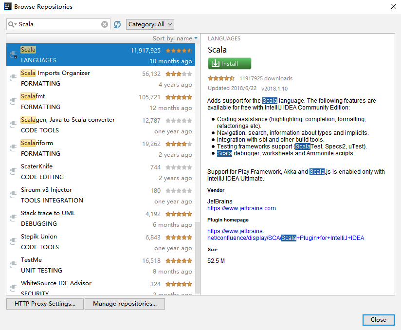
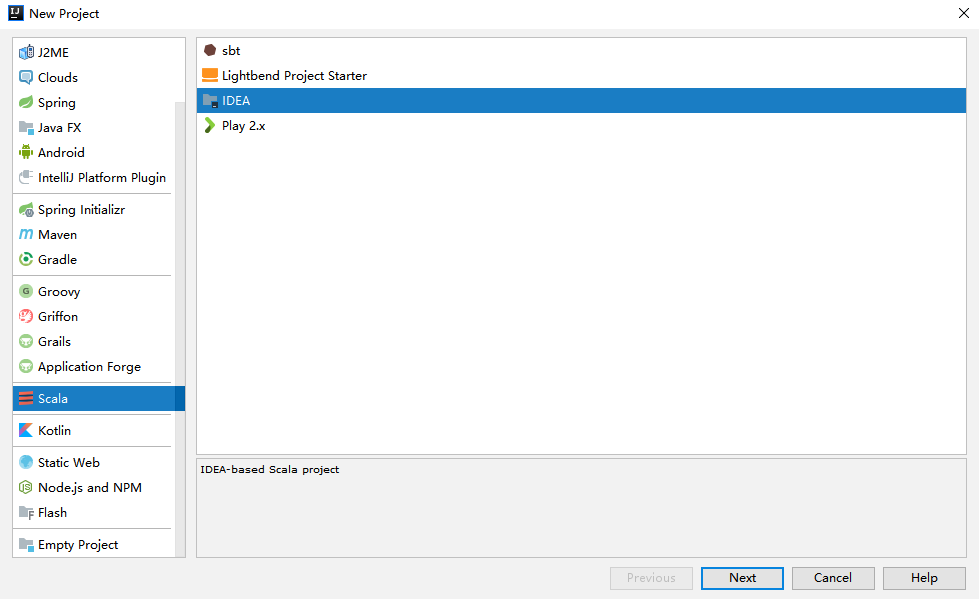
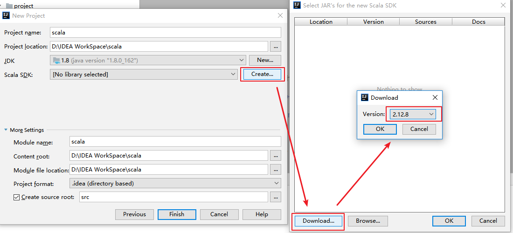
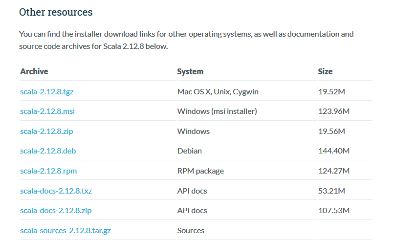
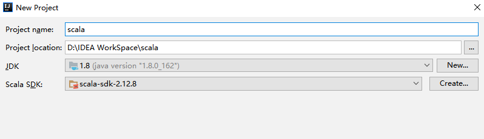
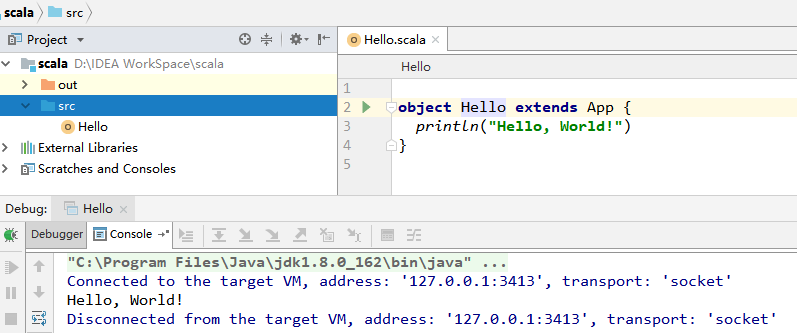
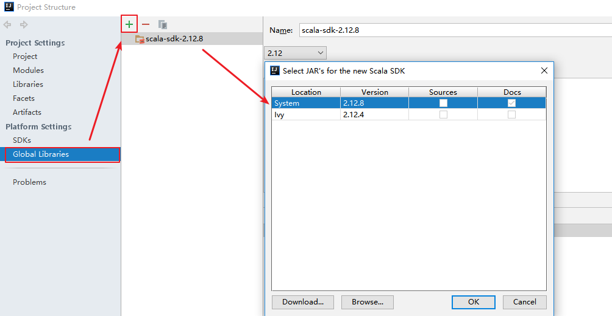
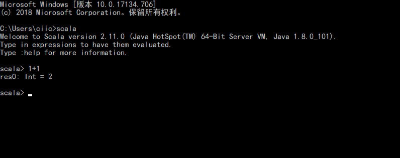

# Scala简介及开发环境配置

<nav>
<a href="#一Scala简介">一、Scala简介</a> 
<a href="#二配置IDEA开发环境">二、配置IDEA开发环境</a> 
</nav>

## 一、Scala简介

### 1.1 概念

Scala 全称为 Scalable Language，即“可伸缩的语言”，之所以这样命名，是因为它的设计目标是希望伴随着用户的需求一起成长。Scala 是一门综合了**面向对象**和**函数式编程概念**的**静态类型**的编程语言，它运行在标准的 Java 平台上，可以与所有的 Java 类库无缝协作。

### 1.2 特点

#### 1. Scala是面向对象的

Scala 是一种面向对象的语言，每个值都是对象，每个方法都是调用。举例来说，如果你执行 `1+2`，则对于 Scala 而言，实际是在调用 Int 类里定义的名为 `+` 的方法。

#### 2. Scala是函数式的

Scala 不只是一门纯的面对对象的语言，它也是功能完整的函数式编程语言。函数式编程以两大核心理念为指导：

+ 函数是一等公民；
+ 程序中的操作应该将输入值映射成输出值，而不是当场修改数据。即方法不应该有副作用。

### 1.3 Scala的优点

#### 1. 与Java的兼容

Scala 可以与 Java 无缝对接，其在执行时会被编译成 JVM 字节码，这使得其性能与 Java 相当。Scala 可以直接调用 Java 中的方法、访问 Java 中的字段、继承 Java 类、实现 Java 接口。Scala 重度复用并包装了原生的 Java 类型，并支持隐式转换。

#### 2. 精简的语法

Scala 的程序通常比较简洁，相比 Java 而言，代码行数会大大减少，这使得程序员对代码的阅读和理解更快，缺陷也更少。

#### 3. 高级语言的特性

Scala 具有高级语言的特定，对代码进行了高级别的抽象，能够让你更好地控制程序的复杂度，保证开发的效率。

#### 4. 静态类型

Scala 拥有非常先进的静态类型系统，Scala 不仅拥有与 Java 类似的允许嵌套类的类型系统，还支持使用泛型对类型进行参数化，用交集（intersection）来组合类型，以及使用抽象类型来进行隐藏类型的细节。通过这些特性，可以更快地设计出安全易用的程序和接口。

## 二、配置IDEA开发环境

### 2.1 前置条件

Scala 的运行依赖于 JDK，Scala 2.12.x 需要 JDK 1.8+。

### 2.2 安装Scala插件

IDEA 默认不支持 Scala 语言的开发，需要通过插件进行扩展。打开 IDEA，依次点击 **File** => **settings**=> **plugins** 选项卡，搜索 Scala 插件 (如下图)。找到插件后进行安装，并重启 IDEA 使得安装生效。

  

### 2.3 创建Scala项目

在 IDEA 中依次点击 **File** => **New** => **Project** 选项卡，然后选择创建 `Scala—IDEA` 工程：

  

### 2.4 下载Scala SDK

#### 1. 方式一

此时看到 `Scala SDK` 为空，依次点击 `Create` => `Download` ，选择所需的版本后，点击 `OK` 按钮进行下载，下载完成点击 `Finish` 进入工程。

  

#### 2. 方式二

方式一是 Scala 官方安装指南里使用的方式，但下载速度通常比较慢，且这种安装下并没有直接提供 Scala 命令行工具。所以个人推荐到官网下载安装包进行安装，下载地址：https://www.scala-lang.org/download/

这里我的系统是 Windows，下载 msi 版本的安装包后，一直点击下一步进行安装，安装完成后会自动配置好环境变量。

  

由于安装时已经自动配置好环境变量，所以 IDEA 会自动选择对应版本的 SDK。

  

### 2.5 创建Hello World

在工程 `src` 目录上右击 **New** => **Scala class** 创建 `Hello.scala`。输入代码如下，完成后点击运行按钮，成功运行则代表搭建成功。

  

### 2.6 切换Scala版本

在日常的开发中，由于对应软件（如 Spark）的版本切换，可能导致需要切换 Scala 的版本，则可以在 `Project Structures` 中的 `Global Libraries` 选项卡中进行切换。

  

### 2.7 使用scala命令行

采用 `msi` 方式安装，程序会自动配置好环境变量。此时可以直接使用命令行工具：

  

## 参考资料

1. Martin Odersky(著)，高宇翔 (译) . Scala 编程 (第 3 版)[M] . 电子工业出版社 . 2018-1-1 
2. https://www.scala-lang.org/download/
