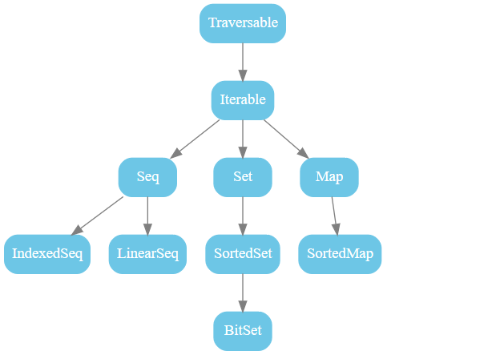
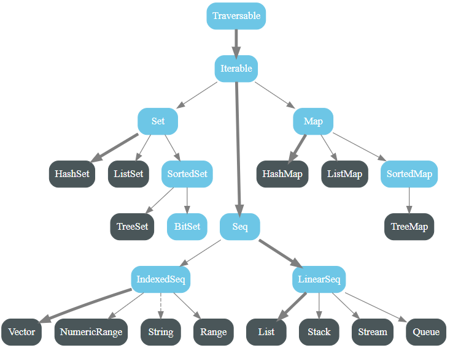
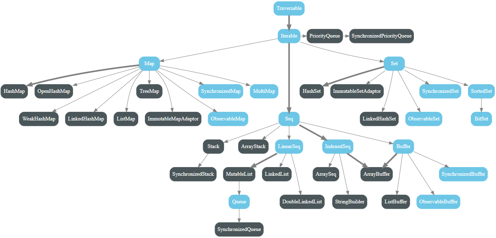

# 集合

<nav>
<a href="#一集合简介">一、集合简介</a><br/>
<a href="#二集合结构">二、集合结构</a><br/>
&nbsp;&nbsp;&nbsp;&nbsp;&nbsp;&nbsp;&nbsp;&nbsp;<a href="#31-scalacollection">3.1 scala.collection</a><br/>
&nbsp;&nbsp;&nbsp;&nbsp;&nbsp;&nbsp;&nbsp;&nbsp;<a href="#32-scalacollectionmutable">3.2 scala.collection.mutable</a><br/>
&nbsp;&nbsp;&nbsp;&nbsp;&nbsp;&nbsp;&nbsp;&nbsp;<a href="#32-scalacollectionimmutable">3.2 scala.collection.immutable</a><br/>
<a href="#三Trait-Traversable">三、Trait Traversable</a><br/>
<a href="#四Trait-Iterable">四、Trait Iterable</a><br/>
<a href="#五修改集合">五、修改集合</a><br/>
</nav>

## 一、集合简介

Scala 中拥有多种集合类型，主要分为可变的和不可变的集合两大类：

+ **可变集合**： 可以被修改。即可以更改，添加，删除集合中的元素；

+ **不可变集合类**：不能被修改。对集合执行更改，添加或删除操作都会返回一个新的集合，而不是修改原来的集合。

## 二、集合结构

Scala 中的大部分集合类都存在三类变体，分别位于 `scala.collection`, `scala.collection.immutable`, `scala.collection.mutable` 包中。还有部分集合类位于 `scala.collection.generic` 包下。

- **scala.collection.immutable** ：包是中的集合是不可变的；
- **scala.collection.mutable** ：包中的集合是可变的；
- **scala.collection** ：包中的集合，既可以是可变的，也可以是不可变的。

```scala
val sortSet = scala.collection.SortedSet(1, 2, 3, 4, 5)
val mutableSet = collection.mutable.SortedSet(1, 2, 3, 4, 5)
val immutableSet = collection.immutable.SortedSet(1, 2, 3, 4, 5)
```

如果你仅写了 `Set` 而没有加任何前缀也没有进行任何 `import`，则 Scala 默认采用不可变集合类。

```scala
scala> Set(1,2,3,4,5)
res0: scala.collection.immutable.Set[Int] = Set(5, 1, 2, 3, 4)
```

### 3.1 scala.collection

scala.collection 包中所有集合如下图：

<div align="center">  </div>

### 3.2 scala.collection.mutable

scala.collection.mutable 包中所有集合如下图：

<div align="center">  </div>

### 3.2 scala.collection.immutable

scala.collection.immutable 包中所有集合如下图：

<div align="center">  </div>

## 三、Trait Traversable

Scala 中所有集合的顶层实现是 `Traversable` 。它唯一的抽象方法是 `foreach`：

```scala
def foreach[U](f: Elem => U)
```

实现 `Traversable` 的集合类只需要实现这个抽象方法，其他方法可以从 `Traversable` 继承。`Traversable` 中的所有可用方法如下：

| **方法**                            | **作用**                                                     |
| ----------------------------------- | ------------------------------------------------------------ |
| **Abstract Method:**                |                                                              |
| `xs foreach f`                      | 为 xs 的每个元素执行函数 f                                   |
| **Addition:**                       |                                                              |
| `xs ++ ys`                          | 一个包含 xs 和 ys 中所有元素的新的集合。 ys 是一个 Traversable 或 Iterator。 |
| **Maps:**                           |                                                              |
| `xs map f`                          | 对 xs 中每一个元素应用函数 f，并返回一个新的集合             |
| `xs flatMap f`                      | 对 xs 中每一个元素应用函数 f，最后将结果合并成一个新的集合   |
| `xs collect f`                      | 对 xs 中每一个元素调用偏函数 f，并返回一个新的集合           |
| **Conversions:**                    |                                                              |
| `xs.toArray`                        | 将集合转化为一个 Array                                       |
| `xs.toList`                         | 将集合转化为一个 List                                        |
| `xs.toIterable`                     | 将集合转化为一个 Iterable                                    |
| `xs.toSeq`                          | 将集合转化为一个 Seq                                         |
| `xs.toIndexedSeq`                   | 将集合转化为一个 IndexedSeq                                  |
| `xs.toStream`                       | 将集合转化为一个延迟计算的流                                 |
| `xs.toSet`                          | 将集合转化为一个 Set                                         |
| `xs.toMap`                          | 将一个（key, value）对的集合转化为一个 Map。 如果当前集合的元素类型不是（key, value）对形式， 则报静态类型错误。 |
| **Copying:**                        |                                                              |
| `xs copyToBuffer buf`               | 拷贝集合中所有元素到缓存 buf                                 |
| `xs copyToArray(arr,s,n)`           | 从索引 s 开始，将集合中最多 n 个元素复制到数组 arr。 最后两个参数是可选的。 |
| **Size info:**                      |                                                              |
| `xs.isEmpty`                        | 判断集合是否为空                                             |
| `xs.nonEmpty`                       | 判断集合是否包含元素                                         |
| `xs.size`                           | 返回集合中元素的个数                                         |
| `xs.hasDefiniteSize`                | 如果 xs 具有有限大小，则为真。                               |
| **Element Retrieval:**              |                                                              |
| `xs.head`                           | 返回集合中的第一个元素（如果无序，则随机返回）               |
| `xs.headOption`                     | 以 Option 的方式返回集合中的第一个元素， 如果集合为空则返回 None |
| `xs.last`                           | 返回集合中的最后一个元素（如果无序，则随机返回）             |
| `xs.lastOption`                     | 以 Option 的方式返回集合中的最后一个元素， 如果集合为空则返回 None |
| `xs find p`                         | 以 Option 的方式返回满足条件 p 的第一个元素， 如果都不满足则返回 None |
| **Subcollection:**                  |                                                              |
| `xs.tail`                           | 除了第一个元素之外的其他元素组成的集合                       |
| `xs.init`                           | 除了最后一个元素之外的其他元素组成的集合                     |
| `xs slice (from, to)`               | 返回给定索引范围之内的元素组成的集合 （包含 from 位置的元素但不包含 to 位置的元素） |
| `xs take n`                         | 返回 xs 的前 n 个元素组成的集合（如果无序，则返回任意 n 个元素） |
| `xs drop n`                         | 返回 xs 的后 n 个元素组成的集合（如果无序，则返回任意 n 个元素） |
| `xs takeWhile p`                    | 从第一个元素开始查找满足条件 p 的元素， 直到遇到一个不满足条件的元素，返回所有遍历到的值。 |
| `xs dropWhile p`                    | 从第一个元素开始查找满足条件 p 的元素， 直到遇到一个不满足条件的元素，返回所有未遍历到的值。 |
| `xs filter p`                       | 返回满足条件 p 的所有元素的集合                              |
| `xs withFilter p`                   | 集合的非严格的过滤器。后续对 xs 调用方法 map、flatMap 以及 withFilter 都只用作于满足条件 p 的元素，而忽略其他元素 |
| `xs filterNot p`                    | 返回不满足条件 p 的所有元素组成的集合                        |
| **Subdivisions:**                   |                                                              |
| `xs splitAt n`                      | 在给定位置拆分集合，返回一个集合对 (xs take n, xs drop n)    |
| `xs span p`                         | 根据给定条件拆分集合，返回一个集合对 (xs takeWhile p, xs dropWhile p)。即遍历元素，直到遇到第一个不符合条件的值则结束遍历，将遍历到的值和未遍历到的值分别放入两个集合返回。 |
| `xs partition p`                    | 按照筛选条件对元素进行分组                                   |
| `xs groupBy f`                      | 根据鉴别器函数 f 将 xs 划分为集合映射                        |
| **Element Conditions:**             |                                                              |
| `xs forall p`                       | 判断集合中所有的元素是否都满足条件 p                         |
| `xs exists p`                       | 判断集合中是否存在一个元素满足条件 p                         |
| `xs count p`                        | xs 中满足条件 p 的元素的个数                                 |
| **Folds:**                          |                                                              |
| `(z /: xs) (op)`                    | 以 z 为初始值，从左到右对 xs 中的元素执行操作为 op 的归约操作 |
| `(xs :\ z) (op)`                    | 以 z 为初始值，从右到左对 xs 中的元素执行操作为 op 的归约操作 |
| `xs.foldLeft(z) (op)`               | 同 (z /: xs) (op)                                            |
| `xs.foldRight(z) (op)`              | 同 (xs :\ z) (op)                                            |
| `xs reduceLeft op`                  | 从左到右对 xs 中的元素执行操作为 op 的归约操作               |
| `xs reduceRight op`                 | 从右到左对 xs 中的元素执行操作为 op 的归约操作               |
| **Specific Folds:**                 |                                                              |
| `xs.sum`                            | 累计求和                                                     |
| `xs.product`                        | 累计求积                                                     |
| `xs.min`                            | xs 中的最小值                                                |
| `xs.max`                            | xs 中的最大值                                                |
| **String:**                         |                                                              |
| `xs addString (b, start, sep, end)` | 向 StringBuilder  b 中添加一个字符串， 该字符串包含 xs 的所有元素。start、seq 和 end  都是可选的，seq 为分隔符，start 为开始符号，end 为结束符号。 |
| `xs mkString (start, seq, end)`     | 将集合转化为一个字符串。start、seq 和 end  都是可选的，seq 为分隔符，start 为开始符号，end 为结束符号。 |
| `xs.stringPrefix`                   | 返回 xs.toString 字符串开头的集合名称                        |
| **Views:**                          |                                                              |
| `xs.view`                           | 生成 xs 的视图                                               |
| `xs view (from, to)`                | 生成 xs 上指定索引范围内元素的视图                            |


下面为部分方法的使用示例：

```scala
scala> List(1, 2, 3, 4, 5, 6).collect { case i if i % 2 == 0 => i * 10 }
res0: List[Int] = List(20, 40, 60)

scala> List(1, 2, 3, 4, 5, 6).withFilter(_ % 2 == 0).map(_ * 10)
res1: List[Int] = List(20, 40, 60)

scala> (10 /: List(1, 2, 3)) (_ + _)
res2: Int = 16

scala> List(1, 2, 3, -4, 5) takeWhile (_ > 0)
res3: List[Int] = List(1, 2, 3)

scala> List(1, 2, 3, -4, 5) span (_ > 0)
res4: (List[Int], List[Int]) = (List(1, 2, 3),List(-4, 5))

scala> List(1, 2, 3).mkString("[","-","]")
res5: String = [1-2-3]
```


## 四、Trait Iterable

Scala 中所有的集合都直接或者间接实现了 `Iterable` 特质，`Iterable` 拓展自 `Traversable`，并额外定义了部分方法：

| **方法**               | **作用**                                                     |
| ---------------------- | ------------------------------------------------------------ |
| **Abstract Method:**   |                                                              |
| `xs.iterator`          | 返回一个迭代器，用于遍历 xs 中的元素， 与 foreach 遍历元素的顺序相同。 |
| **Other Iterators:**   |                                                              |
| `xs grouped size`      | 返回一个固定大小的迭代器                                     |
| `xs sliding size`      | 返回一个固定大小的滑动窗口的迭代器                           |
| **Subcollections:**    |                                                              |
| `xs takeRigtht n`      | 返回 xs 中最后 n 个元素组成的集合（如果无序，则返回任意 n 个元素组成的集合） |
| `xs dropRight n`       | 返回 xs 中除了最后 n 个元素外的部分                          |
| **Zippers:**           |                                                              |
| `xs zip ys`            | 返回 xs 和 ys 的对应位置上的元素对组成的集合                 |
| `xs zipAll (ys, x, y)` | 返回 xs 和 ys 的对应位置上的元素对组成的集合。其中较短的序列通过附加元素 x 或 y 来扩展以匹配较长的序列。 |
| `xs.zipWithIndex`      | 返回一个由 xs 中元素及其索引所组成的元素对的集合             |
| **Comparison:**        |                                                              |
| `xs sameElements ys`   | 测试 xs 和 ys 是否包含相同顺序的相同元素                     |

所有方法示例如下：

```scala
scala> List(1, 2, 3).iterator.reduce(_ * _ * 10)
res0: Int = 600

scala> List("a","b","c","d","e") grouped 2 foreach println
List(a, b)
List(c, d)
List(e)

scala> List("a","b","c","d","e") sliding 2 foreach println
List(a, b)
List(b, c)
List(c, d)
List(d, e)

scala>  List("a","b","c","d","e").takeRight(3)
res1: List[String] = List(c, d, e)

scala> List("a","b","c","d","e").dropRight(3)
res2: List[String] = List(a, b)

scala> List("a","b","c").zip(List(1,2,3))
res3: List[(String, Int)] = List((a,1), (b,2), (c,3))

scala> List("a","b","c","d").zipAll(List(1,2,3),"",4)
res4: List[(String, Int)] = List((a,1), (b,2), (c,3), (d,4))

scala> List("a","b","c").zipAll(List(1,2,3,4),"d","")
res5: List[(String, Any)] = List((a,1), (b,2), (c,3), (d,4))

scala> List("a", "b", "c").zipWithIndex
res6: List[(String, Int)] = List((a,0), (b,1), (c,2))

scala> List("a", "b") sameElements List("a", "b")
res7: Boolean = true

scala> List("a", "b") sameElements List("b", "a")
res8: Boolean = false
```


## 五、修改集合

当你想对集合添加或者删除元素，需要根据不同的集合类型选择不同的操作符号：

| 操作符                                                       | 描述                                              | 集合类型              |
| ------------------------------------------------------------ | ------------------------------------------------- | --------------------- |
| coll(k)<br/>即 coll.apply(k)                                  | 获取指定位置的元素                                | Seq, Map              |
| coll :+ elem<br/>elem +: coll                                | 向集合末尾或者集合头增加元素                      | Seq                   |
| coll + elem<br/>coll + (e1, e2, ...)                         | 追加元素                                          | Seq, Map              |
| coll - elem<br/>coll - (e1, e2, ...)                         | 删除元素                                          | Set, Map, ArrayBuffer |
| coll ++ coll2<br/>coll2 ++: coll                             | 合并集合                                          | Iterable              |
| coll -- coll2                                                | 移除 coll 中包含的 coll2 中的元素                     | Set, Map, ArrayBuffer |
| elem :: lst<br/>lst2 :: lst                                  | 把指定列表 (lst2) 或者元素 (elem) 添加到列表 (lst) 头部 | List                  |
| list ::: list2                                               | 合并 List                                          | List                  |
| set \| set2<br/>set & set2<br/>set &~ set2                   | 并集、交集、差集                                  | Set                   |
| coll += elem<br/>coll += (e1, e2, ...)<br/>coll ++= coll2<br/>coll -= elem<br/>coll -= (e1, e2, ...)<br/>coll --= coll2 | 添加或者删除元素，并将修改后的结果赋值给集合本身  | 可变集合              |
| elem +=: coll<br/>coll2 ++=: coll                            | 在集合头部追加元素或集合                          | ArrayBuffer           |


## 参考资料

1. https://docs.scala-lang.org/overviews/collections/overview.html
2. https://docs.scala-lang.org/overviews/collections/trait-traversable.html
3. https://docs.scala-lang.org/overviews/collections/trait-iterable.html
