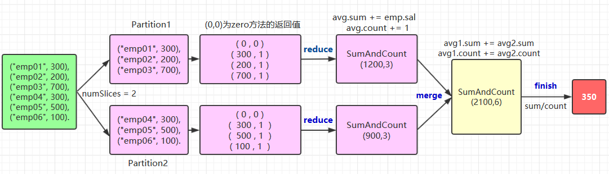

# 聚合函数Aggregations

<nav>
<a href="#一简单聚合">一、简单聚合</a><br/>
&nbsp;&nbsp;&nbsp;&nbsp;&nbsp;&nbsp;&nbsp;&nbsp;<a href="#11-数据准备">1.1 数据准备</a><br/>
&nbsp;&nbsp;&nbsp;&nbsp;&nbsp;&nbsp;&nbsp;&nbsp;<a href="#12-count">1.2 count</a><br/>
&nbsp;&nbsp;&nbsp;&nbsp;&nbsp;&nbsp;&nbsp;&nbsp;<a href="#13-countDistinct">1.3 countDistinct</a><br/>
&nbsp;&nbsp;&nbsp;&nbsp;&nbsp;&nbsp;&nbsp;&nbsp;<a href="#14-approx_count_distinct">1.4 approx_count_distinct </a><br/>
&nbsp;&nbsp;&nbsp;&nbsp;&nbsp;&nbsp;&nbsp;&nbsp;<a href="#15-first--last">1.5 first & last </a><br/>
&nbsp;&nbsp;&nbsp;&nbsp;&nbsp;&nbsp;&nbsp;&nbsp;<a href="#16-min--max">1.6 min & max</a><br/>
&nbsp;&nbsp;&nbsp;&nbsp;&nbsp;&nbsp;&nbsp;&nbsp;<a href="#17-sum--sumDistinct">1.7 sum & sumDistinct</a><br/>
&nbsp;&nbsp;&nbsp;&nbsp;&nbsp;&nbsp;&nbsp;&nbsp;<a href="#18-avg">1.8 avg</a><br/>
&nbsp;&nbsp;&nbsp;&nbsp;&nbsp;&nbsp;&nbsp;&nbsp;<a href="#19-数学函数">1.9 数学函数</a><br/>
&nbsp;&nbsp;&nbsp;&nbsp;&nbsp;&nbsp;&nbsp;&nbsp;<a href="#110-聚合数据到集合">1.10 聚合数据到集合</a><br/>
<a href="#二分组聚合">二、分组聚合</a><br/>
&nbsp;&nbsp;&nbsp;&nbsp;&nbsp;&nbsp;&nbsp;&nbsp;<a href="#21-简单分组">2.1 简单分组</a><br/>
&nbsp;&nbsp;&nbsp;&nbsp;&nbsp;&nbsp;&nbsp;&nbsp;<a href="#22-分组聚合">2.2 分组聚合</a><br/>
<a href="#三自定义聚合函数">三、自定义聚合函数</a><br/>
&nbsp;&nbsp;&nbsp;&nbsp;&nbsp;&nbsp;&nbsp;&nbsp;<a href="#31-有类型的自定义函数">3.1 有类型的自定义函数</a><br/>
&nbsp;&nbsp;&nbsp;&nbsp;&nbsp;&nbsp;&nbsp;&nbsp;<a href="#32-无类型的自定义聚合函数">3.2 无类型的自定义聚合函数</a><br/>
</nav>


## 一、简单聚合

### 1.1 数据准备

```scala
// 需要导入 spark sql 内置的函数包
import org.apache.spark.sql.functions._

val spark = SparkSession.builder().appName("aggregations").master("local[2]").getOrCreate()
val empDF = spark.read.json("/usr/file/json/emp.json")
// 注册为临时视图，用于后面演示 SQL 查询
empDF.createOrReplaceTempView("emp")
empDF.show()
```

> 注：emp.json 可以从本仓库的[resources](https://github.com/heibaiying/BigData-Notes/tree/master/resources) 目录下载。

### 1.2 count

```scala
// 计算员工人数
empDF.select(count("ename")).show()
```

### 1.3 countDistinct

```scala
// 计算姓名不重复的员工人数
empDF.select(countDistinct("deptno")).show()
```

### 1.4 approx_count_distinct 

通常在使用大型数据集时，你可能关注的只是近似值而不是准确值，这时可以使用 approx_count_distinct 函数，并可以使用第二个参数指定最大允许误差。

```scala
empDF.select(approx_count_distinct ("ename",0.1)).show()
```

### 1.5 first & last 

获取 DataFrame 中指定列的第一个值或者最后一个值。

```scala
empDF.select(first("ename"),last("job")).show()
```

### 1.6 min & max

获取 DataFrame 中指定列的最小值或者最大值。

```scala
empDF.select(min("sal"),max("sal")).show()
```

### 1.7 sum & sumDistinct

求和以及求指定列所有不相同的值的和。

```scala
empDF.select(sum("sal")).show()
empDF.select(sumDistinct("sal")).show()
```

### 1.8 avg

内置的求平均数的函数。

```scala
empDF.select(avg("sal")).show()
```

### 1.9 数学函数

Spark SQL 中还支持多种数学聚合函数，用于通常的数学计算，以下是一些常用的例子：

```scala
// 1.计算总体方差、均方差、总体标准差、样本标准差
empDF.select(var_pop("sal"), var_samp("sal"), stddev_pop("sal"), stddev_samp("sal")).show()

// 2.计算偏度和峰度
empDF.select(skewness("sal"), kurtosis("sal")).show()

// 3. 计算两列的皮尔逊相关系数、样本协方差、总体协方差。(这里只是演示，员工编号和薪资两列实际上并没有什么关联关系)
empDF.select(corr("empno", "sal"), covar_samp("empno", "sal"),covar_pop("empno", "sal")).show()
```

### 1.10 聚合数据到集合

```scala
scala>  empDF.agg(collect_set("job"), collect_list("ename")).show()

输出：
+--------------------+--------------------+
|    collect_set(job)| collect_list(ename)|
+--------------------+--------------------+
|[MANAGER, SALESMA...|[SMITH, ALLEN, WA...|
+--------------------+--------------------+
```


## 二、分组聚合

### 2.1 简单分组

```scala
empDF.groupBy("deptno", "job").count().show()
//等价 SQL
spark.sql("SELECT deptno, job, count(*) FROM emp GROUP BY deptno, job").show()

输出：
+------+---------+-----+
|deptno|      job|count|
+------+---------+-----+
|    10|PRESIDENT|    1|
|    30|    CLERK|    1|
|    10|  MANAGER|    1|
|    30|  MANAGER|    1|
|    20|    CLERK|    2|
|    30| SALESMAN|    4|
|    20|  ANALYST|    2|
|    10|    CLERK|    1|
|    20|  MANAGER|    1|
+------+---------+-----+
```

### 2.2 分组聚合

```scala
empDF.groupBy("deptno").agg(count("ename").alias("人数"), sum("sal").alias("总工资")).show()
// 等价语法
empDF.groupBy("deptno").agg("ename"->"count","sal"->"sum").show()
// 等价 SQL
spark.sql("SELECT deptno, count(ename) ,sum(sal) FROM emp GROUP BY deptno").show()

输出：
+------+----+------+
|deptno|人数|总工资|
+------+----+------+
|    10|   3|8750.0|
|    30|   6|9400.0|
|    20|   5|9375.0|
+------+----+------+
```


## 三、自定义聚合函数

Scala 提供了两种自定义聚合函数的方法，分别如下：

- 有类型的自定义聚合函数，主要适用于 DataSet；
- 无类型的自定义聚合函数，主要适用于 DataFrame。

以下分别使用两种方式来自定义一个求平均值的聚合函数，这里以计算员工平均工资为例。两种自定义方式分别如下：

### 3.1 有类型的自定义函数

```scala
import org.apache.spark.sql.expressions.Aggregator
import org.apache.spark.sql.{Encoder, Encoders, SparkSession, functions}

// 1.定义员工类,对于可能存在 null 值的字段需要使用 Option 进行包装
case class Emp(ename: String, comm: scala.Option[Double], deptno: Long, empno: Long,
               hiredate: String, job: String, mgr: scala.Option[Long], sal: Double)

// 2.定义聚合操作的中间输出类型
case class SumAndCount(var sum: Double, var count: Long)

/* 3.自定义聚合函数
 * @IN  聚合操作的输入类型
 * @BUF reduction 操作输出值的类型
 * @OUT 聚合操作的输出类型
 */
object MyAverage extends Aggregator[Emp, SumAndCount, Double] {
    
    // 4.用于聚合操作的的初始零值
    override def zero: SumAndCount = SumAndCount(0, 0)
    
    // 5.同一分区中的 reduce 操作
    override def reduce(avg: SumAndCount, emp: Emp): SumAndCount = {
        avg.sum += emp.sal
        avg.count += 1
        avg
    }

    // 6.不同分区中的 merge 操作
    override def merge(avg1: SumAndCount, avg2: SumAndCount): SumAndCount = {
        avg1.sum += avg2.sum
        avg1.count += avg2.count
        avg1
    }

    // 7.定义最终的输出类型
    override def finish(reduction: SumAndCount): Double = reduction.sum / reduction.count

    // 8.中间类型的编码转换
    override def bufferEncoder: Encoder[SumAndCount] = Encoders.product

    // 9.输出类型的编码转换
    override def outputEncoder: Encoder[Double] = Encoders.scalaDouble
}

object SparkSqlApp {

    // 测试方法
    def main(args: Array[String]): Unit = {

        val spark = SparkSession.builder().appName("Spark-SQL").master("local[2]").getOrCreate()
        import spark.implicits._
        val ds = spark.read.json("file/emp.json").as[Emp]

        // 10.使用内置 avg() 函数和自定义函数分别进行计算，验证自定义函数是否正确
        val myAvg = ds.select(MyAverage.toColumn.name("average_sal")).first()
        val avg = ds.select(functions.avg(ds.col("sal"))).first().get(0)

        println("自定义 average 函数 : " + myAvg)
        println("内置的 average 函数 : " + avg)
    }
}
```

自定义聚合函数需要实现的方法比较多，这里以绘图的方式来演示其执行流程，以及每个方法的作用：

<div align="center">  </div>


关于 `zero`,`reduce`,`merge`,`finish` 方法的作用在上图都有说明，这里解释一下中间类型和输出类型的编码转换，这个写法比较固定，基本上就是两种情况：

- 自定义类型 Case Class 或者元组就使用 `Encoders.product` 方法；
- 基本类型就使用其对应名称的方法，如 `scalaByte `，`scalaFloat`，`scalaShort` 等，示例如下：

```scala
override def bufferEncoder: Encoder[SumAndCount] = Encoders.product
override def outputEncoder: Encoder[Double] = Encoders.scalaDouble
```


### 3.2 无类型的自定义聚合函数

理解了有类型的自定义聚合函数后，无类型的定义方式也基本相同，代码如下：

```scala
import org.apache.spark.sql.expressions.{MutableAggregationBuffer, UserDefinedAggregateFunction}
import org.apache.spark.sql.types._
import org.apache.spark.sql.{Row, SparkSession}

object MyAverage extends UserDefinedAggregateFunction {
  // 1.聚合操作输入参数的类型,字段名称可以自定义
  def inputSchema: StructType = StructType(StructField("MyInputColumn", LongType) :: Nil)

  // 2.聚合操作中间值的类型,字段名称可以自定义
  def bufferSchema: StructType = {
    StructType(StructField("sum", LongType) :: StructField("MyCount", LongType) :: Nil)
  }

  // 3.聚合操作输出参数的类型
  def dataType: DataType = DoubleType

  // 4.此函数是否始终在相同输入上返回相同的输出,通常为 true
  def deterministic: Boolean = true

  // 5.定义零值
  def initialize(buffer: MutableAggregationBuffer): Unit = {
    buffer(0) = 0L
    buffer(1) = 0L
  }

  // 6.同一分区中的 reduce 操作
  def update(buffer: MutableAggregationBuffer, input: Row): Unit = {
    if (!input.isNullAt(0)) {
      buffer(0) = buffer.getLong(0) + input.getLong(0)
      buffer(1) = buffer.getLong(1) + 1
    }
  }

  // 7.不同分区中的 merge 操作
  def merge(buffer1: MutableAggregationBuffer, buffer2: Row): Unit = {
    buffer1(0) = buffer1.getLong(0) + buffer2.getLong(0)
    buffer1(1) = buffer1.getLong(1) + buffer2.getLong(1)
  }

  // 8.计算最终的输出值
  def evaluate(buffer: Row): Double = buffer.getLong(0).toDouble / buffer.getLong(1)
}

object SparkSqlApp {

  // 测试方法
  def main(args: Array[String]): Unit = {

    val spark = SparkSession.builder().appName("Spark-SQL").master("local[2]").getOrCreate()
    // 9.注册自定义的聚合函数
    spark.udf.register("myAverage", MyAverage)

    val df = spark.read.json("file/emp.json")
    df.createOrReplaceTempView("emp")

    // 10.使用自定义函数和内置函数分别进行计算
    val myAvg = spark.sql("SELECT myAverage(sal) as avg_sal FROM emp").first()
    val avg = spark.sql("SELECT avg(sal) as avg_sal FROM emp").first()

    println("自定义 average 函数 : " + myAvg)
    println("内置的 average 函数 : " + avg)
  }
}
```


## 参考资料

1. Matei Zaharia, Bill Chambers . Spark: The Definitive Guide[M] . 2018-02 
