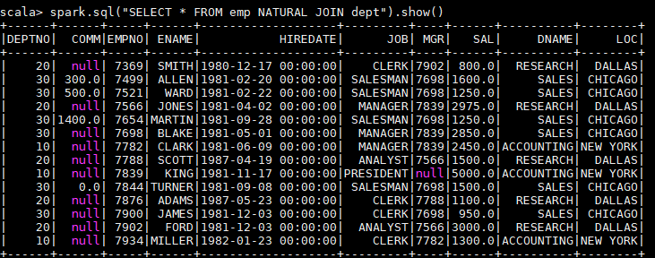
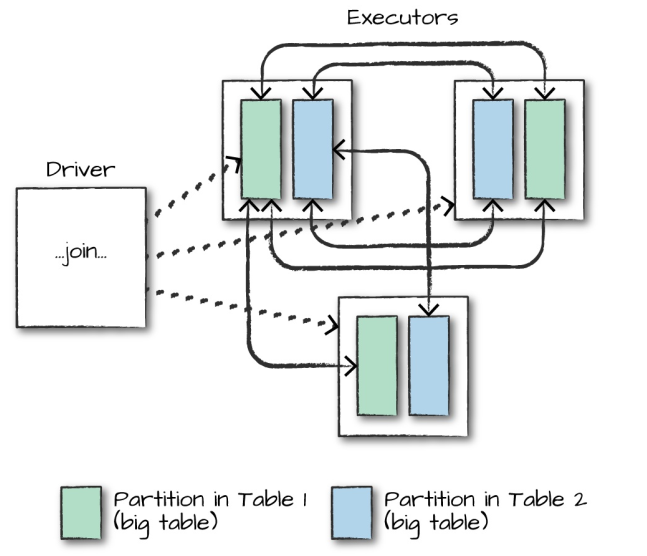
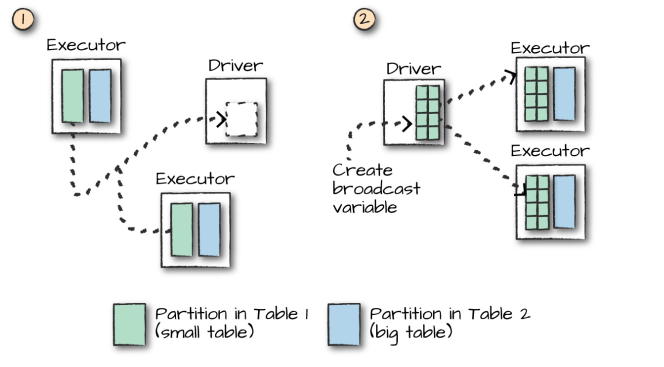

# Spark SQL JOIN

<nav>
<a href="#一-数据准备">一、 数据准备</a><br/>
<a href="#二连接类型">二、连接类型</a><br/>
&nbsp;&nbsp;&nbsp;&nbsp;&nbsp;&nbsp;&nbsp;&nbsp;<a href="#21-INNER-JOIN">2.1 INNER JOIN</a><br/>
&nbsp;&nbsp;&nbsp;&nbsp;&nbsp;&nbsp;&nbsp;&nbsp;<a href="#22-FULL-OUTER-JOIN">2.2 FULL OUTER JOIN</a><br/>
&nbsp;&nbsp;&nbsp;&nbsp;&nbsp;&nbsp;&nbsp;&nbsp;<a href="#23-LEFT-OUTER-JOIN"> 2.3 LEFT OUTER JOIN</a><br/>
&nbsp;&nbsp;&nbsp;&nbsp;&nbsp;&nbsp;&nbsp;&nbsp;<a href="#24-RIGHT-OUTER-JOIN">2.4 RIGHT OUTER JOIN</a><br/>
&nbsp;&nbsp;&nbsp;&nbsp;&nbsp;&nbsp;&nbsp;&nbsp;<a href="#25-LEFT-SEMI-JOIN">2.5 LEFT SEMI JOIN</a><br/>
&nbsp;&nbsp;&nbsp;&nbsp;&nbsp;&nbsp;&nbsp;&nbsp;<a href="#26-LEFT-ANTI-JOIN">2.6 LEFT ANTI JOIN </a><br/>
&nbsp;&nbsp;&nbsp;&nbsp;&nbsp;&nbsp;&nbsp;&nbsp;<a href="#27-CROSS-JOIN">2.7 CROSS JOIN</a><br/>
&nbsp;&nbsp;&nbsp;&nbsp;&nbsp;&nbsp;&nbsp;&nbsp;<a href="#28-NATURAL-JOIN">2.8 NATURAL JOIN</a><br/>
<a href="#三连接的执行">三、连接的执行</a><br/>
</nav>

## 一、 数据准备

本文主要介绍 Spark SQL 的多表连接，需要预先准备测试数据。分别创建员工和部门的 Datafame，并注册为临时视图，代码如下：

```scala
val spark = SparkSession.builder().appName("aggregations").master("local[2]").getOrCreate()

val empDF = spark.read.json("/usr/file/json/emp.json")
empDF.createOrReplaceTempView("emp")

val deptDF = spark.read.json("/usr/file/json/dept.json")
deptDF.createOrReplaceTempView("dept")
```

两表的主要字段如下：

```properties
emp 员工表
 |-- ENAME: 员工姓名
 |-- DEPTNO: 部门编号
 |-- EMPNO: 员工编号
 |-- HIREDATE: 入职时间
 |-- JOB: 职务
 |-- MGR: 上级编号
 |-- SAL: 薪资
 |-- COMM: 奖金  
```

```properties
dept 部门表
 |-- DEPTNO: 部门编号
 |-- DNAME:  部门名称
 |-- LOC:    部门所在城市
```

> 注：emp.json，dept.json 可以在本仓库的[resources](https://github.com/heibaiying/BigData-Notes/tree/master/resources) 目录进行下载。


## 二、连接类型

Spark 中支持多种连接类型：

+ **Inner Join** : 内连接；
+ **Full Outer Join** :  全外连接；
+ **Left Outer Join** :  左外连接；
+ **Right Outer Join** :  右外连接；
+ **Left Semi Join** :  左半连接；
+ **Left Anti Join** :  左反连接；
+ **Natural Join** :  自然连接；
+ **Cross (or Cartesian) Join** :  交叉 (或笛卡尔) 连接。

其中内，外连接，笛卡尔积均与普通关系型数据库中的相同，如下图所示：

<div align="center">  </div>

这里解释一下左半连接和左反连接，这两个连接等价于关系型数据库中的 `IN` 和 `NOT IN` 字句：

```sql
-- LEFT SEMI JOIN
SELECT * FROM emp LEFT SEMI JOIN dept ON emp.deptno = dept.deptno
-- 等价于如下的 IN 语句
SELECT * FROM emp WHERE deptno IN (SELECT deptno FROM dept)

-- LEFT ANTI JOIN
SELECT * FROM emp LEFT ANTI JOIN dept ON emp.deptno = dept.deptno
-- 等价于如下的 IN 语句
SELECT * FROM emp WHERE deptno NOT IN (SELECT deptno FROM dept)
```

所有连接类型的示例代码如下：

### 2.1 INNER JOIN

```scala
// 1.定义连接表达式
val joinExpression = empDF.col("deptno") === deptDF.col("deptno")
// 2.连接查询 
empDF.join(deptDF,joinExpression).select("ename","dname").show()

// 等价 SQL 如下：
spark.sql("SELECT ename,dname FROM emp JOIN dept ON emp.deptno = dept.deptno").show()
```

### 2.2 FULL OUTER JOIN

```scala
empDF.join(deptDF, joinExpression, "outer").show()
spark.sql("SELECT * FROM emp FULL OUTER JOIN dept ON emp.deptno = dept.deptno").show()
```

###  2.3 LEFT OUTER JOIN

```scala
empDF.join(deptDF, joinExpression, "left_outer").show()
spark.sql("SELECT * FROM emp LEFT OUTER JOIN dept ON emp.deptno = dept.deptno").show()
```

### 2.4 RIGHT OUTER JOIN

```scala
empDF.join(deptDF, joinExpression, "right_outer").show()
spark.sql("SELECT * FROM emp RIGHT OUTER JOIN dept ON emp.deptno = dept.deptno").show()
```

### 2.5 LEFT SEMI JOIN

```scala
empDF.join(deptDF, joinExpression, "left_semi").show()
spark.sql("SELECT * FROM emp LEFT SEMI JOIN dept ON emp.deptno = dept.deptno").show()
```

### 2.6 LEFT ANTI JOIN 

```scala
empDF.join(deptDF, joinExpression, "left_anti").show()
spark.sql("SELECT * FROM emp LEFT ANTI JOIN dept ON emp.deptno = dept.deptno").show()
```

### 2.7 CROSS JOIN

```scala
empDF.join(deptDF, joinExpression, "cross").show()
spark.sql("SELECT * FROM emp CROSS JOIN dept ON emp.deptno = dept.deptno").show()
```

### 2.8 NATURAL JOIN

自然连接是在两张表中寻找那些数据类型和列名都相同的字段，然后自动地将他们连接起来，并返回所有符合条件的结果。

```scala
spark.sql("SELECT * FROM emp NATURAL JOIN dept").show()
```

以下是一个自然连接的查询结果，程序自动推断出使用两张表都存在的 dept 列进行连接，其实际等价于：

```sql
spark.sql("SELECT * FROM emp JOIN dept ON emp.deptno = dept.deptno").show()
```

<div align="center">  </div>

由于自然连接常常会产生不可预期的结果，所以并不推荐使用。


## 三、连接的执行

在对大表与大表之间进行连接操作时，通常都会触发 `Shuffle Join`，两表的所有分区节点会进行 `All-to-All` 的通讯，这种查询通常比较昂贵，会对网络 IO 会造成比较大的负担。

<div align="center">  </div>


而对于大表和小表的连接操作，Spark 会在一定程度上进行优化，如果小表的数据量小于 Worker Node 的内存空间，Spark 会考虑将小表的数据广播到每一个 Worker Node，在每个工作节点内部执行连接计算，这可以降低网络的 IO，但会加大每个 Worker Node 的 CPU 负担。

<div align="center">  </div>

是否采用广播方式进行 `Join` 取决于程序内部对小表的判断，如果想明确使用广播方式进行 `Join`，则可以在 DataFrame API 中使用 `broadcast` 方法指定需要广播的小表：

```scala
empDF.join(broadcast(deptDF), joinExpression).show()
```


## 参考资料

1. Matei Zaharia, Bill Chambers . Spark: The Definitive Guide[M] . 2018-02 
