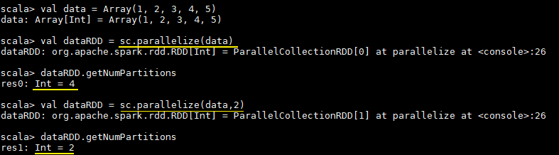
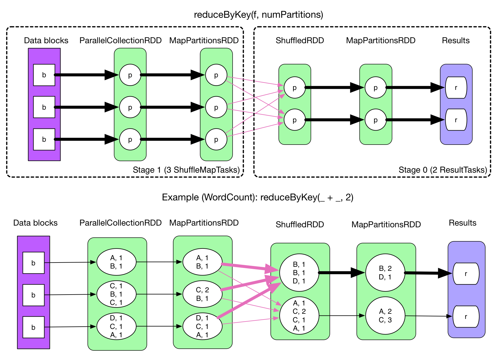
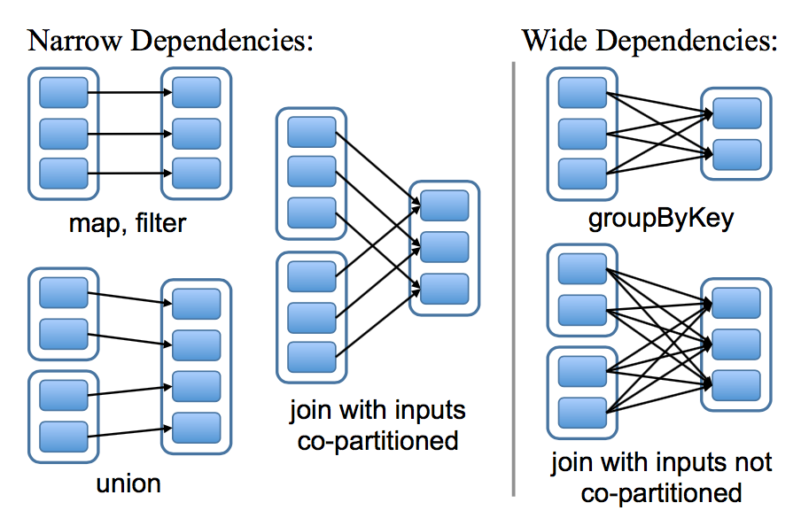
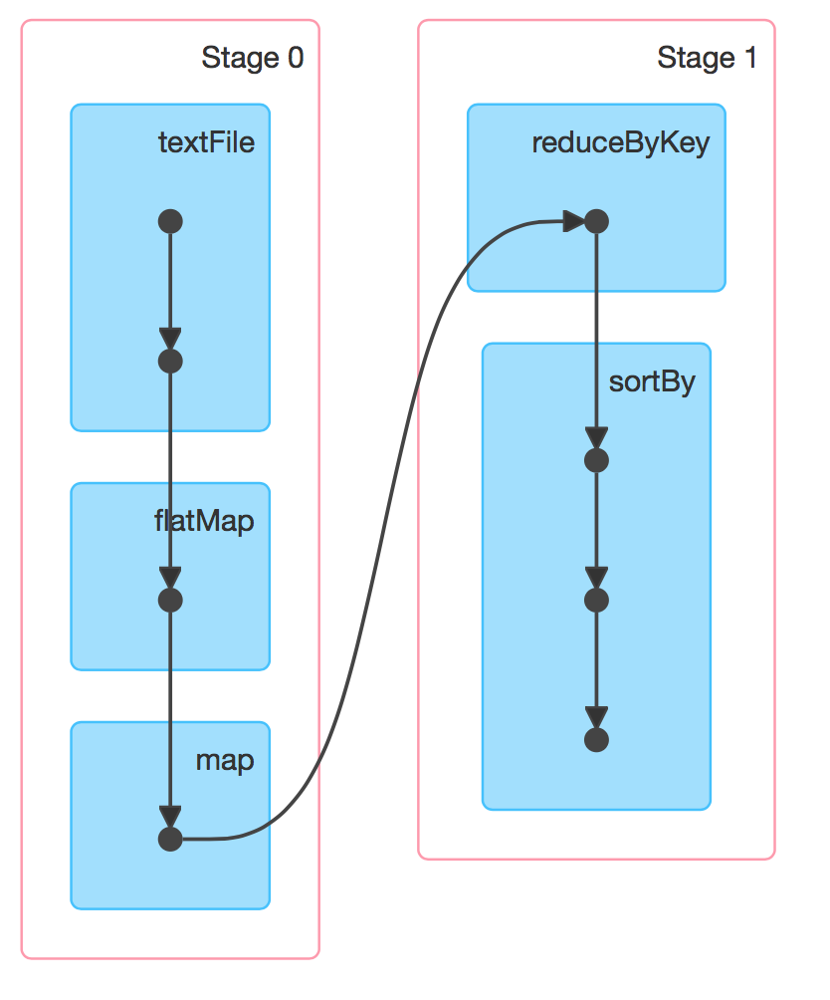

# 弹性式数据集RDDs

<nav>
<a href="#一RDD简介">一、RDD简介</a><br/>
<a href="#二创建RDD">二、创建RDD</a><br/>
&nbsp;&nbsp;&nbsp;&nbsp;&nbsp;&nbsp;&nbsp;&nbsp;<a href="#21-由现有集合创建">2.1 由现有集合创建</a><br/>
&nbsp;&nbsp;&nbsp;&nbsp;&nbsp;&nbsp;&nbsp;&nbsp;<a href="#22-引用外部存储系统中的数据集">2.2 引用外部存储系统中的数据集</a><br/>
&nbsp;&nbsp;&nbsp;&nbsp;&nbsp;&nbsp;&nbsp;&nbsp;<a href="#23-textFile--wholeTextFiles">2.3 textFile & wholeTextFiles</a><br/>
<a href="#三操作RDD">三、操作RDD</a><br/>
<a href="#四缓存RDD">四、缓存RDD</a><br/>
&nbsp;&nbsp;&nbsp;&nbsp;&nbsp;&nbsp;&nbsp;&nbsp;<a href="#41-缓存级别">4.1 缓存级别</a><br/>
&nbsp;&nbsp;&nbsp;&nbsp;&nbsp;&nbsp;&nbsp;&nbsp;<a href="#42-使用缓存">4.2 使用缓存</a><br/>
&nbsp;&nbsp;&nbsp;&nbsp;&nbsp;&nbsp;&nbsp;&nbsp;<a href="#43-移除缓存">4.3 移除缓存</a><br/>
<a href="#五理解shuffle">五、理解shuffle</a><br/>
&nbsp;&nbsp;&nbsp;&nbsp;&nbsp;&nbsp;&nbsp;&nbsp;<a href="#51-shuffle介绍">5.1 shuffle介绍</a><br/>
&nbsp;&nbsp;&nbsp;&nbsp;&nbsp;&nbsp;&nbsp;&nbsp;<a href="#52-Shuffle的影响">5.2 Shuffle的影响</a><br/>
&nbsp;&nbsp;&nbsp;&nbsp;&nbsp;&nbsp;&nbsp;&nbsp;<a href="#53-导致Shuffle的操作">5.3 导致Shuffle的操作</a><br/>
<a href="#五宽依赖和窄依赖">五、宽依赖和窄依赖</a><br/>
<a href="#六DAG的生成">六、DAG的生成</a><br/>
</nav>

## 一、RDD简介

`RDD` 全称为 Resilient Distributed Datasets，是 Spark 最基本的数据抽象，它是只读的、分区记录的集合，支持并行操作，可以由外部数据集或其他 RDD 转换而来，它具有以下特性：

+ 一个 RDD 由一个或者多个分区（Partitions）组成。对于 RDD 来说，每个分区会被一个计算任务所处理，用户可以在创建 RDD 时指定其分区个数，如果没有指定，则默认采用程序所分配到的 CPU 的核心数；
+ RDD 拥有一个用于计算分区的函数 compute；
+ RDD 会保存彼此间的依赖关系，RDD 的每次转换都会生成一个新的依赖关系，这种 RDD 之间的依赖关系就像流水线一样。在部分分区数据丢失后，可以通过这种依赖关系重新计算丢失的分区数据，而不是对 RDD 的所有分区进行重新计算；
+ Key-Value 型的 RDD 还拥有 Partitioner(分区器)，用于决定数据被存储在哪个分区中，目前 Spark 中支持 HashPartitioner(按照哈希分区) 和 RangeParationer(按照范围进行分区)；
+ 一个优先位置列表 (可选)，用于存储每个分区的优先位置 (prefered location)。对于一个 HDFS 文件来说，这个列表保存的就是每个分区所在的块的位置，按照“移动数据不如移动计算“的理念，Spark 在进行任务调度的时候，会尽可能的将计算任务分配到其所要处理数据块的存储位置。

`RDD[T]` 抽象类的部分相关代码如下：

```scala
// 由子类实现以计算给定分区
def compute(split: Partition, context: TaskContext): Iterator[T]

// 获取所有分区
protected def getPartitions: Array[Partition]

// 获取所有依赖关系
protected def getDependencies: Seq[Dependency[_]] = deps

// 获取优先位置列表
protected def getPreferredLocations(split: Partition): Seq[String] = Nil

// 分区器 由子类重写以指定它们的分区方式
@transient val partitioner: Option[Partitioner] = None
```


## 二、创建RDD

RDD 有两种创建方式，分别介绍如下：

### 2.1 由现有集合创建

这里使用 `spark-shell` 进行测试，启动命令如下：

```shell
spark-shell --master local[4]
```

启动 `spark-shell` 后，程序会自动创建应用上下文，相当于执行了下面的 Scala 语句：

```scala
val conf = new SparkConf().setAppName("Spark shell").setMaster("local[4]")
val sc = new SparkContext(conf)
```

由现有集合创建 RDD，你可以在创建时指定其分区个数，如果没有指定，则采用程序所分配到的 CPU 的核心数：

```scala
val data = Array(1, 2, 3, 4, 5)
// 由现有集合创建 RDD,默认分区数为程序所分配到的 CPU 的核心数
val dataRDD = sc.parallelize(data) 
// 查看分区数
dataRDD.getNumPartitions
// 明确指定分区数
val dataRDD = sc.parallelize(data,2)
```

执行结果如下：

<div align="center">  </div>

### 2.2 引用外部存储系统中的数据集

引用外部存储系统中的数据集，例如本地文件系统，HDFS，HBase 或支持 Hadoop InputFormat 的任何数据源。

```scala
val fileRDD = sc.textFile("/usr/file/emp.txt")
// 获取第一行文本
fileRDD.take(1)
```

使用外部存储系统时需要注意以下两点：

+ 如果在集群环境下从本地文件系统读取数据，则要求该文件必须在集群中所有机器上都存在，且路径相同；
+ 支持目录路径，支持压缩文件，支持使用通配符。

### 2.3 textFile & wholeTextFiles

两者都可以用来读取外部文件，但是返回格式是不同的：

+ **textFile**：其返回格式是 `RDD[String]` ，返回的是就是文件内容，RDD 中每一个元素对应一行数据；
+ **wholeTextFiles**：其返回格式是 `RDD[(String, String)]`，元组中第一个参数是文件路径，第二个参数是文件内容；
+ 两者都提供第二个参数来控制最小分区数；
+ 从 HDFS 上读取文件时，Spark 会为每个块创建一个分区。

```scala
def textFile(path: String,minPartitions: Int = defaultMinPartitions): RDD[String] = withScope {...}
def wholeTextFiles(path: String,minPartitions: Int = defaultMinPartitions): RDD[(String, String)]={..}
```


## 三、操作RDD

RDD 支持两种类型的操作：*transformations*（转换，从现有数据集创建新数据集）和 *actions*（在数据集上运行计算后将值返回到驱动程序）。RDD 中的所有转换操作都是惰性的，它们只是记住这些转换操作，但不会立即执行，只有遇到 *action* 操作后才会真正的进行计算，这类似于函数式编程中的惰性求值。

```scala
val list = List(1, 2, 3)
// map 是一个 transformations 操作，而 foreach 是一个 actions 操作
sc.parallelize(list).map(_ * 10).foreach(println)
// 输出： 10 20 30
```


## 四、缓存RDD

### 4.1 缓存级别

Spark 速度非常快的一个原因是 RDD 支持缓存。成功缓存后，如果之后的操作使用到了该数据集，则直接从缓存中获取。虽然缓存也有丢失的风险，但是由于 RDD 之间的依赖关系，如果某个分区的缓存数据丢失，只需要重新计算该分区即可。

Spark 支持多种缓存级别 ：

| Storage Level<br/>（存储级别）                 | Meaning（含义）                                              |
| ---------------------------------------------- | ------------------------------------------------------------ |
| `MEMORY_ONLY`                                  | 默认的缓存级别，将 RDD 以反序列化的 Java 对象的形式存储在 JVM 中。如果内存空间不够，则部分分区数据将不再缓存。 |
| `MEMORY_AND_DISK`                              | 将 RDD 以反序列化的 Java 对象的形式存储 JVM 中。如果内存空间不够，将未缓存的分区数据存储到磁盘，在需要使用这些分区时从磁盘读取。 |
| `MEMORY_ONLY_SER`<br/>     | 将 RDD 以序列化的 Java 对象的形式进行存储（每个分区为一个 byte 数组）。这种方式比反序列化对象节省存储空间，但在读取时会增加 CPU 的计算负担。仅支持 Java 和 Scala 。  |
| `MEMORY_AND_DISK_SER`<br/> | 类似于 `MEMORY_ONLY_SER`，但是溢出的分区数据会存储到磁盘，而不是在用到它们时重新计算。仅支持 Java 和 Scala。 |
| `DISK_ONLY`                                    | 只在磁盘上缓存 RDD                                            |
| `MEMORY_ONLY_2`, <br/>`MEMORY_AND_DISK_2`, etc | 与上面的对应级别功能相同，但是会为每个分区在集群中的两个节点上建立副本。 |
| `OFF_HEAP`                                     | 与 `MEMORY_ONLY_SER` 类似，但将数据存储在堆外内存中。这需要启用堆外内存。 |

> 启动堆外内存需要配置两个参数：
>
> + **spark.memory.offHeap.enabled** ：是否开启堆外内存，默认值为 false，需要设置为 true；
> + **spark.memory.offHeap.size** : 堆外内存空间的大小，默认值为 0，需要设置为正值。

### 4.2 使用缓存

缓存数据的方法有两个：`persist` 和 `cache` 。`cache` 内部调用的也是 `persist`，它是 `persist` 的特殊化形式，等价于 `persist(StorageLevel.MEMORY_ONLY)`。示例如下：

```scala
// 所有存储级别均定义在 StorageLevel 对象中
fileRDD.persist(StorageLevel.MEMORY_AND_DISK)
fileRDD.cache()
```

### 4.3 移除缓存

Spark 会自动监视每个节点上的缓存使用情况，并按照最近最少使用（LRU）的规则删除旧数据分区。当然，你也可以使用 `RDD.unpersist()` 方法进行手动删除。


## 五、理解shuffle

### 5.1 shuffle介绍

在 Spark 中，一个任务对应一个分区，通常不会跨分区操作数据。但如果遇到 `reduceByKey` 等操作，Spark 必须从所有分区读取数据，并查找所有键的所有值，然后汇总在一起以计算每个键的最终结果 ，这称为 `Shuffle`。

<div align="center">  </div>


### 5.2 Shuffle的影响

Shuffle 是一项昂贵的操作，因为它通常会跨节点操作数据，这会涉及磁盘 I/O，网络 I/O，和数据序列化。某些 Shuffle 操作还会消耗大量的堆内存，因为它们使用堆内存来临时存储需要网络传输的数据。Shuffle 还会在磁盘上生成大量中间文件，从 Spark 1.3 开始，这些文件将被保留，直到相应的 RDD 不再使用并进行垃圾回收，这样做是为了避免在计算时重复创建 Shuffle 文件。如果应用程序长期保留对这些 RDD 的引用，则垃圾回收可能在很长一段时间后才会发生，这意味着长时间运行的 Spark 作业可能会占用大量磁盘空间，通常可以使用 `spark.local.dir` 参数来指定这些临时文件的存储目录。

### 5.3 导致Shuffle的操作

由于 Shuffle 操作对性能的影响比较大，所以需要特别注意使用，以下操作都会导致 Shuffle：

+ **涉及到重新分区操作**： 如 `repartition` 和 `coalesce`；
+ **所有涉及到 ByKey 的操作**：如 `groupByKey` 和 `reduceByKey`，但 `countByKey` 除外；
+ **联结操作**：如 `cogroup` 和 `join`。


## 五、宽依赖和窄依赖

RDD 和它的父 RDD(s) 之间的依赖关系分为两种不同的类型：

- **窄依赖 (narrow dependency)**：父 RDDs 的一个分区最多被子 RDDs 一个分区所依赖；
- **宽依赖 (wide dependency)**：父 RDDs 的一个分区可以被子 RDDs 的多个子分区所依赖。

如下图，每一个方框表示一个 RDD，带有颜色的矩形表示分区：

<div align="center">  </div>


区分这两种依赖是非常有用的：

+ 首先，窄依赖允许在一个集群节点上以流水线的方式（pipeline）对父分区数据进行计算，例如先执行 map 操作，然后执行 filter 操作。而宽依赖则需要计算好所有父分区的数据，然后再在节点之间进行 Shuffle，这与 MapReduce 类似。
+ 窄依赖能够更有效地进行数据恢复，因为只需重新对丢失分区的父分区进行计算，且不同节点之间可以并行计算；而对于宽依赖而言，如果数据丢失，则需要对所有父分区数据进行计算并再次 Shuffle。


## 六、DAG的生成

RDD(s) 及其之间的依赖关系组成了 DAG(有向无环图)，DAG 定义了这些 RDD(s) 之间的 Lineage(血统) 关系，通过血统关系，如果一个 RDD 的部分或者全部计算结果丢失了，也可以重新进行计算。那么 Spark 是如何根据 DAG 来生成计算任务呢？主要是根据依赖关系的不同将 DAG 划分为不同的计算阶段 (Stage)：

+ 对于窄依赖，由于分区的依赖关系是确定的，其转换操作可以在同一个线程执行，所以可以划分到同一个执行阶段；
+ 对于宽依赖，由于 Shuffle 的存在，只能在父 RDD(s) 被 Shuffle 处理完成后，才能开始接下来的计算，因此遇到宽依赖就需要重新划分阶段。

<div align="center">  </div>


## 参考资料

1. 张安站 . Spark 技术内幕：深入解析 Spark 内核架构设计与实现原理[M] . 机械工业出版社 . 2015-09-01
2. [RDD Programming Guide](https://spark.apache.org/docs/latest/rdd-programming-guide.html#rdd-programming-guide)
3. [RDD：基于内存的集群计算容错抽象](http://shiyanjun.cn/archives/744.html)


