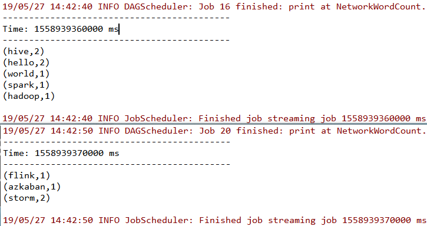
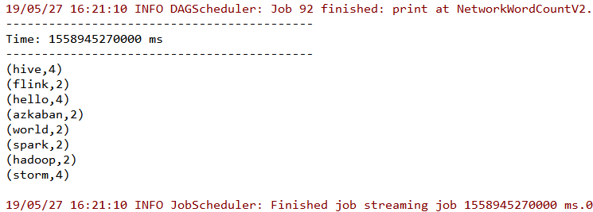
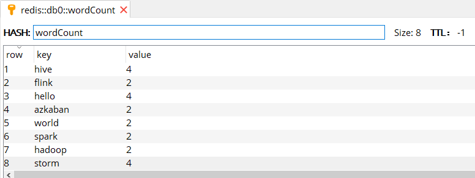

# Spark Streaming 基本操作

<nav>
<a href="#一案例引入">一、案例引入</a><br/>
&nbsp;&nbsp;&nbsp;&nbsp;&nbsp;&nbsp;&nbsp;&nbsp;<a href="#31-StreamingContext">3.1 StreamingContext</a><br/>
&nbsp;&nbsp;&nbsp;&nbsp;&nbsp;&nbsp;&nbsp;&nbsp;<a href="#32-数据源">3.2 数据源</a><br/>
&nbsp;&nbsp;&nbsp;&nbsp;&nbsp;&nbsp;&nbsp;&nbsp;<a href="#33-服务的启动与停止">3.3 服务的启动与停止</a><br/>
<a href="#二Transformation">二、Transformation</a><br/>
&nbsp;&nbsp;&nbsp;&nbsp;&nbsp;&nbsp;&nbsp;&nbsp;<a href="#21-DStream与RDDs">2.1 DStream与RDDs</a><br/>
&nbsp;&nbsp;&nbsp;&nbsp;&nbsp;&nbsp;&nbsp;&nbsp;<a href="#22-updateStateByKey">2.2 updateStateByKey</a><br/>
&nbsp;&nbsp;&nbsp;&nbsp;&nbsp;&nbsp;&nbsp;&nbsp;<a href="#23-启动测试">2.3 启动测试</a><br/>
<a href="#三输出操作">三、输出操作</a><br/>
&nbsp;&nbsp;&nbsp;&nbsp;&nbsp;&nbsp;&nbsp;&nbsp;<a href="#31-输出API">3.1 输出API</a><br/>
&nbsp;&nbsp;&nbsp;&nbsp;&nbsp;&nbsp;&nbsp;&nbsp;<a href="#31-foreachRDD">3.1 foreachRDD</a><br/>
&nbsp;&nbsp;&nbsp;&nbsp;&nbsp;&nbsp;&nbsp;&nbsp;<a href="#33-代码说明">3.3 代码说明</a><br/>
&nbsp;&nbsp;&nbsp;&nbsp;&nbsp;&nbsp;&nbsp;&nbsp;<a href="#34-启动测试">3.4 启动测试</a><br/>
</nav>

## 一、案例引入

这里先引入一个基本的案例来演示流的创建：获取指定端口上的数据并进行词频统计。项目依赖和代码实现如下：

```xml
<dependency>
    <groupId>org.apache.spark</groupId>
    <artifactId>spark-streaming_2.12</artifactId>
    <version>2.4.3</version>
</dependency>
```

```scala
import org.apache.spark.SparkConf
import org.apache.spark.streaming.{Seconds, StreamingContext}

object NetworkWordCount {

  def main(args: Array[String]) {

    /*指定时间间隔为 5s*/
    val sparkConf = new SparkConf().setAppName("NetworkWordCount").setMaster("local[2]")
    val ssc = new StreamingContext(sparkConf, Seconds(5))

    /*创建文本输入流,并进行词频统计*/
    val lines = ssc.socketTextStream("hadoop001", 9999)
    lines.flatMap(_.split(" ")).map(x => (x, 1)).reduceByKey(_ + _).print()

    /*启动服务*/
    ssc.start()
    /*等待服务结束*/
    ssc.awaitTermination()
  }
}
```

使用本地模式启动 Spark 程序，然后使用 `nc -lk 9999` 打开端口并输入测试数据：

```shell
[root@hadoop001 ~]#  nc -lk 9999
hello world hello spark hive hive hadoop
storm storm flink azkaban
```

此时控制台输出如下，可以看到已经接收到数据并按行进行了词频统计。

<div align="center">  </div>
<br/>

下面针对示例代码进行讲解：

### 3.1 StreamingContext

Spark Streaming 编程的入口类是 StreamingContext，在创建时候需要指明 `sparkConf` 和 `batchDuration`(批次时间)，Spark 流处理本质是将流数据拆分为一个个批次，然后进行微批处理，`batchDuration` 就是批次拆分的时间间隔。这个时间可以根据业务需求和服务器性能进行指定，如果业务要求低延迟并且服务器性能也允许，则这个时间可以指定得很短。

这里需要注意的是：示例代码使用的是本地模式，配置为 `local[2]`，这里不能配置为 `local[1]`。这是因为对于流数据的处理，Spark 必须有一个独立的 Executor 来接收数据，然后再由其他的 Executors 来处理，所以为了保证数据能够被处理，至少要有 2 个 Executors。这里我们的程序只有一个数据流，在并行读取多个数据流的时候，也需要保证有足够的 Executors 来接收和处理数据。

### 3.2 数据源

在示例代码中使用的是 `socketTextStream` 来创建基于 Socket 的数据流，实际上 Spark 还支持多种数据源，分为以下两类：

+ **基本数据源**：包括文件系统、Socket 连接等；
+ **高级数据源**：包括 Kafka，Flume，Kinesis 等。

在基本数据源中，Spark 支持监听 HDFS 上指定目录，当有新文件加入时，会获取其文件内容作为输入流。创建方式如下：

```scala
// 对于文本文件，指明监听目录即可
streamingContext.textFileStream(dataDirectory)
// 对于其他文件，需要指明目录，以及键的类型、值的类型、和输入格式
streamingContext.fileStream[KeyClass, ValueClass, InputFormatClass](dataDirectory)
```

被监听的目录可以是具体目录，如 `hdfs://host:8040/logs/`；也可以使用通配符，如 `hdfs://host:8040/logs/2017/*`。

> 关于高级数据源的整合单独整理至：[Spark Streaming 整合 Flume](https://github.com/heibaiying/BigData-Notes/blob/master/notes/Spark_Streaming整合Flume.md) 和 [Spark Streaming 整合 Kafka](https://github.com/heibaiying/BigData-Notes/blob/master/notes/Spark_Streaming整合Kafka.md)

### 3.3 服务的启动与停止

在示例代码中，使用 `streamingContext.start()` 代表启动服务，此时还要使用 `streamingContext.awaitTermination()` 使服务处于等待和可用的状态，直到发生异常或者手动使用 `streamingContext.stop()` 进行终止。


## 二、Transformation

### 2.1 DStream与RDDs

DStream 是 Spark Streaming 提供的基本抽象。它表示连续的数据流。在内部，DStream 由一系列连续的 RDD 表示。所以从本质上而言，应用于 DStream 的任何操作都会转换为底层 RDD 上的操作。例如，在示例代码中 flatMap 算子的操作实际上是作用在每个 RDDs 上 (如下图)。因为这个原因，所以 DStream 能够支持 RDD 大部分的*transformation*算子。

<div align="center">  </div>

### 2.2 updateStateByKey

除了能够支持 RDD 的算子外，DStream 还有部分独有的*transformation*算子，这当中比较常用的是 `updateStateByKey`。文章开头的词频统计程序，只能统计每一次输入文本中单词出现的数量，想要统计所有历史输入中单词出现的数量，可以使用 `updateStateByKey` 算子。代码如下：

```scala
object NetworkWordCountV2 {


  def main(args: Array[String]) {

    /*
     * 本地测试时最好指定 hadoop 用户名,否则会默认使用本地电脑的用户名,
     * 此时在 HDFS 上创建目录时可能会抛出权限不足的异常
     */
    System.setProperty("HADOOP_USER_NAME", "root")
      
    val sparkConf = new SparkConf().setAppName("NetworkWordCountV2").setMaster("local[2]")
    val ssc = new StreamingContext(sparkConf, Seconds(5))
    /*必须要设置检查点*/
    ssc.checkpoint("hdfs://hadoop001:8020/spark-streaming")
    val lines = ssc.socketTextStream("hadoop001", 9999)
    lines.flatMap(_.split(" ")).map(x => (x, 1))
      .updateStateByKey[Int](updateFunction _)   //updateStateByKey 算子
      .print()

    ssc.start()
    ssc.awaitTermination()
  }

  /**
    * 累计求和
    *
    * @param currentValues 当前的数据
    * @param preValues     之前的数据
    * @return 相加后的数据
    */
  def updateFunction(currentValues: Seq[Int], preValues: Option[Int]): Option[Int] = {
    val current = currentValues.sum
    val pre = preValues.getOrElse(0)
    Some(current + pre)
  }
}
```

使用 `updateStateByKey` 算子，你必须使用 `ssc.checkpoint()` 设置检查点，这样当使用 `updateStateByKey` 算子时，它会去检查点中取出上一次保存的信息，并使用自定义的 `updateFunction` 函数将上一次的数据和本次数据进行相加，然后返回。

### 2.3 启动测试

在监听端口输入如下测试数据：

```shell
[root@hadoop001 ~]#  nc -lk 9999
hello world hello spark hive hive hadoop
storm storm flink azkaban
hello world hello spark hive hive hadoop
storm storm flink azkaban
```

此时控制台输出如下，所有输入都被进行了词频累计：

<div align="center">  </div>
同时在输出日志中还可以看到检查点操作的相关信息：

```shell
# 保存检查点信息
19/05/27 16:21:05 INFO CheckpointWriter: Saving checkpoint for time 1558945265000 ms 
to file 'hdfs://hadoop001:8020/spark-streaming/checkpoint-1558945265000'

# 删除已经无用的检查点信息
19/05/27 16:21:30 INFO CheckpointWriter: 
Deleting hdfs://hadoop001:8020/spark-streaming/checkpoint-1558945265000
```

## 三、输出操作

### 3.1 输出API

Spark Streaming 支持以下输出操作：

| Output Operation                            | Meaning                                                      |
| :------------------------------------------ | :----------------------------------------------------------- |
| **print**()                                 | 在运行流应用程序的 driver 节点上打印 DStream 中每个批次的前十个元素。用于开发调试。 |
| **saveAsTextFiles**(*prefix*, [*suffix*])   | 将 DStream 的内容保存为文本文件。每个批处理间隔的文件名基于前缀和后缀生成：“prefix-TIME_IN_MS [.suffix]”。 |
| **saveAsObjectFiles**(*prefix*, [*suffix*]) | 将 DStream 的内容序列化为 Java 对象，并保存到 SequenceFiles。每个批处理间隔的文件名基于前缀和后缀生成：“prefix-TIME_IN_MS [.suffix]”。 |
| **saveAsHadoopFiles**(*prefix*, [*suffix*]) | 将 DStream 的内容保存为 Hadoop 文件。每个批处理间隔的文件名基于前缀和后缀生成：“prefix-TIME_IN_MS [.suffix]”。 |
| **foreachRDD**(*func*)                      | 最通用的输出方式，它将函数 func 应用于从流生成的每个 RDD。此函数应将每个 RDD 中的数据推送到外部系统，例如将 RDD 保存到文件，或通过网络将其写入数据库。 |

前面的四个 API 都是直接调用即可，下面主要讲解通用的输出方式 `foreachRDD(func)`，通过该 API 你可以将数据保存到任何你需要的数据源。

### 3.1 foreachRDD

这里我们使用 Redis 作为客户端，对文章开头示例程序进行改变，把每一次词频统计的结果写入到 Redis，并利用 Redis 的 `HINCRBY` 命令来进行词频统计。这里需要导入 Jedis 依赖：

```xml
<dependency>
    <groupId>redis.clients</groupId>
    <artifactId>jedis</artifactId>
    <version>2.9.0</version>
</dependency>
```

具体实现代码如下:

```scala
import org.apache.spark.SparkConf
import org.apache.spark.streaming.dstream.DStream
import org.apache.spark.streaming.{Seconds, StreamingContext}
import redis.clients.jedis.Jedis

object NetworkWordCountToRedis {
  
    def main(args: Array[String]) {

    val sparkConf = new SparkConf().setAppName("NetworkWordCountToRedis").setMaster("local[2]")
    val ssc = new StreamingContext(sparkConf, Seconds(5))

    /*创建文本输入流,并进行词频统计*/
    val lines = ssc.socketTextStream("hadoop001", 9999)
    val pairs: DStream[(String, Int)] = lines.flatMap(_.split(" ")).map(x => (x, 1)).reduceByKey(_ + _)
     /*保存数据到 Redis*/
    pairs.foreachRDD { rdd =>
      rdd.foreachPartition { partitionOfRecords =>
        var jedis: Jedis = null
        try {
          jedis = JedisPoolUtil.getConnection
          partitionOfRecords.foreach(record => jedis.hincrBy("wordCount", record._1, record._2))
        } catch {
          case ex: Exception =>
            ex.printStackTrace()
        } finally {
          if (jedis != null) jedis.close()
        }
      }
    }
    ssc.start()
    ssc.awaitTermination()
  }
}

```

其中 `JedisPoolUtil` 的代码如下：

```java
import redis.clients.jedis.Jedis;
import redis.clients.jedis.JedisPool;
import redis.clients.jedis.JedisPoolConfig;

public class JedisPoolUtil {

    /* 声明为 volatile 防止指令重排序 */
    private static volatile JedisPool jedisPool = null;
    private static final String HOST = "localhost";
    private static final int PORT = 6379;

    /* 双重检查锁实现懒汉式单例 */
    public static Jedis getConnection() {
        if (jedisPool == null) {
            synchronized (JedisPoolUtil.class) {
                if (jedisPool == null) {
                    JedisPoolConfig config = new JedisPoolConfig();
                    config.setMaxTotal(30);
                    config.setMaxIdle(10);
                    jedisPool = new JedisPool(config, HOST, PORT);
                }
            }
        }
        return jedisPool.getResource();
    }
}
```

### 3.3 代码说明

这里将上面保存到 Redis 的代码单独抽取出来，并去除异常判断的部分。精简后的代码如下：

```scala
pairs.foreachRDD { rdd =>
  rdd.foreachPartition { partitionOfRecords =>
    val jedis = JedisPoolUtil.getConnection
    partitionOfRecords.foreach(record => jedis.hincrBy("wordCount", record._1, record._2))
    jedis.close()
  }
}
```

这里可以看到一共使用了三次循环，分别是循环 RDD，循环分区，循环每条记录，上面我们的代码是在循环分区的时候获取连接，也就是为每一个分区获取一个连接。但是这里大家可能会有疑问：为什么不在循环 RDD 的时候，为每一个 RDD 获取一个连接，这样所需要的连接数会更少。实际上这是不可行的，如果按照这种情况进行改写，如下：

```scala
pairs.foreachRDD { rdd =>
    val jedis = JedisPoolUtil.getConnection
    rdd.foreachPartition { partitionOfRecords =>
        partitionOfRecords.foreach(record => jedis.hincrBy("wordCount", record._1, record._2))
    }
    jedis.close()
}
```

此时在执行时候就会抛出 `Caused by: java.io.NotSerializableException: redis.clients.jedis.Jedis`，这是因为在实际计算时，Spark 会将对 RDD 操作分解为多个 Task，Task 运行在具体的 Worker Node 上。在执行之前，Spark 会对任务进行闭包，之后闭包被序列化并发送给每个 Executor，而 `Jedis` 显然是不能被序列化的，所以会抛出异常。

第二个需要注意的是 ConnectionPool 最好是一个静态，惰性初始化连接池 。这是因为 Spark 的转换操作本身就是惰性的，且没有数据流时不会触发写出操作，所以出于性能考虑，连接池应该是惰性的，因此上面 `JedisPool` 在初始化时采用了懒汉式单例进行惰性初始化。

### 3.4 启动测试

在监听端口输入如下测试数据：

```shell
[root@hadoop001 ~]#  nc -lk 9999
hello world hello spark hive hive hadoop
storm storm flink azkaban
hello world hello spark hive hive hadoop
storm storm flink azkaban
```

使用 Redis Manager 查看写入结果 (如下图),可以看到与使用 `updateStateByKey` 算子得到的计算结果相同。

<div align="center">  </div>  
<br/>

> 本片文章所有源码见本仓库：[spark-streaming-basis](https://github.com/heibaiying/BigData-Notes/tree/master/code/spark/spark-streaming-basis)


## 参考资料

Spark 官方文档：http://spark.apache.org/docs/latest/streaming-programming-guide.html
