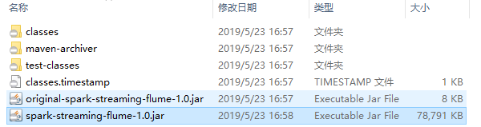
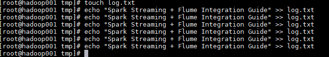
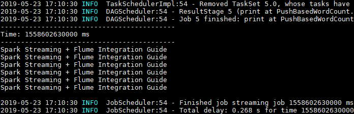

# Spark Streaming 整合 Flume

<nav>
<a href="#一简介">一、简介</a><br/>
<a href="#二推送式方法">二、推送式方法</a><br/>
&nbsp;&nbsp;&nbsp;&nbsp;&nbsp;&nbsp;&nbsp;&nbsp;<a href="#21-配置日志收集Flume">2.1 配置日志收集Flume</a><br/>
&nbsp;&nbsp;&nbsp;&nbsp;&nbsp;&nbsp;&nbsp;&nbsp;<a href="#22-项目依赖">2.2 项目依赖</a><br/>
&nbsp;&nbsp;&nbsp;&nbsp;&nbsp;&nbsp;&nbsp;&nbsp;<a href="#23-Spark-Streaming接收日志数据">2.3 Spark Streaming接收日志数据</a><br/>
&nbsp;&nbsp;&nbsp;&nbsp;&nbsp;&nbsp;&nbsp;&nbsp;<a href="#24-项目打包">2.4 项目打包</a><br/>
&nbsp;&nbsp;&nbsp;&nbsp;&nbsp;&nbsp;&nbsp;&nbsp;<a href="#25-启动服务和提交作业">2.5 启动服务和提交作业</a><br/>
&nbsp;&nbsp;&nbsp;&nbsp;&nbsp;&nbsp;&nbsp;&nbsp;<a href="#26-测试">2.6 测试</a><br/>
&nbsp;&nbsp;&nbsp;&nbsp;&nbsp;&nbsp;&nbsp;&nbsp;<a href="#27-注意事项">2.7 注意事项</a><br/>
<a href="#三拉取式方法">三、拉取式方法</a><br/>
&nbsp;&nbsp;&nbsp;&nbsp;&nbsp;&nbsp;&nbsp;&nbsp;<a href="#31--配置日志收集Flume">3.1  配置日志收集Flume</a><br/>
&nbsp;&nbsp;&nbsp;&nbsp;&nbsp;&nbsp;&nbsp;&nbsp;<a href="#22-新增依赖">2.2 新增依赖</a><br/>
&nbsp;&nbsp;&nbsp;&nbsp;&nbsp;&nbsp;&nbsp;&nbsp;<a href="#23-Spark-Streaming接收日志数据">2.3 Spark Streaming接收日志数据</a><br/>
&nbsp;&nbsp;&nbsp;&nbsp;&nbsp;&nbsp;&nbsp;&nbsp;<a href="#24-启动测试">2.4 启动测试</a><br/>
</nav>


## 一、简介

Apache Flume 是一个分布式，高可用的数据收集系统，可以从不同的数据源收集数据，经过聚合后发送到分布式计算框架或者存储系统中。Spark Straming 提供了以下两种方式用于 Flume 的整合。

## 二、推送式方法

在推送式方法 (Flume-style Push-based Approach) 中，Spark Streaming 程序需要对某台服务器的某个端口进行监听，Flume 通过 `avro Sink` 将数据源源不断推送到该端口。这里以监听日志文件为例，具体整合方式如下：

### 2.1 配置日志收集Flume

新建配置 `netcat-memory-avro.properties`，使用 `tail` 命令监听文件内容变化，然后将新的文件内容通过 `avro sink` 发送到 hadoop001 这台服务器的 8888 端口：

```properties
#指定agent的sources,sinks,channels
a1.sources = s1
a1.sinks = k1
a1.channels = c1

#配置sources属性
a1.sources.s1.type = exec
a1.sources.s1.command = tail -F /tmp/log.txt
a1.sources.s1.shell = /bin/bash -c
a1.sources.s1.channels = c1

#配置sink
a1.sinks.k1.type = avro
a1.sinks.k1.hostname = hadoop001
a1.sinks.k1.port = 8888
a1.sinks.k1.batch-size = 1
a1.sinks.k1.channel = c1

#配置channel类型
a1.channels.c1.type = memory
a1.channels.c1.capacity = 1000
a1.channels.c1.transactionCapacity = 100
```

### 2.2 项目依赖

项目采用 Maven 工程进行构建，主要依赖为 `spark-streaming` 和 `spark-streaming-flume`。

```xml
<properties>
    <scala.version>2.11</scala.version>
    <spark.version>2.4.0</spark.version>
</properties>

<dependencies>
    <!-- Spark Streaming-->
    <dependency>
        <groupId>org.apache.spark</groupId>
        <artifactId>spark-streaming_${scala.version}</artifactId>
        <version>${spark.version}</version>
    </dependency>
    <!-- Spark Streaming 整合 Flume 依赖-->
    <dependency>
        <groupId>org.apache.spark</groupId>
        <artifactId>spark-streaming-flume_${scala.version}</artifactId>
        <version>2.4.3</version>
    </dependency>
</dependencies>

```

### 2.3 Spark Streaming接收日志数据

调用 FlumeUtils 工具类的 `createStream` 方法，对 hadoop001 的 8888 端口进行监听，获取到流数据并进行打印：

```scala
import org.apache.spark.SparkConf
import org.apache.spark.streaming.{Seconds, StreamingContext}
import org.apache.spark.streaming.flume.FlumeUtils

object PushBasedWordCount {
    
  def main(args: Array[String]): Unit = {
    val sparkConf = new SparkConf()
    val ssc = new StreamingContext(sparkConf, Seconds(5))
    // 1.获取输入流
    val flumeStream = FlumeUtils.createStream(ssc, "hadoop001", 8888)
    // 2.打印输入流的数据
    flumeStream.map(line => new String(line.event.getBody.array()).trim).print()

    ssc.start()
    ssc.awaitTermination()
  }
}
```

### 2.4 项目打包

因为 Spark 安装目录下是不含有 `spark-streaming-flume` 依赖包的，所以在提交到集群运行时候必须提供该依赖包，你可以在提交命令中使用 `--jar` 指定上传到服务器的该依赖包，或者使用 `--packages org.apache.spark:spark-streaming-flume_2.12:2.4.3` 指定依赖包的完整名称，这样程序在启动时会先去中央仓库进行下载。

这里我采用的是第三种方式：使用 `maven-shade-plugin` 插件进行 `ALL IN ONE` 打包，把所有依赖的 Jar 一并打入最终包中。需要注意的是 `spark-streaming` 包在 Spark 安装目录的 `jars` 目录中已经提供，所以不需要打入。插件配置如下：


```xml
<build>
    <plugins>
        <plugin>
            <groupId>org.apache.maven.plugins</groupId>
            <artifactId>maven-compiler-plugin</artifactId>
            <configuration>
                <source>8</source>
                <target>8</target>
            </configuration>
        </plugin>
        <!--使用 shade 进行打包-->
        <plugin>
            <groupId>org.apache.maven.plugins</groupId>
            <artifactId>maven-shade-plugin</artifactId>
            <configuration>
                <createDependencyReducedPom>true</createDependencyReducedPom>
                <filters>
                    <filter>
                        <artifact>*:*</artifact>
                        <excludes>
                            <exclude>META-INF/*.SF</exclude>
                            <exclude>META-INF/*.sf</exclude>
                            <exclude>META-INF/*.DSA</exclude>
                            <exclude>META-INF/*.dsa</exclude>
                            <exclude>META-INF/*.RSA</exclude>
                            <exclude>META-INF/*.rsa</exclude>
                            <exclude>META-INF/*.EC</exclude>
                            <exclude>META-INF/*.ec</exclude>
                            <exclude>META-INF/MSFTSIG.SF</exclude>
                            <exclude>META-INF/MSFTSIG.RSA</exclude>
                        </excludes>
                    </filter>
                </filters>
                <artifactSet>
                    <excludes>
                        <exclude>org.apache.spark:spark-streaming_${scala.version}</exclude>
                        <exclude>org.scala-lang:scala-library</exclude>
                        <exclude>org.apache.commons:commons-lang3</exclude>
                    </excludes>
                </artifactSet>
            </configuration>
            <executions>
                <execution>
                    <phase>package</phase>
                    <goals>
                        <goal>shade</goal>
                    </goals>
                    <configuration>
                        <transformers>
                            <transformer 
                              implementation="org.apache.maven.plugins.shade.resource.ServicesResourceTransformer"/>
                            <transformer 
                              implementation="org.apache.maven.plugins.shade.resource.ManifestResourceTransformer">
                            </transformer>
                        </transformers>
                    </configuration>
                </execution>
            </executions>
        </plugin>
        <!--打包.scala 文件需要配置此插件-->
        <plugin>
            <groupId>org.scala-tools</groupId>
            <artifactId>maven-scala-plugin</artifactId>
            <version>2.15.1</version>
            <executions>
                <execution>
                    <id>scala-compile</id>
                    <goals>
                        <goal>compile</goal>
                    </goals>
                    <configuration>
                        <includes>
                            <include>**/*.scala</include>
                        </includes>
                    </configuration>
                </execution>
                <execution>
                    <id>scala-test-compile</id>
                    <goals>
                        <goal>testCompile</goal>
                    </goals>
                </execution>
            </executions>
        </plugin>
    </plugins>
</build>
```
> 本项目完整源码见：[spark-streaming-flume](https://github.com/heibaiying/BigData-Notes/tree/master/code/spark/spark-streaming-flume)

使用 `mvn clean package` 命令打包后会生产以下两个 Jar 包，提交 ` 非 original` 开头的 Jar 即可。

<div align="center">  </div>

### 2.5 启动服务和提交作业

 启动 Flume 服务：

```shell
flume-ng agent \
--conf conf \
--conf-file /usr/app/apache-flume-1.6.0-cdh5.15.2-bin/examples/netcat-memory-avro.properties \
--name a1 -Dflume.root.logger=INFO,console
```

提交 Spark Streaming 作业：

```shell
spark-submit \
--class com.heibaiying.flume.PushBasedWordCount \
--master local[4] \
/usr/appjar/spark-streaming-flume-1.0.jar
```

### 2.6 测试

这里使用 `echo` 命令模拟日志产生的场景，往日志文件中追加数据，然后查看程序的输出：

<div align="center">  </div>

Spark Streaming 程序成功接收到数据并打印输出：

<div align="center">  </div>

### 2.7 注意事项

#### 1. 启动顺序

这里需要注意的，不论你先启动 Spark 程序还是 Flume 程序，由于两者的启动都需要一定的时间，此时先启动的程序会短暂地抛出端口拒绝连接的异常，此时不需要进行任何操作，等待两个程序都启动完成即可。

<div align="center">  </div>

#### 2. 版本一致

最好保证用于本地开发和编译的 Scala 版本和 Spark 的 Scala 版本一致，至少保证大版本一致，如都是 `2.11`。

<br/>

## 三、拉取式方法

拉取式方法 (Pull-based Approach using a Custom Sink) 是将数据推送到 `SparkSink` 接收器中，此时数据会保持缓冲状态，Spark Streaming 定时从接收器中拉取数据。这种方式是基于事务的，即只有在 Spark Streaming 接收和复制数据完成后，才会删除缓存的数据。与第一种方式相比，具有更强的可靠性和容错保证。整合步骤如下：

### 3.1  配置日志收集Flume

新建 Flume 配置文件 `netcat-memory-sparkSink.properties`，配置和上面基本一致，只是把 `a1.sinks.k1.type` 的属性修改为 `org.apache.spark.streaming.flume.sink.SparkSink`，即采用 Spark 接收器。

```properties
#指定agent的sources,sinks,channels
a1.sources = s1
a1.sinks = k1
a1.channels = c1

#配置sources属性
a1.sources.s1.type = exec
a1.sources.s1.command = tail -F /tmp/log.txt
a1.sources.s1.shell = /bin/bash -c
a1.sources.s1.channels = c1

#配置sink
a1.sinks.k1.type = org.apache.spark.streaming.flume.sink.SparkSink
a1.sinks.k1.hostname = hadoop001
a1.sinks.k1.port = 8888
a1.sinks.k1.batch-size = 1
a1.sinks.k1.channel = c1

#配置channel类型
a1.channels.c1.type = memory
a1.channels.c1.capacity = 1000
a1.channels.c1.transactionCapacity = 100
```

### 2.2 新增依赖

使用拉取式方法需要额外添加以下两个依赖：

```xml
<dependency>
    <groupId>org.scala-lang</groupId>
    <artifactId>scala-library</artifactId>
    <version>2.12.8</version>
</dependency>
<dependency>
    <groupId>org.apache.commons</groupId>
    <artifactId>commons-lang3</artifactId>
    <version>3.5</version>
</dependency>
```

注意：添加这两个依赖只是为了本地测试，Spark 的安装目录下已经提供了这两个依赖，所以在最终打包时需要进行排除。

### 2.3 Spark Streaming接收日志数据

这里和上面推送式方法的代码基本相同，只是将调用方法改为 `createPollingStream`。

```scala
import org.apache.spark.SparkConf
import org.apache.spark.streaming.{Seconds, StreamingContext}
import org.apache.spark.streaming.flume.FlumeUtils

object PullBasedWordCount {

  def main(args: Array[String]): Unit = {

    val sparkConf = new SparkConf()
    val ssc = new StreamingContext(sparkConf, Seconds(5))
    // 1.获取输入流
    val flumeStream = FlumeUtils.createPollingStream(ssc, "hadoop001", 8888)
    // 2.打印输入流中的数据
    flumeStream.map(line => new String(line.event.getBody.array()).trim).print()
    ssc.start()
    ssc.awaitTermination()
  }
}
```

### 2.4 启动测试

启动和提交作业流程与上面相同，这里给出执行脚本，过程不再赘述。

启动 Flume 进行日志收集：

```shell
flume-ng agent \
--conf conf \
--conf-file /usr/app/apache-flume-1.6.0-cdh5.15.2-bin/examples/netcat-memory-sparkSink.properties \
--name a1 -Dflume.root.logger=INFO,console
```

提交 Spark Streaming 作业：

```shel
spark-submit \
--class com.heibaiying.flume.PullBasedWordCount \
--master local[4] \
/usr/appjar/spark-streaming-flume-1.0.jar
```


## 参考资料

- [streaming-flume-integration](https://spark.apache.org/docs/latest/streaming-flume-integration.html)
- 关于大数据应用常用的打包方式可以参见：[大数据应用常用打包方式](https://github.com/heibaiying/BigData-Notes/blob/master/notes/大数据应用常用打包方式.md)
