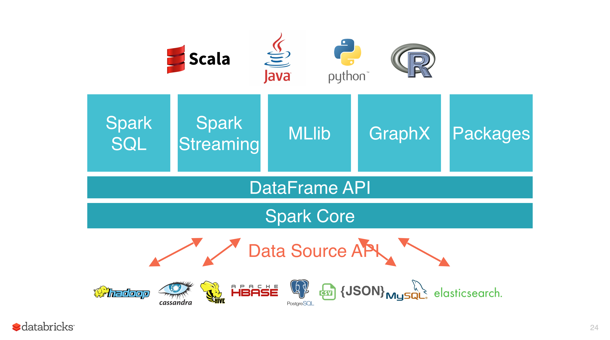

# Spark简介

<nav>
<a href="#一简介">一、简介</a> 
<a href="#二特点">二、特点</a> 
<a href="#三集群架构">三、集群架构</a> 
<a href="#四核心组件">四、核心组件</a> 
&nbsp;&nbsp;&nbsp;&nbsp;&nbsp;&nbsp;&nbsp;&nbsp;<a href="#31-Spark--SQL">3.1 Spark  SQL</a> 
&nbsp;&nbsp;&nbsp;&nbsp;&nbsp;&nbsp;&nbsp;&nbsp;<a href="#32-Spark-Streaming">3.2 Spark Streaming</a> 
&nbsp;&nbsp;&nbsp;&nbsp;&nbsp;&nbsp;&nbsp;&nbsp;<a href="#33-MLlib">3.3 MLlib</a> 
&nbsp;&nbsp;&nbsp;&nbsp;&nbsp;&nbsp;&nbsp;&nbsp;<a href="#34-Graphx">3.4 Graphx</a> 
 
</nav>

## 一、简介

Spark 于 2009 年诞生于加州大学伯克利分校 AMPLab，2013 年被捐赠给 Apache 软件基金会，2014 年 2 月成为 Apache 的顶级项目。相对于 MapReduce 的批处理计算，Spark 可以带来上百倍的性能提升，因此它成为继 MapReduce 之后，最为广泛使用的分布式计算框架。

## 二、特点

Apache Spark 具有以下特点：

+ 使用先进的 DAG 调度程序，查询优化器和物理执行引擎，以实现性能上的保证；
+ 多语言支持，目前支持的有 Java，Scala，Python 和 R；
+ 提供了 80 多个高级 API，可以轻松地构建应用程序；
+ 支持批处理，流处理和复杂的业务分析；
+ 丰富的类库支持：包括 SQL，MLlib，GraphX 和 Spark Streaming 等库，并且可以将它们无缝地进行组合；  
+ 丰富的部署模式：支持本地模式和自带的集群模式，也支持在 Hadoop，Mesos，Kubernetes 上运行；
+ 多数据源支持：支持访问 HDFS，Alluxio，Cassandra，HBase，Hive 以及数百个其他数据源中的数据。

  

## 三、集群架构

| Term（术语）    | Meaning（含义）                                              |
| --------------- | ------------------------------------------------------------ |
| Application     | Spark 应用程序，由集群上的一个 Driver 节点和多个 Executor 节点组成。 |
| Driver program  | 主运用程序，该进程运行应用的 main() 方法并且创建  SparkContext |
| Cluster manager | 集群资源管理器（例如，Standlone Manager，Mesos，YARN）       |
| Worker node     | 执行计算任务的工作节点                                       |
| Executor        | 位于工作节点上的应用进程，负责执行计算任务并且将输出数据保存到内存或者磁盘中 |
| Task            | 被发送到 Executor 中的工作单元                                 |

  

**执行过程**：

1. 用户程序创建 SparkContext 后，它会连接到集群资源管理器，集群资源管理器会为用户程序分配计算资源，并启动 Executor；
2. Dirver 将计算程序划分为不同的执行阶段和多个 Task，之后将 Task 发送给 Executor；
3. Executor 负责执行 Task，并将执行状态汇报给 Driver，同时也会将当前节点资源的使用情况汇报给集群资源管理器。

## 四、核心组件

Spark 基于 Spark Core 扩展了四个核心组件，分别用于满足不同领域的计算需求。

  

### 3.1 Spark  SQL

Spark SQL 主要用于结构化数据的处理。其具有以下特点：

- 能够将 SQL 查询与 Spark 程序无缝混合，允许您使用 SQL 或 DataFrame API 对结构化数据进行查询；
- 支持多种数据源，包括 Hive，Avro，Parquet，ORC，JSON 和 JDBC；
- 支持 HiveQL 语法以及用户自定义函数 (UDF)，允许你访问现有的 Hive 仓库；
- 支持标准的 JDBC 和 ODBC 连接；
- 支持优化器，列式存储和代码生成等特性，以提高查询效率。

### 3.2 Spark Streaming

Spark Streaming 主要用于快速构建可扩展，高吞吐量，高容错的流处理程序。支持从 HDFS，Flume，Kafka，Twitter 和 ZeroMQ 读取数据，并进行处理。

  

 Spark Streaming 的本质是微批处理，它将数据流进行极小粒度的拆分，拆分为多个批处理，从而达到接近于流处理的效果。

  

### 3.3 MLlib

MLlib 是 Spark 的机器学习库。其设计目标是使得机器学习变得简单且可扩展。它提供了以下工具：

+ **常见的机器学习算法**：如分类，回归，聚类和协同过滤；
+ **特征化**：特征提取，转换，降维和选择；
+ **管道**：用于构建，评估和调整 ML 管道的工具；
+ **持久性**：保存和加载算法，模型，管道数据；
+ **实用工具**：线性代数，统计，数据处理等。

### 3.4 Graphx

GraphX 是 Spark 中用于图形计算和图形并行计算的新组件。在高层次上，GraphX 通过引入一个新的图形抽象来扩展 RDD(一种具有附加到每个顶点和边缘的属性的定向多重图形)。为了支持图计算，GraphX 提供了一组基本运算符（如： subgraph，joinVertices 和 aggregateMessages）以及优化后的 Pregel API。此外，GraphX 还包括越来越多的图形算法和构建器，以简化图形分析任务。

##   
