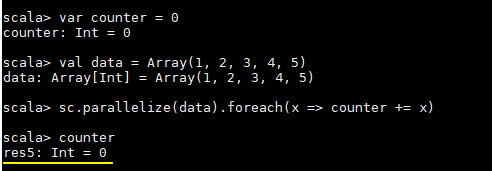
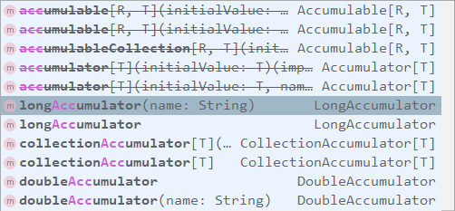
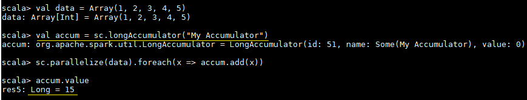

# Spark 累加器与广播变量

<nav>
<a href="#一简介">一、简介</a><br/>
<a href="#二累加器">二、累加器</a><br/>
&nbsp;&nbsp;&nbsp;&nbsp;&nbsp;&nbsp;&nbsp;&nbsp;<a href="#21-理解闭包">2.1 理解闭包</a><br/>
&nbsp;&nbsp;&nbsp;&nbsp;&nbsp;&nbsp;&nbsp;&nbsp;<a href="#22-使用累加器">2.2 使用累加器</a><br/>
<a href="#三广播变量">三、广播变量</a><br/>
</nav>

## 一、简介

在 Spark 中，提供了两种类型的共享变量：累加器 (accumulator) 与广播变量 (broadcast variable)：

+ **累加器**：用来对信息进行聚合，主要用于累计计数等场景；
+ **广播变量**：主要用于在节点间高效分发大对象。

## 二、累加器

这里先看一个具体的场景，对于正常的累计求和，如果在集群模式中使用下面的代码进行计算，会发现执行结果并非预期：

```scala
var counter = 0
val data = Array(1, 2, 3, 4, 5)
sc.parallelize(data).foreach(x => counter += x)
 println(counter)
```

counter 最后的结果是 0，导致这个问题的主要原因是闭包。

<div align="center">  </div>


### 2.1 理解闭包

**1. Scala 中闭包的概念**

这里先介绍一下 Scala 中关于闭包的概念：

```
var more = 10
val addMore = (x: Int) => x + more
```

如上函数 `addMore` 中有两个变量 x 和 more:

- **x** : 是一个绑定变量 (bound variable)，因为其是该函数的入参，在函数的上下文中有明确的定义；
- **more** : 是一个自由变量 (free variable)，因为函数字面量本生并没有给 more 赋予任何含义。

按照定义：在创建函数时，如果需要捕获自由变量，那么包含指向被捕获变量的引用的函数就被称为闭包函数。

**2. Spark 中的闭包**

在实际计算时，Spark 会将对 RDD 操作分解为 Task，Task 运行在 Worker Node 上。在执行之前，Spark 会对任务进行闭包，如果闭包内涉及到自由变量，则程序会进行拷贝，并将副本变量放在闭包中，之后闭包被序列化并发送给每个执行者。因此，当在 foreach 函数中引用 `counter` 时，它将不再是 Driver 节点上的 `counter`，而是闭包中的副本 `counter`，默认情况下，副本 `counter` 更新后的值不会回传到 Driver，所以 `counter` 的最终值仍然为零。

需要注意的是：在 Local 模式下，有可能执行 `foreach` 的 Worker Node 与 Diver 处在相同的 JVM，并引用相同的原始 `counter`，这时候更新可能是正确的，但是在集群模式下一定不正确。所以在遇到此类问题时应优先使用累加器。

累加器的原理实际上很简单：就是将每个副本变量的最终值传回 Driver，由 Driver 聚合后得到最终值，并更新原始变量。


<div align="center">  </div>

### 2.2 使用累加器

`SparkContext` 中定义了所有创建累加器的方法，需要注意的是：被中横线划掉的累加器方法在 Spark 2.0.0 之后被标识为废弃。

<div align="center">  </div>

使用示例和执行结果分别如下：

```scala
val data = Array(1, 2, 3, 4, 5)
// 定义累加器
val accum = sc.longAccumulator("My Accumulator")
sc.parallelize(data).foreach(x => accum.add(x))
// 获取累加器的值
accum.value
```

<div align="center">  </div>


## 三、广播变量

在上面介绍中闭包的过程中我们说道每个 Task 任务的闭包都会持有自由变量的副本，如果变量很大且 Task 任务很多的情况下，这必然会对网络 IO 造成压力，为了解决这个情况，Spark 提供了广播变量。

广播变量的做法很简单：就是不把副本变量分发到每个 Task 中，而是将其分发到每个 Executor，Executor 中的所有 Task 共享一个副本变量。

```scala
// 把一个数组定义为一个广播变量
val broadcastVar = sc.broadcast(Array(1, 2, 3, 4, 5))
// 之后用到该数组时应优先使用广播变量，而不是原值
sc.parallelize(broadcastVar.value).map(_ * 10).collect()
```


## 参考资料

[RDD Programming Guide](http://spark.apache.org/docs/latest/rdd-programming-guide.html#rdd-programming-guide)

