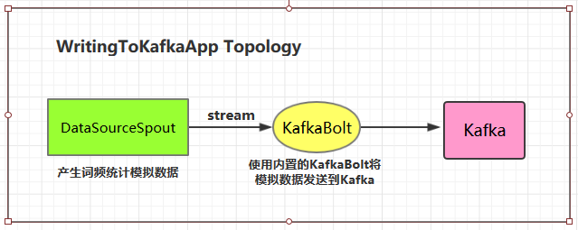
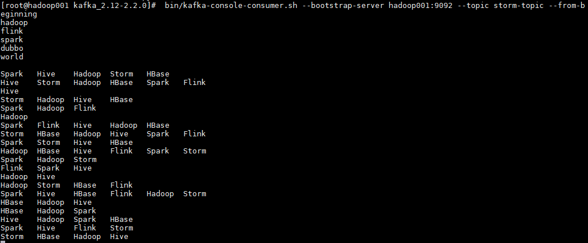
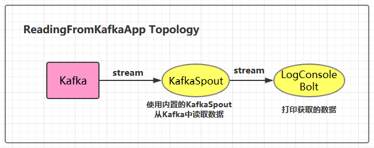
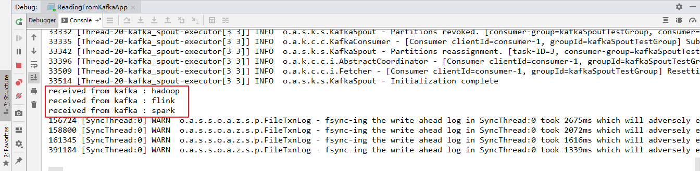

# Storm集成Kafka

<nav>
<a href="#一整合说明">一、整合说明</a><br/>
<a href="#二写入数据到Kafka">二、写入数据到Kafka</a><br/>
<a href="#三从Kafka中读取数据">三、从Kafka中读取数据</a><br/>
</nav>


## 一、整合说明

Storm 官方对 Kafka 的整合分为两个版本，官方说明文档分别如下：

+ [Storm Kafka Integration](http://storm.apache.org/releases/2.0.0-SNAPSHOT/storm-kafka.html) : 主要是针对 0.8.x 版本的 Kafka 提供整合支持；
+  [Storm Kafka Integration (0.10.x+)]() : 包含 Kafka 新版本的 consumer API，主要对 Kafka 0.10.x + 提供整合支持。

这里我服务端安装的 Kafka 版本为 2.2.0(Released Mar 22, 2019) ，按照官方 0.10.x+ 的整合文档进行整合，不适用于 0.8.x 版本的 Kafka。

## 二、写入数据到Kafka

### 2.1 项目结构

<div align="center">  </div>

### 2.2 项目主要依赖

```xml
<properties>
    <storm.version>1.2.2</storm.version>
    <kafka.version>2.2.0</kafka.version>
</properties>

<dependencies>
    <dependency>
        <groupId>org.apache.storm</groupId>
        <artifactId>storm-core</artifactId>
        <version>${storm.version}</version>
    </dependency>
    <dependency>
        <groupId>org.apache.storm</groupId>
        <artifactId>storm-kafka-client</artifactId>
        <version>${storm.version}</version>
    </dependency>
    <dependency>
        <groupId>org.apache.kafka</groupId>
        <artifactId>kafka-clients</artifactId>
        <version>${kafka.version}</version>
    </dependency>
</dependencies>
```

### 2.3 DataSourceSpout

```java
/**
 * 产生词频样本的数据源
 */
public class DataSourceSpout extends BaseRichSpout {

    private List<String> list = Arrays.asList("Spark", "Hadoop", "HBase", "Storm", "Flink", "Hive");

    private SpoutOutputCollector spoutOutputCollector;

    @Override
    public void open(Map map, TopologyContext topologyContext, SpoutOutputCollector spoutOutputCollector) {
        this.spoutOutputCollector = spoutOutputCollector;
    }

    @Override
    public void nextTuple() {
        // 模拟产生数据
        String lineData = productData();
        spoutOutputCollector.emit(new Values(lineData));
        Utils.sleep(1000);
    }

    @Override
    public void declareOutputFields(OutputFieldsDeclarer outputFieldsDeclarer) {
        outputFieldsDeclarer.declare(new Fields("line"));
    }


    /**
     * 模拟数据
     */
    private String productData() {
        Collections.shuffle(list);
        Random random = new Random();
        int endIndex = random.nextInt(list.size()) % (list.size()) + 1;
        return StringUtils.join(list.toArray(), "\t", 0, endIndex);
    }

}
```

产生的模拟数据格式如下：

```properties
Spark	HBase
Hive	Flink	Storm	Hadoop	HBase	Spark
Flink
HBase	Storm
HBase	Hadoop	Hive	Flink
HBase	Flink	Hive	Storm
Hive	Flink	Hadoop
HBase	Hive
Hadoop	Spark	HBase	Storm
```

### 2.4 WritingToKafkaApp

```java
/**
 * 写入数据到 Kafka 中
 */
public class WritingToKafkaApp {

    private static final String BOOTSTRAP_SERVERS = "hadoop001:9092";
    private static final String TOPIC_NAME = "storm-topic";

    public static void main(String[] args) {


        TopologyBuilder builder = new TopologyBuilder();

        // 定义 Kafka 生产者属性
        Properties props = new Properties();
        /*
         * 指定 broker 的地址清单，清单里不需要包含所有的 broker 地址，生产者会从给定的 broker 里查找其他 broker 的信息。
         * 不过建议至少要提供两个 broker 的信息作为容错。
         */
        props.put("bootstrap.servers", BOOTSTRAP_SERVERS);
        /*
         * acks 参数指定了必须要有多少个分区副本收到消息，生产者才会认为消息写入是成功的。
         * acks=0 : 生产者在成功写入消息之前不会等待任何来自服务器的响应。
         * acks=1 : 只要集群的首领节点收到消息，生产者就会收到一个来自服务器成功响应。
         * acks=all : 只有当所有参与复制的节点全部收到消息时，生产者才会收到一个来自服务器的成功响应。
         */
        props.put("acks", "1");
        props.put("key.serializer", "org.apache.kafka.common.serialization.StringSerializer");
        props.put("value.serializer", "org.apache.kafka.common.serialization.StringSerializer");

        KafkaBolt bolt = new KafkaBolt<String, String>()
                .withProducerProperties(props)
                .withTopicSelector(new DefaultTopicSelector(TOPIC_NAME))
                .withTupleToKafkaMapper(new FieldNameBasedTupleToKafkaMapper<>());

        builder.setSpout("sourceSpout", new DataSourceSpout(), 1);
        builder.setBolt("kafkaBolt", bolt, 1).shuffleGrouping("sourceSpout");


        if (args.length > 0 && args[0].equals("cluster")) {
            try {
                StormSubmitter.submitTopology("ClusterWritingToKafkaApp", new Config(), builder.createTopology());
            } catch (AlreadyAliveException | InvalidTopologyException | AuthorizationException e) {
                e.printStackTrace();
            }
        } else {
            LocalCluster cluster = new LocalCluster();
            cluster.submitTopology("LocalWritingToKafkaApp",
                    new Config(), builder.createTopology());
        }
    }
}
```

### 2.5 测试准备工作

进行测试前需要启动 Kakfa：

#### 1. 启动Kakfa

Kafka 的运行依赖于 zookeeper，需要预先启动，可以启动 Kafka 内置的 zookeeper,也可以启动自己安装的：

```shell
# zookeeper启动命令
bin/zkServer.sh start

# 内置zookeeper启动命令
bin/zookeeper-server-start.sh config/zookeeper.properties
```

启动单节点 kafka 用于测试：

```shell
# bin/kafka-server-start.sh config/server.properties
```

#### 2. 创建topic

```shell
# 创建用于测试主题
bin/kafka-topics.sh --create --bootstrap-server hadoop001:9092 --replication-factor 1 --partitions 1 --topic storm-topic

# 查看所有主题
 bin/kafka-topics.sh --list --bootstrap-server hadoop001:9092
```

#### 3. 启动消费者

 启动一个消费者用于观察写入情况，启动命令如下：

```shell
# bin/kafka-console-consumer.sh --bootstrap-server hadoop001:9092 --topic storm-topic --from-beginning
```

### 2.6 测试

可以用直接使用本地模式运行，也可以打包后提交到服务器集群运行。本仓库提供的源码默认采用 `maven-shade-plugin` 进行打包，打包命令如下：

```shell
# mvn clean package -D maven.test.skip=true
```

启动后，消费者监听情况如下：

<div align="center">  </div>


## 三、从Kafka中读取数据

### 3.1 项目结构

<div align="center">  </div>

### 3.2  ReadingFromKafkaApp

```java
/**
 * 从 Kafka 中读取数据
 */
public class ReadingFromKafkaApp {

    private static final String BOOTSTRAP_SERVERS = "hadoop001:9092";
    private static final String TOPIC_NAME = "storm-topic";

    public static void main(String[] args) {

        final TopologyBuilder builder = new TopologyBuilder();
        builder.setSpout("kafka_spout", new KafkaSpout<>(getKafkaSpoutConfig(BOOTSTRAP_SERVERS, TOPIC_NAME)), 1);
        builder.setBolt("bolt", new LogConsoleBolt()).shuffleGrouping("kafka_spout");

        // 如果外部传参 cluster 则代表线上环境启动,否则代表本地启动
        if (args.length > 0 && args[0].equals("cluster")) {
            try {
                StormSubmitter.submitTopology("ClusterReadingFromKafkaApp", new Config(), builder.createTopology());
            } catch (AlreadyAliveException | InvalidTopologyException | AuthorizationException e) {
                e.printStackTrace();
            }
        } else {
            LocalCluster cluster = new LocalCluster();
            cluster.submitTopology("LocalReadingFromKafkaApp",
                    new Config(), builder.createTopology());
        }
    }

    private static KafkaSpoutConfig<String, String> getKafkaSpoutConfig(String bootstrapServers, String topic) {
        return KafkaSpoutConfig.builder(bootstrapServers, topic)
                // 除了分组 ID,以下配置都是可选的。分组 ID 必须指定,否则会抛出 InvalidGroupIdException 异常
                .setProp(ConsumerConfig.GROUP_ID_CONFIG, "kafkaSpoutTestGroup")
                // 定义重试策略
                .setRetry(getRetryService())
                // 定时提交偏移量的时间间隔,默认是 15s
                .setOffsetCommitPeriodMs(10_000)
                .build();
    }

    // 定义重试策略
    private static KafkaSpoutRetryService getRetryService() {
        return new KafkaSpoutRetryExponentialBackoff(TimeInterval.microSeconds(500),
                TimeInterval.milliSeconds(2), Integer.MAX_VALUE, TimeInterval.seconds(10));
    }
}

```

### 3.3 LogConsoleBolt

```java
/**
 * 打印从 Kafka 中获取的数据
 */
public class LogConsoleBolt extends BaseRichBolt {


    private OutputCollector collector;

    public void prepare(Map stormConf, TopologyContext context, OutputCollector collector) {
        this.collector=collector;
    }

    public void execute(Tuple input) {
        try {
            String value = input.getStringByField("value");
            System.out.println("received from kafka : "+ value);
            // 必须 ack,否则会重复消费 kafka 中的消息
            collector.ack(input);
        }catch (Exception e){
            e.printStackTrace();
            collector.fail(input);
        }

    }

    public void declareOutputFields(OutputFieldsDeclarer declarer) {

    }
}
```

这里从 `value` 字段中获取 kafka 输出的值数据。

在开发中，我们可以通过继承 `RecordTranslator` 接口定义了 Kafka 中 Record 与输出流之间的映射关系，可以在构建 `KafkaSpoutConfig` 的时候通过构造器或者 `setRecordTranslator()` 方法传入，并最后传递给具体的 `KafkaSpout`。

默认情况下使用内置的 `DefaultRecordTranslator`，其源码如下，`FIELDS` 中 定义了 tuple 中所有可用的字段：主题，分区，偏移量，消息键，值。

```java
public class DefaultRecordTranslator<K, V> implements RecordTranslator<K, V> {
    private static final long serialVersionUID = -5782462870112305750L;
    public static final Fields FIELDS = new Fields("topic", "partition", "offset", "key", "value");
    @Override
    public List<Object> apply(ConsumerRecord<K, V> record) {
        return new Values(record.topic(),
                record.partition(),
                record.offset(),
                record.key(),
                record.value());
    }

    @Override
    public Fields getFieldsFor(String stream) {
        return FIELDS;
    }

    @Override
    public List<String> streams() {
        return DEFAULT_STREAM;
    }
}
```

### 3.4 启动测试

这里启动一个生产者用于发送测试数据，启动命令如下：

```shell
# bin/kafka-console-producer.sh --broker-list hadoop001:9092 --topic storm-topic
```

<div align="center">  </div>

本地运行的项目接收到从 Kafka 发送过来的数据：

<div align="center">  </div>


<br>

> 用例源码下载地址：[storm-kafka-integration](https://github.com/heibaiying/BigData-Notes/tree/master/code/Storm/storm-kafka-integration)


## 参考资料

1. [Storm Kafka Integration (0.10.x+)](http://storm.apache.org/releases/2.0.0-SNAPSHOT/storm-kafka-client.html)
