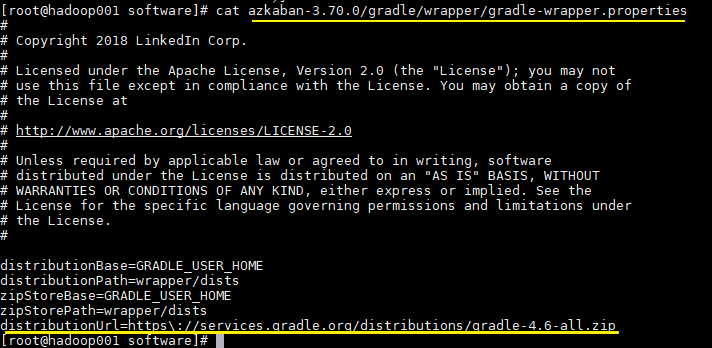
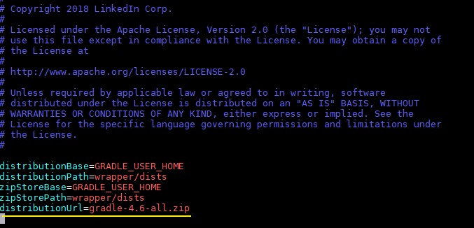
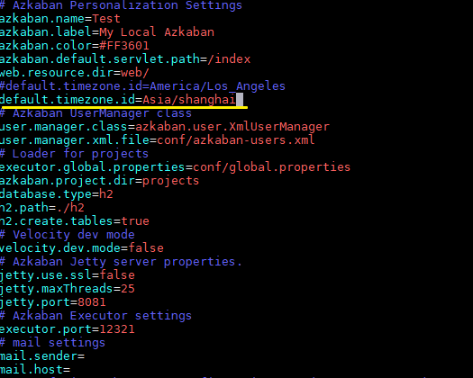
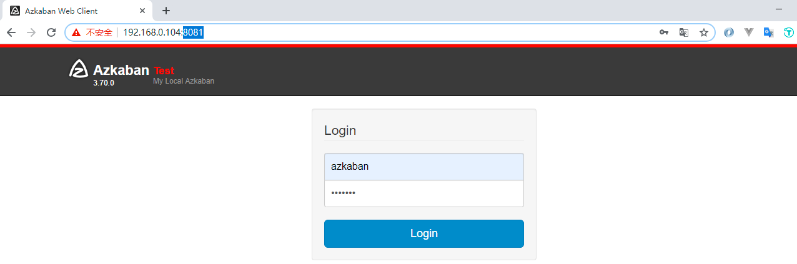

# Azkaban 3.x 编译及部署

<nav>
<a href="#一Azkaban-源码编译">一、Azkaban 源码编译</a><br/>
<a href="#二Azkaban-部署模式">二、Azkaban 部署模式</a><br/>
<a href="#三-Solo-Server-模式部署">三、Solo Server 模式部署</a><br/>
</nav>


## 一、Azkaban 源码编译

### 1.1 下载并解压

Azkaban 在 3.0 版本之后就不提供对应的安装包，需要自己下载源码进行编译。

下载所需版本的源码，Azkaban 的源码托管在 GitHub 上，地址为 https://github.com/azkaban/azkaban 。可以使用 `git clone` 的方式获取源码，也可以使用 `wget` 直接下载对应 release 版本的 `tar.gz` 文件，这里我采用第二种方式：

```shell
# 下载
wget https://github.com/azkaban/azkaban/archive/3.70.0.tar.gz
# 解压
tar -zxvf azkaban-3.70.0.tar.gz
```

### 1.2 准备编译环境

#### 1. JDK

Azkaban 编译依赖 JDK 1.8+ ，JDK 安装方式见本仓库：

> [Linux 环境下 JDK 安装](https://github.com/heibaiying/BigData-Notes/blob/master/notes/installation/Linux下JDK安装.md)

#### 2. Gradle

Azkaban 3.70.0 编译需要依赖 `gradle-4.6-all.zip`。Gradle 是一个项目自动化构建开源工具，类似于 Maven，但由于采用 Groovy 语言进行项目配置，所以比 Maven 更为灵活，目前广泛用于 Android 开发、Spring 项目的构建。

需要注意的是不同版本的 Azkaban 依赖 Gradle 版本不同，可以在解压后的 `/gradle/wrapper/gradle-wrapper.properties` 文件查看

<div align="center">  </div>

在编译时程序会自动去图中所示的地址进行下载，但是下载速度很慢。为避免影响编译过程，建议先手动下载至 `/gradle/wrapper/` 目录下：

```shell
# wget https://services.gradle.org/distributions/gradle-4.6-all.zip
```

然后修改配置文件 `gradle-wrapper.properties` 中的 `distributionUrl` 属性，指明使用本地的 gradle。

<div align="center">  </div>

#### 3. Git

Azkaban 的编译过程需要用 Git 下载部分 JAR 包，所以需要预先安装 Git：

```shell
# yum install git
```

### 1.3 项目编译

在根目录下执行编译命令，编译成功后会有 `BUILD SUCCESSFUL` 的提示：

```shell
# ./gradlew build installDist -x test
```

编译过程中需要注意以下问题：

+ 因为编译的过程需要下载大量的 Jar 包，下载速度根据网络情况而定，通常都不会很快，如果网络不好，耗费半个小时，一个小时都是很正常的；
+ 编译过程中如果出现网络问题而导致 JAR 无法下载，编译可能会被强行终止，这时候重复执行编译命令即可，gradle 会把已经下载的 JAR 缓存到本地，所以不用担心会重复下载 JAR 包。


## 二、Azkaban 部署模式

>After version 3.0, we provide two modes: the stand alone “solo-server” mode and distributed multiple-executor mode. The following describes thedifferences between the two modes.

按照官方文档的说明，Azkaban 3.x 之后版本提供 2 种运行模式：

+ **solo server model(单服务模式)** ：元数据默认存放在内置的 H2 数据库（可以修改为 MySQL），该模式中 `webServer`(管理服务器) 和 `executorServer`(执行服务器) 运行在同一个进程中，进程名是 `AzkabanSingleServer`。该模式适用于小规模工作流的调度。
- **multiple-executor(分布式多服务模式)** ：存放元数据的数据库为 MySQL，MySQL 应采用主从模式进行备份和容错。这种模式下 `webServer` 和 `executorServer` 在不同进程中运行，彼此之间互不影响，适合用于生产环境。

下面主要介绍 `Solo Server` 模式。


## 三 、Solo Server 模式部署

### 2.1  解压

Solo Server 模式安装包在编译后的 `/azkaban-solo-server/build/distributions` 目录下，找到后进行解压即可：

```shell
# 解压
tar -zxvf  azkaban-solo-server-3.70.0.tar.gz
```

### 2.2 修改时区

这一步不是必须的。但是因为 Azkaban 默认采用的时区是 `America/Los_Angeles`，如果你的调度任务中有定时任务的话，就需要进行相应的更改，这里我更改为常用的 `Asia/Shanghai`

<div align="center">  </div>

### 2.3 启动

执行启动命令，需要注意的是一定要在根目录下执行，不能进入 `bin` 目录下执行，不然会抛出 `Cannot find 'database.properties'` 异常。

```shell
# bin/start-solo.sh
```

### 2.4 验证

验证方式一：使用 `jps` 命令查看是否有 `AzkabanSingleServer` 进程：

<div align="center">  </div>
<br/>

验证方式二：访问 8081 端口，查看 Web UI 界面，默认的登录名密码都是 `azkaban`，如果需要修改或新增用户，可以在 `conf/azkaban-users.xml ` 文件中进行配置：

<div align="center">  </div>


