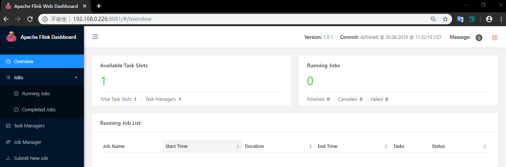
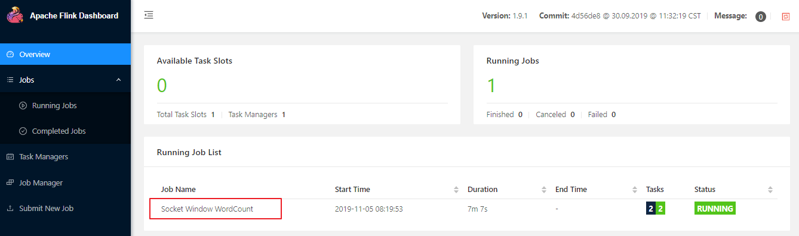
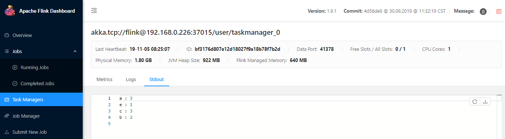
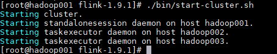
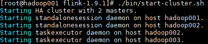
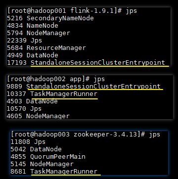
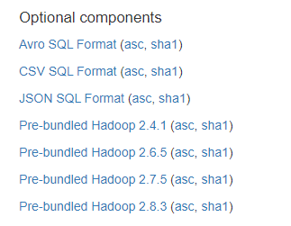

# Flink Standalone Cluster
<nav>
<a href="#一部署模式">一、部署模式</a><br/>
<a href="#二单机模式">二、单机模式</a><br/>
&nbsp;&nbsp;&nbsp;&nbsp;&nbsp;&nbsp;&nbsp;&nbsp;<a href="#21-安装部署">2.1 安装部署</a><br/>
&nbsp;&nbsp;&nbsp;&nbsp;&nbsp;&nbsp;&nbsp;&nbsp;<a href="#22-作业提交">2.2 作业提交</a><br/>
&nbsp;&nbsp;&nbsp;&nbsp;&nbsp;&nbsp;&nbsp;&nbsp;<a href="#23-停止作业">2.3 停止作业</a><br/>
&nbsp;&nbsp;&nbsp;&nbsp;&nbsp;&nbsp;&nbsp;&nbsp;<a href="#24-停止-Flink">2.4 停止 Flink </a><br/>
<a href="#三Standalone-Cluster">三、Standalone Cluster</a><br/>
&nbsp;&nbsp;&nbsp;&nbsp;&nbsp;&nbsp;&nbsp;&nbsp;<a href="#31-前置条件">3.1 前置条件</a><br/>
&nbsp;&nbsp;&nbsp;&nbsp;&nbsp;&nbsp;&nbsp;&nbsp;<a href="#32-搭建步骤">3.2 搭建步骤</a><br/>
&nbsp;&nbsp;&nbsp;&nbsp;&nbsp;&nbsp;&nbsp;&nbsp;<a href="#33-可选配置">3.3 可选配置</a><br/>
<a href="#四Standalone-Cluster-HA">四、Standalone Cluster HA</a><br/>
&nbsp;&nbsp;&nbsp;&nbsp;&nbsp;&nbsp;&nbsp;&nbsp;<a href="#41-前置条件">4.1 前置条件</a><br/>
&nbsp;&nbsp;&nbsp;&nbsp;&nbsp;&nbsp;&nbsp;&nbsp;<a href="#42-搭建步骤">4.2 搭建步骤</a><br/>
&nbsp;&nbsp;&nbsp;&nbsp;&nbsp;&nbsp;&nbsp;&nbsp;<a href="#43-常见异常">4.3 常见异常</a><br/>
</nav>


## 一、部署模式

Flink 支持使用多种部署模式来满足不同规模应用的需求，常见的有单机模式，Standalone Cluster 模式，同时 Flink 也支持部署在其他第三方平台上，如 YARN，Mesos，Docker，Kubernetes 等。以下主要介绍其单机模式和 Standalone Cluster 模式的部署。

## 二、单机模式

单机模式是一种开箱即用的模式，可以在单台服务器上运行，适用于日常的开发和调试。具体操作步骤如下：

### 2.1 安装部署

**1. 前置条件**

Flink 的运行依赖 JAVA 环境，故需要预先安装好 JDK，具体步骤可以参考：[Linux 环境下 JDK 安装](https://github.com/heibaiying/BigData-Notes/blob/master/notes/installation/Linux下JDK安装.md)

**2. 下载 & 解压 & 运行**

Flink 所有版本的安装包可以直接从其[官网](https://flink.apache.org/downloads.html)进行下载，这里我下载的 Flink 的版本为 `1.9.1` ，要求的 JDK 版本为 `1.8.x +`。 下载后解压到指定目录：

```shell
tar -zxvf flink-1.9.1-bin-scala_2.12.tgz  -C /usr/app
```

不需要进行任何配置，直接使用以下命令就可以启动单机版本的 Flink：

```shell
bin/start-cluster.sh
```

**3. WEB UI 界面**

Flink 提供了 WEB 界面用于直观的管理 Flink 集群，访问端口为 `8081`：

<div align="center">  </div>


Flink 的 WEB UI 界面支持大多数常用功能，如提交作业，取消作业，查看各个节点运行情况，查看作业执行情况等，大家可以在部署完成后，进入该页面进行详细的浏览。

### 2.2 作业提交

启动后可以运行安装包中自带的词频统计案例，具体步骤如下：

**1. 开启端口**

```shell
nc -lk 9999
```

**2. 提交作业**

```shell
bin/flink run examples/streaming/SocketWindowWordCount.jar --port 9999
```

该 JAR 包的源码可以在 Flink 官方的 GitHub 仓库中找到，地址为 ：[SocketWindowWordCount](https://github.com/apache/flink/blob/master/flink-examples/flink-examples-streaming/src/main/java/org/apache/flink/streaming/examples/socket/SocketWindowWordCount.java) ，可选传参有 hostname， port，对应的词频数据需要使用空格进行分割。

**3. 输入测试数据**

```shell
a a b b c c c a e
```

**4. 查看控制台输出**

可以通过 WEB UI 的控制台查看作业统运行情况：

<div align="center">  </div>


也可以通过 WEB 控制台查看到统计结果：

<div align="center">  </div>


### 2.3 停止作业

可以直接在 WEB 界面上点击对应作业的 `Cancel Job`  按钮进行取消，也可以使用命令行进行取消。使用命令行进行取消时，需要先获取到作业的 JobId，可以使用 `flink list` 命令查看，输出如下：

```shell
[root@hadoop001 flink-1.9.1]# ./bin/flink list
Waiting for response...
------------------ Running/Restarting Jobs -------------------
05.11.2019 08:19:53 : ba2b1cc41a5e241c32d574c93de8a2bc : Socket Window WordCount (RUNNING)
--------------------------------------------------------------
No scheduled jobs.
```

获取到 JobId 后，就可以使用 `flink cancel` 命令取消作业：

```shell
bin/flink cancel ba2b1cc41a5e241c32d574c93de8a2bc
```

### 2.4 停止 Flink 

命令如下：

```shell
bin/stop-cluster.sh
```


## 三、Standalone Cluster

Standalone Cluster 模式是 Flink 自带的一种集群模式，具体配置步骤如下：

### 3.1 前置条件

使用该模式前，需要确保所有服务器间都已经配置好 SSH 免密登录服务。这里我以三台服务器为例，主机名分别为 hadoop001，hadoop002，hadoop003 , 其中 hadoop001 为 master 节点，其余两台为 slave 节点，搭建步骤如下：

### 3.2 搭建步骤

修改 `conf/flink-conf.yaml` 中 jobmanager 节点的通讯地址为 hadoop001:

```yaml
jobmanager.rpc.address: hadoop001
```

修改 `conf/slaves` 配置文件，将 hadoop002 和 hadoop003 配置为 slave 节点：

```shell
hadoop002
hadoop003
```

将配置好的 Flink 安装包分发到其他两台服务器上：

```shell
 scp -r /usr/app/flink-1.9.1 hadoop002:/usr/app
 scp -r /usr/app/flink-1.9.1 hadoop003:/usr/app
```

在 hadoop001 上使用和单机模式相同的命令来启动集群：

```shell
bin/start-cluster.sh
```

此时控制台输出如下：

<div align="center">  </div>


启动完成后可以使用 `Jps` 命令或者通过 WEB 界面来查看是否启动成功。

### 3.3 可选配置

除了上面介绍的 *jobmanager.rpc.address* 是必选配置外，Flink h还支持使用其他可选参数来优化集群性能，主要如下：

- **jobmanager.heap.size**：JobManager 的 JVM 堆内存大小，默认为 1024m 。
- **taskmanager.heap.size**：Taskmanager 的 JVM 堆内存大小，默认为 1024m 。
- **taskmanager.numberOfTaskSlots**：Taskmanager 上 slots 的数量，通常设置为 CPU 核心的数量，或其一半。
- **parallelism.default**：任务默认的并行度。
- **io.tmp.dirs**：存储临时文件的路径，如果没有配置，则默认采用服务器的临时目录，如 LInux 的 `/tmp` 目录。

更多配置可以参考 Flink 的官方手册：[Configuration](https://ci.apache.org/projects/flink/flink-docs-release-1.9/ops/config.html)

## 四、Standalone Cluster HA

上面我们配置的 Standalone 集群实际上只有一个 JobManager，此时是存在单点故障的，所以官方提供了 Standalone Cluster HA 模式来实现集群高可用。

### 4.1 前置条件

在 Standalone Cluster HA 模式下，集群可以由多个 JobManager，但只有一个处于 active 状态，其余的则处于备用状态，Flink 使用 ZooKeeper 来选举出 Active JobManager，并依赖其来提供一致性协调服务，所以需要预先安装 ZooKeeper 。

另外在高可用模式下，还需要使用分布式文件系统来持久化存储 JobManager 的元数据，最常用的就是 HDFS，所以 Hadoop 也需要预先安装。关于 Hadoop 集群和 ZooKeeper 集群的搭建可以参考：

+ [Hadoop 集群环境搭建](https://github.com/heibaiying/BigData-Notes/blob/master/notes/installation/Hadoop集群环境搭建.md)
+ [Zookeeper 单机环境和集群环境搭建](https://github.com/heibaiying/BigData-Notes/blob/master/notes/installation/Zookeeper单机环境和集群环境搭建.md) 

### 4.2 搭建步骤

修改 `conf/flink-conf.yaml` 文件，增加如下配置：

```yaml
# 配置使用zookeeper来开启高可用模式
high-availability: zookeeper
# 配置zookeeper的地址，采用zookeeper集群时，可以使用逗号来分隔多个节点地址
high-availability.zookeeper.quorum: hadoop003:2181
# 在zookeeper上存储flink集群元信息的路径
high-availability.zookeeper.path.root: /flink
# 集群id
high-availability.cluster-id: /standalone_cluster_one
# 持久化存储JobManager元数据的地址，zookeeper上存储的只是指向该元数据的指针信息
high-availability.storageDir: hdfs://hadoop001:8020/flink/recovery
```

修改 `conf/masters` 文件，将 hadoop001 和 hadoop002 都配置为 master 节点：

```shell
hadoop001:8081
hadoop002:8081
```

确保 Hadoop 和 ZooKeeper 已经启动后，使用以下命令来启动集群：

```shell
bin/start-cluster.sh
```

此时输出如下：

<div align="center">  </div>


可以看到集群已经以 HA 的模式启动，此时还需要在各个节点上使用 `jps` 命令来查看进程是否启动成功，正常情况如下：

<div align="center">  </div>


只有 hadoop001 和 hadoop002 的 JobManager 进程，hadoop002 和 hadoop003 上的 TaskManager 进程都已经完全启动，才表示 Standalone Cluster HA 模式搭建成功。

### 4.3 常见异常

如果进程没有启动，可以通过查看 `log` 目录下的日志来定位错误，常见的一个错误如下：

```shell
2019-11-05 09:18:35,877 INFO  org.apache.flink.runtime.entrypoint.ClusterEntrypoint      
- Shutting StandaloneSessionClusterEntrypoint down with application status FAILED. Diagnostics
java.io.IOException: Could not create FileSystem for highly available storage (high-availability.storageDir)
.......
Caused by: org.apache.flink.core.fs.UnsupportedFileSystemSchemeException: Could not find a file 
system implementation for scheme 'hdfs'. The scheme is not directly supported by Flink and no 
Hadoop file system to support this scheme could be loaded.
.....
Caused by: org.apache.flink.core.fs.UnsupportedFileSystemSchemeException: Hadoop is not in 
the classpath/dependencies.
......
```

可以看到是因为在 classpath 目录下找不到 Hadoop 的相关依赖，此时需要检查是否在环境变量中配置了 Hadoop 的安装路径，如果路径已经配置但仍然存在上面的问题，可以从 [Flink 官网](https://flink.apache.org/downloads.html)下载对应版本的 Hadoop 组件包：

<div align="center">  </div>


下载完成后，将该 JAR 包上传至**所有** Flink 安装目录的 `lib` 目录即可。


## 参考资料

+ [Standalone Cluster](https://ci.apache.org/projects/flink/flink-docs-release-1.9/ops/deployment/cluster_setup.html#standalone-cluster)
+ [JobManager High Availability (HA)](https://ci.apache.org/projects/flink/flink-docs-release-1.9/ops/jobmanager_high_availability.html)

