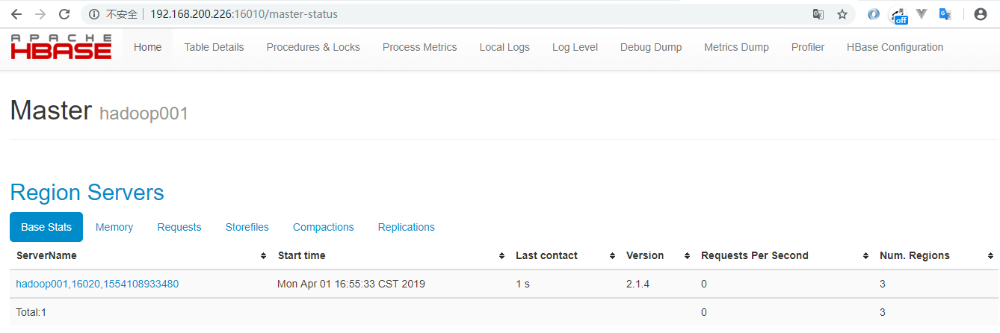
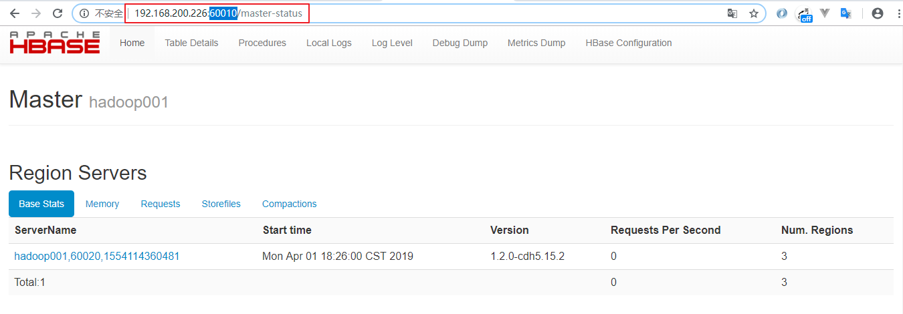

# HBase基本环境搭建

<nav>
<a href="#一安装前置条件说明">一、安装前置条件说明</a><br/>
<a href="#二Standalone-模式">二、Standalone 模式</a><br/>
<a href="#三伪集群模式安装Pseudo-Distributed">三、伪集群模式安装（Pseudo-Distributed）</a><br/>
</nav>

## 一、安装前置条件说明

### 1.1 JDK版本说明

HBase 需要依赖 JDK 环境，同时 HBase 2.0+ 以上版本不再支持 JDK 1.7 ，需要安装 JDK 1.8+ 。JDK 安装方式见本仓库：

> [Linux 环境下 JDK 安装](https://github.com/heibaiying/BigData-Notes/blob/master/notes/installation/Linux下JDK安装.md)

### 1.2 Standalone模式和伪集群模式的区别

+ 在 `Standalone` 模式下，所有守护进程都运行在一个 `jvm` 进程/实例中；
+ 在伪分布模式下，HBase 仍然在单个主机上运行，但是每个守护进程 (HMaster，HRegionServer 和 ZooKeeper) 则分别作为一个单独的进程运行。

**说明：两种模式任选其一进行部署即可，对于开发测试来说区别不大。**


## 二、Standalone 模式

### 2.1 下载并解压

从[官方网站](https://hbase.apache.org/downloads.html) 下载所需要版本的二进制安装包，并进行解压：

```shell
# tar -zxvf hbase-2.1.4-bin.tar.gz
```

### 2.2 配置环境变量

```shell
# vim /etc/profile
```

添加环境变量：

```shell
export HBASE_HOME=/usr/app/hbase-2.1.4
export PATH=$HBASE_HOME/bin:$PATH
```

使得配置的环境变量生效：

```shell
# source /etc/profile
```

### 2.3 进行HBase相关配置

修改安装目录下的 `conf/hbase-env.sh`,指定 JDK 的安装路径：

```shell
# The java implementation to use.  Java 1.8+ required.
export JAVA_HOME=/usr/java/jdk1.8.0_201
```

修改安装目录下的 `conf/hbase-site.xml`，增加如下配置：

```xml
<configuration>
 <property>
    <name>hbase.rootdir</name>
    <value>file:///home/hbase/rootdir</value>
  </property>
  <property>
    <name>hbase.zookeeper.property.dataDir</name>
    <value>/home/zookeeper/dataDir</value>
  </property>
  <property>
    <name>hbase.unsafe.stream.capability.enforce</name>
    <value>false</value>
  </property>
</configuration>
```

`hbase.rootdir`: 配置 hbase 数据的存储路径；

`hbase.zookeeper.property.dataDir`: 配置 zookeeper 数据的存储路径；

`hbase.unsafe.stream.capability.enforce`: 使用本地文件系统存储，不使用 HDFS 的情况下需要禁用此配置，设置为 false。

### 2.4 启动HBase

由于已经将 HBase 的 bin 目录配置到环境变量，直接使用以下命令启动：

```shell
# start-hbase.sh
```

### 2.5 验证启动是否成功

验证方式一 ：使用 `jps` 命令查看 HMaster 进程是否启动。

```
[root@hadoop001 hbase-2.1.4]# jps
16336 Jps
15500 HMaster
```

验证方式二 ：访问 HBaseWeb UI 页面，默认端口为 `16010` 。

<div align="center">  </div>


## 三、伪集群模式安装（Pseudo-Distributed）

### 3.1 Hadoop单机伪集群安装

这里我们采用 HDFS 作为 HBase 的存储方案，需要预先安装 Hadoop。Hadoop 的安装方式单独整理至：

> [Hadoop 单机伪集群搭建](https://github.com/heibaiying/BigData-Notes/blob/master/notes/installation/Hadoop单机版本环境搭建.md)

### 3.2 Hbase版本选择

HBase 的版本必须要与 Hadoop 的版本兼容，不然会出现各种 Jar 包冲突。这里我 Hadoop 安装的版本为 `hadoop-2.6.0-cdh5.15.2`，为保持版本一致，选择的 HBase 版本为 `hbase-1.2.0-cdh5.15.2` 。所有软件版本如下：

+ Hadoop 版本： hadoop-2.6.0-cdh5.15.2
+ HBase 版本： hbase-1.2.0-cdh5.15.2
+ JDK 版本：JDK 1.8


### 3.3 软件下载解压

下载后进行解压，下载地址：http://archive.cloudera.com/cdh5/cdh/5/    

```shell
# tar -zxvf hbase-1.2.0-cdh5.15.2.tar.gz
```

### 3.4 配置环境变量
```shell
# vim /etc/profile
```

添加环境变量：

```shell
export HBASE_HOME=/usr/app/hbase-1.2.0-cdh5.15.2
export PATH=$HBASE_HOME/bin:$PATH
```

使得配置的环境变量生效：

```shell
# source /etc/profile
```


### 3.5 进行HBase相关配置

1.修改安装目录下的 `conf/hbase-env.sh`,指定 JDK 的安装路径：

```shell
# The java implementation to use.  Java 1.7+ required.
export JAVA_HOME=/usr/java/jdk1.8.0_201
```

2.修改安装目录下的 `conf/hbase-site.xml`，增加如下配置 (hadoop001 为主机名)：

```xml
<configuration>
 <!--指定 HBase 以分布式模式运行-->   
 <property>
    <name>hbase.cluster.distributed</name>
    <value>true</value>
 </property>
 <!--指定 HBase 数据存储路径为 HDFS 上的 hbase 目录,hbase 目录不需要预先创建，程序会自动创建-->   
 <property>
    <name>hbase.rootdir</name>
    <value>hdfs://hadoop001:8020/hbase</value>
  </property>
    <!--指定 zookeeper 数据的存储位置-->   
  <property>
    <name>hbase.zookeeper.property.dataDir</name>
    <value>/home/zookeeper/dataDir</value>
  </property>
</configuration>
```

3.修改安装目录下的 `conf/regionservers`，指定 region  servers 的地址，修改后其内容如下：

```shell
hadoop001
```


### 3.6 启动

```shell
# bin/start-hbase.sh
```


### 3.7 验证启动是否成功

验证方式一 ：使用 `jps` 命令查看进程。其中 `HMaster`，`HRegionServer` 是 HBase 的进程，`HQuorumPeer` 是 HBase 内置的 Zookeeper 的进程，其余的为 HDFS 和 YARN 的进程。

```shell
[root@hadoop001 conf]# jps
28688 NodeManager
25824 GradleDaemon
10177 Jps
22083 HRegionServer
20534 DataNode
20807 SecondaryNameNode
18744 Main
20411 NameNode
21851 HQuorumPeer
28573 ResourceManager
21933 HMaster
```

验证方式二 ：访问 HBase Web UI 界面，需要注意的是 1.2 版本的 HBase 的访问端口为 `60010`

<div align="center">  </div>
