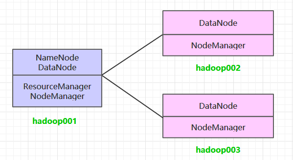
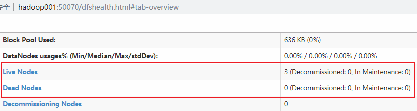
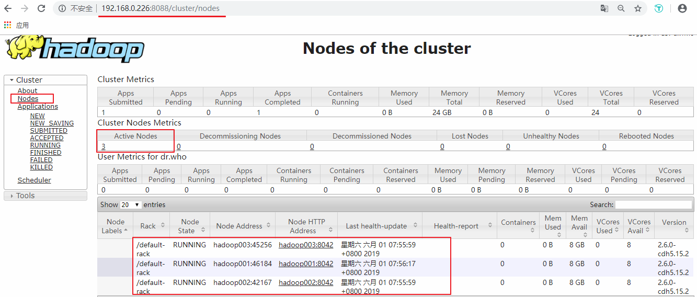

# Hadoop集群环境搭建

<nav>
<a href="#一集群规划">一、集群规划</a><br/>
<a href="#二前置条件">二、前置条件</a><br/>
<a href="#三配置免密登录">三、配置免密登录</a><br/>
&nbsp;&nbsp;&nbsp;&nbsp;&nbsp;&nbsp;&nbsp;&nbsp;<a href="#31-生成密匙">3.1 生成密匙</a><br/>
&nbsp;&nbsp;&nbsp;&nbsp;&nbsp;&nbsp;&nbsp;&nbsp;<a href="#32-免密登录">3.2 免密登录</a><br/>
&nbsp;&nbsp;&nbsp;&nbsp;&nbsp;&nbsp;&nbsp;&nbsp;<a href="#33-验证免密登录">3.3 验证免密登录</a><br/>
<a href="#四集群搭建">四、集群搭建</a><br/>
&nbsp;&nbsp;&nbsp;&nbsp;&nbsp;&nbsp;&nbsp;&nbsp;<a href="#31-下载并解压">3.1 下载并解压</a><br/>
&nbsp;&nbsp;&nbsp;&nbsp;&nbsp;&nbsp;&nbsp;&nbsp;<a href="#32-配置环境变量">3.2 配置环境变量</a><br/>
&nbsp;&nbsp;&nbsp;&nbsp;&nbsp;&nbsp;&nbsp;&nbsp;<a href="#33-修改配置">3.3 修改配置</a><br/>
&nbsp;&nbsp;&nbsp;&nbsp;&nbsp;&nbsp;&nbsp;&nbsp;<a href="#34-分发程序">3.4 分发程序</a><br/>
&nbsp;&nbsp;&nbsp;&nbsp;&nbsp;&nbsp;&nbsp;&nbsp;<a href="#35--初始化">3.5  初始化</a><br/>
&nbsp;&nbsp;&nbsp;&nbsp;&nbsp;&nbsp;&nbsp;&nbsp;<a href="#36-启动集群">3.6 启动集群</a><br/>
&nbsp;&nbsp;&nbsp;&nbsp;&nbsp;&nbsp;&nbsp;&nbsp;<a href="#37-查看集群">3.7 查看集群</a><br/>
<a href="#五提交服务到集群">五、提交服务到集群</a><br/>
</nav>


## 一、集群规划

这里搭建一个 3 节点的 Hadoop 集群，其中三台主机均部署 `DataNode` 和 `NodeManager` 服务，但只有 hadoop001 上部署 `NameNode` 和 `ResourceManager` 服务。

<div align="center">  </div>

## 二、前置条件

Hadoop 的运行依赖 JDK，需要预先安装。其安装步骤单独整理至：

+ [Linux 下 JDK 的安装](https://github.com/heibaiying/BigData-Notes/blob/master/notes/installation/Linux下JDK安装.md)


## 三、配置免密登录

### 3.1 生成密匙

在每台主机上使用 `ssh-keygen` 命令生成公钥私钥对：

```shell
ssh-keygen
```

### 3.2 免密登录

将 `hadoop001` 的公钥写到本机和远程机器的 ` ~/ .ssh/authorized_key` 文件中：

```shell
ssh-copy-id -i ~/.ssh/id_rsa.pub hadoop001
ssh-copy-id -i ~/.ssh/id_rsa.pub hadoop002
ssh-copy-id -i ~/.ssh/id_rsa.pub hadoop003
```

### 3.3 验证免密登录

```she
ssh hadoop002
ssh hadoop003
```


## 四、集群搭建

### 3.1 下载并解压

下载 Hadoop。这里我下载的是 CDH 版本 Hadoop，下载地址为：http://archive.cloudera.com/cdh5/cdh/5/

```shell
# tar -zvxf hadoop-2.6.0-cdh5.15.2.tar.gz 
```

### 3.2 配置环境变量

编辑 `profile` 文件：

```shell
# vim /etc/profile
```

增加如下配置：

```
export HADOOP_HOME=/usr/app/hadoop-2.6.0-cdh5.15.2
export  PATH=${HADOOP_HOME}/bin:$PATH
```

执行 `source` 命令，使得配置立即生效：

```shell
# source /etc/profile
```

### 3.3 修改配置

进入 `${HADOOP_HOME}/etc/hadoop` 目录下，修改配置文件。各个配置文件内容如下：

#### 1. hadoop-env.sh

```shell
# 指定JDK的安装位置
export JAVA_HOME=/usr/java/jdk1.8.0_201/
```

#### 2.  core-site.xml

```xml
<configuration>
    <property>
        <!--指定 namenode 的 hdfs 协议文件系统的通信地址-->
        <name>fs.defaultFS</name>
        <value>hdfs://hadoop001:8020</value>
    </property>
    <property>
        <!--指定 hadoop 集群存储临时文件的目录-->
        <name>hadoop.tmp.dir</name>
        <value>/home/hadoop/tmp</value>
    </property>
</configuration>
```

#### 3. hdfs-site.xml

```xml
<property>
      <!--namenode 节点数据（即元数据）的存放位置，可以指定多个目录实现容错，多个目录用逗号分隔-->
    <name>dfs.namenode.name.dir</name>
    <value>/home/hadoop/namenode/data</value>
</property>
<property>
      <!--datanode 节点数据（即数据块）的存放位置-->
    <name>dfs.datanode.data.dir</name>
    <value>/home/hadoop/datanode/data</value>
</property>
```

#### 4. yarn-site.xml

```xml
<configuration>
    <property>
        <!--配置 NodeManager 上运行的附属服务。需要配置成 mapreduce_shuffle 后才可以在 Yarn 上运行 MapReduce 程序。-->
        <name>yarn.nodemanager.aux-services</name>
        <value>mapreduce_shuffle</value>
    </property>
    <property>
        <!--resourcemanager 的主机名-->
        <name>yarn.resourcemanager.hostname</name>
        <value>hadoop001</value>
    </property>
</configuration>

```

#### 5.  mapred-site.xml

```xml
<configuration>
    <property>
        <!--指定 mapreduce 作业运行在 yarn 上-->
        <name>mapreduce.framework.name</name>
        <value>yarn</value>
    </property>
</configuration>
```

#### 5. slaves

配置所有从属节点的主机名或 IP 地址，每行一个。所有从属节点上的 `DataNode` 服务和 `NodeManager` 服务都会被启动。

```properties
hadoop001
hadoop002
hadoop003
```

### 3.4 分发程序

将 Hadoop 安装包分发到其他两台服务器，分发后建议在这两台服务器上也配置一下 Hadoop 的环境变量。

```shell
# 将安装包分发到hadoop002
scp -r /usr/app/hadoop-2.6.0-cdh5.15.2/  hadoop002:/usr/app/
# 将安装包分发到hadoop003
scp -r /usr/app/hadoop-2.6.0-cdh5.15.2/  hadoop003:/usr/app/
```

### 3.5  初始化

在 `Hadoop001` 上执行 namenode 初始化命令：

```
hdfs namenode -format
```

### 3.6 启动集群

进入到 `Hadoop001` 的 `${HADOOP_HOME}/sbin` 目录下，启动 Hadoop。此时 `hadoop002` 和 `hadoop003` 上的相关服务也会被启动：

```shell
# 启动dfs服务
start-dfs.sh
# 启动yarn服务
start-yarn.sh
```

### 3.7 查看集群

在每台服务器上使用 `jps` 命令查看服务进程，或直接进入 Web-UI 界面进行查看，端口为 `50070`。可以看到此时有三个可用的 `Datanode`：

<div align="center">  </div>
<BR/>

点击 `Live Nodes` 进入，可以看到每个 `DataNode` 的详细情况：

<div align="center">  </div>
<BR/>

接着可以查看 Yarn 的情况，端口号为 `8088` ：

<div align="center">  </div>


## 五、提交服务到集群

提交作业到集群的方式和单机环境完全一致，这里以提交 Hadoop 内置的计算 Pi 的示例程序为例，在任何一个节点上执行都可以，命令如下：

```shell
hadoop jar /usr/app/hadoop-2.6.0-cdh5.15.2/share/hadoop/mapreduce/hadoop-mapreduce-examples-2.6.0-cdh5.15.2.jar  pi  3  3
```

