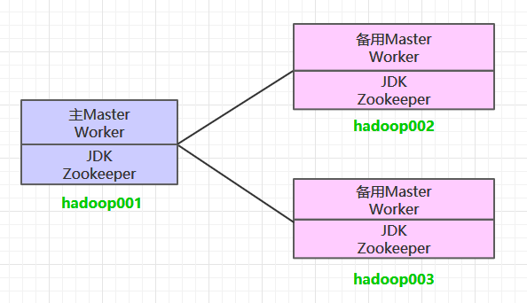
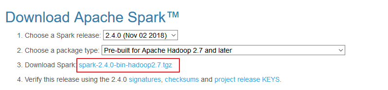
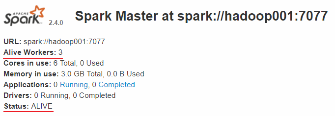
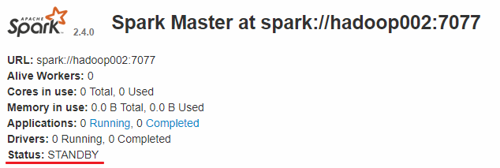
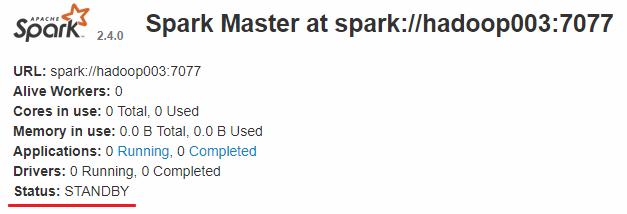
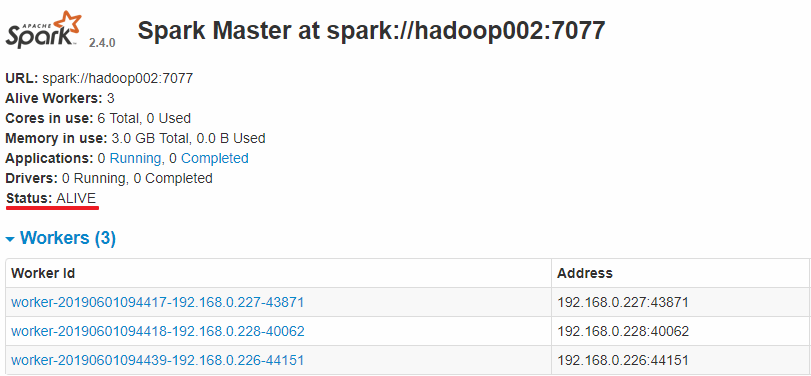

# 基于ZooKeeper搭建Spark高可用集群

<nav>
<a href="#一集群规划">一、集群规划</a><br/>
<a href="#二前置条件">二、前置条件</a><br/>
<a href="#三Spark集群搭建">三、Spark集群搭建</a><br/>
&nbsp;&nbsp;&nbsp;&nbsp;&nbsp;&nbsp;&nbsp;&nbsp;<a href="#31-下载解压">3.1 下载解压</a><br/>
&nbsp;&nbsp;&nbsp;&nbsp;&nbsp;&nbsp;&nbsp;&nbsp;<a href="#32-配置环境变量">3.2 配置环境变量</a><br/>
&nbsp;&nbsp;&nbsp;&nbsp;&nbsp;&nbsp;&nbsp;&nbsp;<a href="#33-集群配置">3.3 集群配置</a><br/>
&nbsp;&nbsp;&nbsp;&nbsp;&nbsp;&nbsp;&nbsp;&nbsp;<a href="#34-安装包分发">3.4 安装包分发</a><br/>
<a href="#四启动集群">四、启动集群</a><br/>
&nbsp;&nbsp;&nbsp;&nbsp;&nbsp;&nbsp;&nbsp;&nbsp;<a href="#41-启动ZooKeeper集群">4.1 启动ZooKeeper集群</a><br/>
&nbsp;&nbsp;&nbsp;&nbsp;&nbsp;&nbsp;&nbsp;&nbsp;<a href="#42-启动Hadoop集群">4.2 启动Hadoop集群</a><br/>
&nbsp;&nbsp;&nbsp;&nbsp;&nbsp;&nbsp;&nbsp;&nbsp;<a href="#43-启动Spark集群">4.3 启动Spark集群</a><br/>
&nbsp;&nbsp;&nbsp;&nbsp;&nbsp;&nbsp;&nbsp;&nbsp;<a href="#44-查看服务">4.4 查看服务</a><br/>
<a href="#五验证集群高可用">五、验证集群高可用</a><br/>
<a href="#六提交作业">六、提交作业</a><br/>
</nav>


## 一、集群规划

这里搭建一个 3 节点的 Spark 集群，其中三台主机上均部署 `Worker` 服务。同时为了保证高可用，除了在 hadoop001 上部署主 `Master` 服务外，还在 hadoop002 和 hadoop003 上分别部署备用的 `Master` 服务，Master 服务由 Zookeeper 集群进行协调管理，如果主 `Master` 不可用，则备用 `Master` 会成为新的主 `Master`。

<div align="center">  </div>

## 二、前置条件

搭建 Spark 集群前，需要保证 JDK 环境、Zookeeper 集群和 Hadoop 集群已经搭建，相关步骤可以参阅：

- [Linux 环境下 JDK 安装](https://github.com/heibaiying/BigData-Notes/blob/master/notes/installation/Linux下JDK安装.md)
- [Zookeeper 单机环境和集群环境搭建](https://github.com/heibaiying/BigData-Notes/blob/master/notes/installation/Zookeeper单机环境和集群环境搭建.md)
- [Hadoop 集群环境搭建](https://github.com/heibaiying/BigData-Notes/blob/master/notes/installation/Hadoop集群环境搭建.md)

## 三、Spark集群搭建

### 3.1 下载解压

下载所需版本的 Spark，官网下载地址：http://spark.apache.org/downloads.html

<div align="center">  </div>


下载后进行解压：

```shell
# tar -zxvf  spark-2.2.3-bin-hadoop2.6.tgz
```


### 3.2 配置环境变量

```shell
# vim /etc/profile
```

添加环境变量：

```shell
export SPARK_HOME=/usr/app/spark-2.2.3-bin-hadoop2.6
export  PATH=${SPARK_HOME}/bin:$PATH
```

使得配置的环境变量立即生效：

```shell
# source /etc/profile
```

### 3.3 集群配置

进入 `${SPARK_HOME}/conf` 目录，拷贝配置样本进行修改：

#### 1. spark-env.sh

```she
 cp spark-env.sh.template spark-env.sh
```

```shell
# 配置JDK安装位置
JAVA_HOME=/usr/java/jdk1.8.0_201
# 配置hadoop配置文件的位置
HADOOP_CONF_DIR=/usr/app/hadoop-2.6.0-cdh5.15.2/etc/hadoop
# 配置zookeeper地址
SPARK_DAEMON_JAVA_OPTS="-Dspark.deploy.recoveryMode=ZOOKEEPER -Dspark.deploy.zookeeper.url=hadoop001:2181,hadoop002:2181,hadoop003:2181 -Dspark.deploy.zookeeper.dir=/spark"
```

#### 2. slaves

```
cp slaves.template slaves
```

配置所有 Woker 节点的位置：

```properties
hadoop001
hadoop002
hadoop003
```

### 3.4 安装包分发

将 Spark 的安装包分发到其他服务器，分发后建议在这两台服务器上也配置一下 Spark 的环境变量。

```shell
scp -r /usr/app/spark-2.4.0-bin-hadoop2.6/   hadoop002:usr/app/
scp -r /usr/app/spark-2.4.0-bin-hadoop2.6/   hadoop003:usr/app/
```


## 四、启动集群

### 4.1 启动ZooKeeper集群

分别到三台服务器上启动 ZooKeeper 服务：

```shell
 zkServer.sh start
```

### 4.2 启动Hadoop集群

```shell
# 启动dfs服务
start-dfs.sh
# 启动yarn服务
start-yarn.sh
```

### 4.3 启动Spark集群

进入 hadoop001 的 ` ${SPARK_HOME}/sbin` 目录下，执行下面命令启动集群。执行命令后，会在 hadoop001 上启动 `Maser` 服务，会在 `slaves` 配置文件中配置的所有节点上启动 `Worker` 服务。

```shell
start-all.sh
```

分别在 hadoop002 和 hadoop003 上执行下面的命令，启动备用的 `Master` 服务：

```shell
# ${SPARK_HOME}/sbin 下执行
start-master.sh
```

### 4.4 查看服务

查看 Spark 的 Web-UI 页面，端口为 `8080`。此时可以看到 hadoop001 上的 Master 节点处于 `ALIVE` 状态，并有 3 个可用的 `Worker` 节点。

<div align="center">  </div>

而 hadoop002 和 hadoop003 上的 Master 节点均处于 `STANDBY` 状态，没有可用的 `Worker` 节点。

<div align="center">  </div>

<div align="center">  </div>


## 五、验证集群高可用

此时可以使用 `kill` 命令杀死 hadoop001 上的 `Master` 进程，此时备用 `Master` 会中会有一个再次成为 ` 主 Master`，我这里是 hadoop002，可以看到 hadoop2 上的 `Master` 经过 `RECOVERING` 后成为了新的主 `Master`，并且获得了全部可以用的 `Workers`。

<div align="center">  </div>

Hadoop002 上的 `Master` 成为主 `Master`，并获得了全部可以用的 `Workers`。

<div align="center">  </div>

此时如果你再在 hadoop001 上使用 `start-master.sh` 启动 Master 服务，那么其会作为备用 `Master` 存在。

## 六、提交作业

和单机环境下的提交到 Yarn 上的命令完全一致，这里以 Spark 内置的计算 Pi 的样例程序为例，提交命令如下：

```shell
spark-submit \
--class org.apache.spark.examples.SparkPi \
--master yarn \
--deploy-mode client \
--executor-memory 1G \
--num-executors 10 \
/usr/app/spark-2.4.0-bin-hadoop2.6/examples/jars/spark-examples_2.11-2.4.0.jar \
100
```

