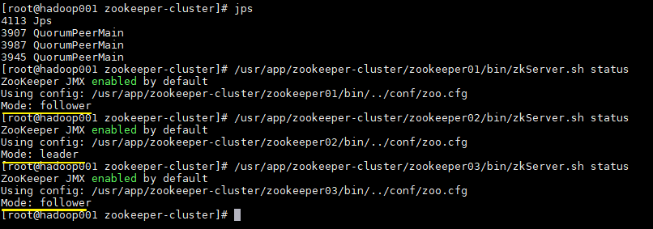
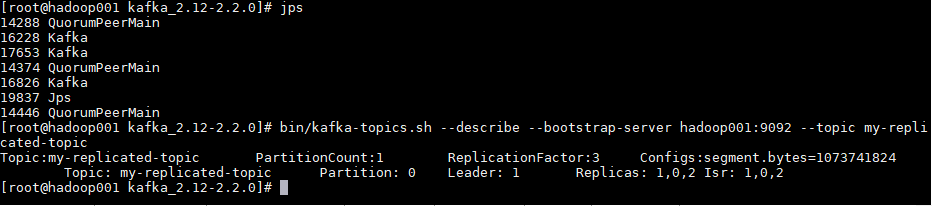

# 基于Zookeeper搭建Kafka高可用集群

<nav>
<a href="#一Zookeeper集群搭建">一、Zookeeper集群搭建</a><br/>
&nbsp;&nbsp;&nbsp;&nbsp;&nbsp;&nbsp;&nbsp;&nbsp;<a href="#11-下载--解压">1.1 下载 & 解压</a><br/>
&nbsp;&nbsp;&nbsp;&nbsp;&nbsp;&nbsp;&nbsp;&nbsp;<a href="#12-修改配置">1.2 修改配置</a><br/>
&nbsp;&nbsp;&nbsp;&nbsp;&nbsp;&nbsp;&nbsp;&nbsp;<a href="#13-标识节点">1.3 标识节点</a><br/>
&nbsp;&nbsp;&nbsp;&nbsp;&nbsp;&nbsp;&nbsp;&nbsp;<a href="#14-启动集群">1.4 启动集群</a><br/>
&nbsp;&nbsp;&nbsp;&nbsp;&nbsp;&nbsp;&nbsp;&nbsp;<a href="#15-集群验证">1.5 集群验证</a><br/>
<a href="#二Kafka集群搭建">二、Kafka集群搭建</a><br/>
&nbsp;&nbsp;&nbsp;&nbsp;&nbsp;&nbsp;&nbsp;&nbsp;<a href="#21-下载解压">2.1 下载解压</a><br/>
&nbsp;&nbsp;&nbsp;&nbsp;&nbsp;&nbsp;&nbsp;&nbsp;<a href="#22-拷贝配置文件">2.2 拷贝配置文件</a><br/>
&nbsp;&nbsp;&nbsp;&nbsp;&nbsp;&nbsp;&nbsp;&nbsp;<a href="#23-修改配置">2.3 修改配置</a><br/>
&nbsp;&nbsp;&nbsp;&nbsp;&nbsp;&nbsp;&nbsp;&nbsp;<a href="#24-启动集群">2.4 启动集群</a><br/>
&nbsp;&nbsp;&nbsp;&nbsp;&nbsp;&nbsp;&nbsp;&nbsp;<a href="#25-创建测试主题">2.5 创建测试主题</a><br/>
</nav>

## 一、Zookeeper集群搭建

为保证集群高可用，Zookeeper 集群的节点数最好是奇数，最少有三个节点，所以这里搭建一个三个节点的集群。

### 1.1 下载 & 解压

下载对应版本 Zookeeper，这里我下载的版本 `3.4.14`。官方下载地址：https://archive.apache.org/dist/zookeeper/

```shell
# 下载
wget https://archive.apache.org/dist/zookeeper/zookeeper-3.4.14/zookeeper-3.4.14.tar.gz
# 解压
tar -zxvf zookeeper-3.4.14.tar.gz
```

### 1.2 修改配置

拷贝三份 zookeeper 安装包。分别进入安装目录的 `conf` 目录，拷贝配置样本 `zoo_sample.cfg ` 为 `zoo.cfg` 并进行修改，修改后三份配置文件内容分别如下：

zookeeper01 配置：

```shell
tickTime=2000
initLimit=10
syncLimit=5
dataDir=/usr/local/zookeeper-cluster/data/01
dataLogDir=/usr/local/zookeeper-cluster/log/01
clientPort=2181

# server.1 这个1是服务器的标识，可以是任意有效数字，标识这是第几个服务器节点，这个标识要写到dataDir目录下面myid文件里
# 指名集群间通讯端口和选举端口
server.1=127.0.0.1:2287:3387
server.2=127.0.0.1:2288:3388
server.3=127.0.0.1:2289:3389
```

> 如果是多台服务器，则集群中每个节点通讯端口和选举端口可相同，IP 地址修改为每个节点所在主机 IP 即可。

zookeeper02 配置，与 zookeeper01 相比，只有 `dataLogDir`、`dataLogDir` 和 `clientPort` 不同：

```shell
tickTime=2000
initLimit=10
syncLimit=5
dataDir=/usr/local/zookeeper-cluster/data/02
dataLogDir=/usr/local/zookeeper-cluster/log/02
clientPort=2182

server.1=127.0.0.1:2287:3387
server.2=127.0.0.1:2288:3388
server.3=127.0.0.1:2289:3389
```

zookeeper03 配置，与 zookeeper01，02 相比，也只有 `dataLogDir`、`dataLogDir` 和 `clientPort` 不同：

```shell
tickTime=2000
initLimit=10
syncLimit=5
dataDir=/usr/local/zookeeper-cluster/data/03
dataLogDir=/usr/local/zookeeper-cluster/log/03
clientPort=2183

server.1=127.0.0.1:2287:3387
server.2=127.0.0.1:2288:3388
server.3=127.0.0.1:2289:3389
```

> 配置参数说明：
>
> - **tickTime**：用于计算的基础时间单元。比如 session 超时：N*tickTime；
> - **initLimit**：用于集群，允许从节点连接并同步到 master 节点的初始化连接时间，以 tickTime 的倍数来表示；
> - **syncLimit**：用于集群， master 主节点与从节点之间发送消息，请求和应答时间长度（心跳机制）；
> - **dataDir**：数据存储位置；
> - **dataLogDir**：日志目录；
> - **clientPort**：用于客户端连接的端口，默认 2181


### 1.3 标识节点

分别在三个节点的数据存储目录下新建 `myid` 文件,并写入对应的节点标识。Zookeeper 集群通过 `myid` 文件识别集群节点，并通过上文配置的节点通信端口和选举端口来进行节点通信，选举出 leader 节点。

创建存储目录：

```shell
# dataDir
mkdir -vp  /usr/local/zookeeper-cluster/data/01
# dataDir
mkdir -vp  /usr/local/zookeeper-cluster/data/02
# dataDir
mkdir -vp  /usr/local/zookeeper-cluster/data/03
```

创建并写入节点标识到 `myid` 文件：

```shell
#server1
echo "1" > /usr/local/zookeeper-cluster/data/01/myid
#server2
echo "2" > /usr/local/zookeeper-cluster/data/02/myid
#server3
echo "3" > /usr/local/zookeeper-cluster/data/03/myid
```

### 1.4 启动集群

分别启动三个节点：

```shell
# 启动节点1
/usr/app/zookeeper-cluster/zookeeper01/bin/zkServer.sh start
# 启动节点2
/usr/app/zookeeper-cluster/zookeeper02/bin/zkServer.sh start
# 启动节点3
/usr/app/zookeeper-cluster/zookeeper03/bin/zkServer.sh start
```

### 1.5 集群验证

使用 jps 查看进程，并且使用 `zkServer.sh status` 查看集群各个节点状态。如图三个节点进程均启动成功，并且两个节点为 follower 节点，一个节点为 leader 节点。

<div align="center">  </div>


## 二、Kafka集群搭建

### 2.1 下载解压

Kafka 安装包官方下载地址：http://kafka.apache.org/downloads ，本用例下载的版本为 `2.2.0`，下载命令：

```shell
# 下载
wget https://www-eu.apache.org/dist/kafka/2.2.0/kafka_2.12-2.2.0.tgz
# 解压
tar -xzf kafka_2.12-2.2.0.tgz
```

>这里 j 解释一下 kafka 安装包的命名规则：以 `kafka_2.12-2.2.0.tgz` 为例，前面的 2.12 代表 Scala 的版本号（Kafka 采用 Scala 语言进行开发），后面的 2.2.0 则代表 Kafka 的版本号。

### 2.2 拷贝配置文件

进入解压目录的 ` config` 目录下 ，拷贝三份配置文件：

```shell
# cp server.properties server-1.properties
# cp server.properties server-2.properties
# cp server.properties server-3.properties
```

### 2.3 修改配置

分别修改三份配置文件中的部分配置，如下：

server-1.properties：

```properties
# The id of the broker. 集群中每个节点的唯一标识
broker.id=0
# 监听地址
listeners=PLAINTEXT://hadoop001:9092
# 数据的存储位置
log.dirs=/usr/local/kafka-logs/00
# Zookeeper连接地址
zookeeper.connect=hadoop001:2181,hadoop001:2182,hadoop001:2183
```

server-2.properties：

```properties
broker.id=1
listeners=PLAINTEXT://hadoop001:9093
log.dirs=/usr/local/kafka-logs/01
zookeeper.connect=hadoop001:2181,hadoop001:2182,hadoop001:2183
```

server-3.properties：

```properties
broker.id=2
listeners=PLAINTEXT://hadoop001:9094
log.dirs=/usr/local/kafka-logs/02
zookeeper.connect=hadoop001:2181,hadoop001:2182,hadoop001:2183
```

这里需要说明的是 `log.dirs` 指的是数据日志的存储位置，确切的说，就是分区数据的存储位置，而不是程序运行日志的位置。程序运行日志的位置是通过同一目录下的 `log4j.properties` 进行配置的。

### 2.4 启动集群

分别指定不同配置文件，启动三个 Kafka 节点。启动后可以使用 jps 查看进程，此时应该有三个 zookeeper 进程和三个 kafka 进程。

```shell
bin/kafka-server-start.sh config/server-1.properties
bin/kafka-server-start.sh config/server-2.properties
bin/kafka-server-start.sh config/server-3.properties
```

### 2.5 创建测试主题

创建测试主题：

```shell
bin/kafka-topics.sh --create --bootstrap-server hadoop001:9092 \
					--replication-factor 3 \
					--partitions 1 --topic my-replicated-topic
```

创建后可以使用以下命令查看创建的主题信息：

```shell
bin/kafka-topics.sh --describe --bootstrap-server hadoop001:9092 --topic my-replicated-topic
```

<div align="center">  </div>


可以看到分区 0 的有 0,1,2 三个副本，且三个副本都是可用副本，都在 ISR(in-sync Replica 同步副本) 列表中，其中 1 为首领副本，此时代表集群已经搭建成功。


