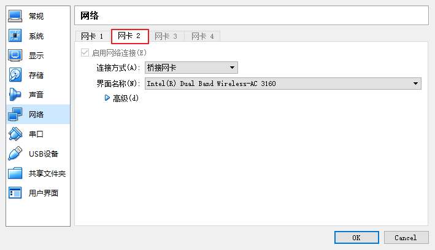
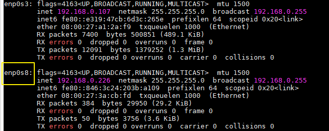
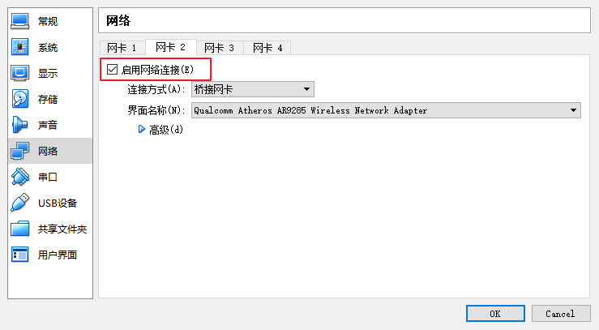

# 虚拟机静态IP及多IP配置

<nav>
<a href="#一虚拟机静态IP配置">一、虚拟机静态IP配置</a><br/>
&nbsp;&nbsp;&nbsp;&nbsp;&nbsp;&nbsp;&nbsp;&nbsp;<a href="#1-编辑网络配置文件">1. 编辑网络配置文件</a><br/>
&nbsp;&nbsp;&nbsp;&nbsp;&nbsp;&nbsp;&nbsp;&nbsp;<a href="#2-重启网络服务">2. 重启网络服务</a><br/>
<a href="#二虚拟机多个静态IP配置">二、虚拟机多个静态IP配置</a><br/>
&nbsp;&nbsp;&nbsp;&nbsp;&nbsp;&nbsp;&nbsp;&nbsp;<a href="#1-配置多网卡">1. 配置多网卡</a><br/>
&nbsp;&nbsp;&nbsp;&nbsp;&nbsp;&nbsp;&nbsp;&nbsp;<a href="#2-查看网卡名称">2. 查看网卡名称</a><br/>
&nbsp;&nbsp;&nbsp;&nbsp;&nbsp;&nbsp;&nbsp;&nbsp;<a href="#3-配置第二块网卡">3. 配置第二块网卡</a><br/>
&nbsp;&nbsp;&nbsp;&nbsp;&nbsp;&nbsp;&nbsp;&nbsp;<a href="#4-重启网络服务器">4. 重启网络服务器</a><br/>
&nbsp;&nbsp;&nbsp;&nbsp;&nbsp;&nbsp;&nbsp;&nbsp;<a href="#5-使用说明">5. 使用说明</a><br/>
</nav>


## 一、虚拟机静态IP配置

### 1. 编辑网络配置文件

```shell
# vim /etc/sysconfig/network-scripts/ifcfg-enp0s3
```

添加如下网络配置：

+ IPADDR 需要和宿主机同一个网段；
+ GATEWAY 保持和宿主机一致；

```properties
BOOTPROTO=static
IPADDR=192.168.0.107
NETMASK=255.255.255.0
GATEWAY=192.168.0.1
DNS1=192.168.0.1
ONBOOT=yes
```

我的主机配置：

<div align="center">  </div>

修改后完整配置如下：

```properties
TYPE=Ethernet
PROXY_METHOD=none
BROWSER_ONLY=no
BOOTPROTO=static
IPADDR=192.168.0.107
NETMASK=255.255.255.0
GATEWAY=192.168.0.1
BROADCAST=192.168.0.255
DNS1=192.168.0.1
DEFROUTE=yes
IPV4_FAILURE_FATAL=no
IPV6INIT=yes
IPV6_AUTOCONF=yes
IPV6_DEFROUTE=yes
IPV6_FAILURE_FATAL=no
IPV6_ADDR_GEN_MODE=stable-privacy
NAME=enp0s3
UUID=03d45df1-8514-4774-9b47-fddd6b9d9fca
DEVICE=enp0s3
ONBOOT=yes
```

### 2. 重启网络服务

```shell
#  systemctl restart network
```


## 二、虚拟机多个静态IP配置

如果一台虚拟机需要经常在不同网络环境使用，可以配置多个静态 IP。

### 1. 配置多网卡

这里我是用的虚拟机是 virtualBox，开启多网卡配置方式如下：

<div align="center">  </div>

### 2. 查看网卡名称

使用 `ifconfig`，查看第二块网卡名称，这里我的名称为 `enp0s8`：

<div align="center">  </div>

### 3. 配置第二块网卡

开启多网卡后并不会自动生成配置文件，需要拷贝 `ifcfg-enp0s3` 进行修改：

```shell
# cp ifcfg-enp0s3 ifcfg-enp0s8
```

静态 IP 配置方法如上，这里不再赘述。除了静态 IP 参数外，以下三个参数还需要修改，UUID 必须与 `ifcfg-enp0s3` 中的不一样：

```properties
NAME=enp0s8
UUID=03d45df1-8514-4774-9b47-fddd6b9d9fcb
DEVICE=enp0s8
```

### 4. 重启网络服务器

```shell
#  systemctl restart network
```

### 5. 使用说明

使用时只需要根据所处的网络环境，勾选对应的网卡即可，不使用的网卡尽量不要勾选启动。

<div align="center">  </div>
