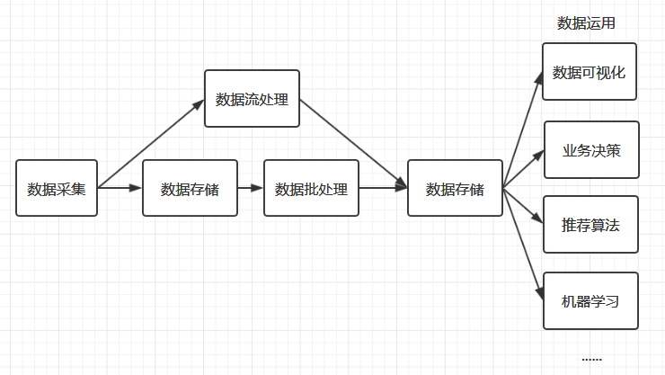

# 大数据学习路线

<nav>
<a href="#一大数据处理流程">一、大数据处理流程</a> 
&nbsp;&nbsp;&nbsp;&nbsp;&nbsp;&nbsp;&nbsp;&nbsp;<a href="#11-数据收集">1.1 数据收集</a> 
&nbsp;&nbsp;&nbsp;&nbsp;&nbsp;&nbsp;&nbsp;&nbsp;<a href="#12-数据存储">1.2 数据存储</a> 
&nbsp;&nbsp;&nbsp;&nbsp;&nbsp;&nbsp;&nbsp;&nbsp;<a href="#13-数据分析">1.3 数据分析</a> 
&nbsp;&nbsp;&nbsp;&nbsp;&nbsp;&nbsp;&nbsp;&nbsp;<a href="#14-数据应用">1.4 数据应用</a> 
&nbsp;&nbsp;&nbsp;&nbsp;&nbsp;&nbsp;&nbsp;&nbsp;<a href="#15-其他框架">1.5 其他框架</a> 
<a href="#二学习路线">二、学习路线</a> 
&nbsp;&nbsp;&nbsp;&nbsp;&nbsp;&nbsp;&nbsp;&nbsp;<a href="#21-语言基础">2.1 语言基础</a> 
&nbsp;&nbsp;&nbsp;&nbsp;&nbsp;&nbsp;&nbsp;&nbsp;<a href="#22-Linux-基础">2.2 Linux 基础</a> 
&nbsp;&nbsp;&nbsp;&nbsp;&nbsp;&nbsp;&nbsp;&nbsp;<a href="#23-构建工具">2.3 构建工具</a> 
&nbsp;&nbsp;&nbsp;&nbsp;&nbsp;&nbsp;&nbsp;&nbsp;<a href="#24-框架学习">2.4 框架学习</a> 
<a href="#三开发工具">三、开发工具</a> 
<a href="#四结语">四、结语</a> 
</nav>

## 一、大数据处理流程

  

上图是一个简化的大数据处理流程图，大数据处理的主要流程包括数据收集、数据存储、数据处理、数据应用等主要环节。下面我们逐一对各个环节所需要的技术栈进行讲解：

### 1.1 数据收集

大数据处理的第一步是数据的收集。现在的中大型项目通常采用微服务架构进行分布式部署，所以数据的采集需要在多台服务器上进行，且采集过程不能影响正常业务的开展。基于这种需求，就衍生了多种日志收集工具，如 Flume 、Logstash、Kibana 等，它们都能通过简单的配置完成复杂的数据收集和数据聚合。

### 1.2 数据存储

收集到数据后，下一个问题就是：数据该如何进行存储？通常大家最为熟知是 MySQL、Oracle 等传统的关系型数据库，它们的优点是能够快速存储结构化的数据，并支持随机访问。但大数据的数据结构通常是半结构化（如日志数据）、甚至是非结构化的（如视频、音频数据），为了解决海量半结构化和非结构化数据的存储，衍生了 Hadoop HDFS 、KFS、GFS 等分布式文件系统，它们都能够支持结构化、半结构和非结构化数据的存储，并可以通过增加机器进行横向扩展。

分布式文件系统完美地解决了海量数据存储的问题，但是一个优秀的数据存储系统需要同时考虑数据存储和访问两方面的问题，比如你希望能够对数据进行随机访问，这是传统的关系型数据库所擅长的，但却不是分布式文件系统所擅长的，那么有没有一种存储方案能够同时兼具分布式文件系统和关系型数据库的优点，基于这种需求，就产生了 HBase、MongoDB。

### 1.3 数据分析

大数据处理最重要的环节就是数据分析，数据分析通常分为两种：批处理和流处理。

+ **批处理**：对一段时间内海量的离线数据进行统一的处理，对应的处理框架有 Hadoop MapReduce、Spark、Flink 等；
+ **流处理**：对运动中的数据进行处理，即在接收数据的同时就对其进行处理，对应的处理框架有 Storm、Spark Streaming、Flink Streaming 等。

批处理和流处理各有其适用的场景，时间不敏感或者硬件资源有限，可以采用批处理；时间敏感和及时性要求高就可以采用流处理。随着服务器硬件的价格越来越低和大家对及时性的要求越来越高，流处理越来越普遍，如股票价格预测和电商运营数据分析等。

上面的框架都是需要通过编程来进行数据分析，那么如果你不是一个后台工程师，是不是就不能进行数据的分析了？当然不是，大数据是一个非常完善的生态圈，有需求就有解决方案。为了能够让熟悉 SQL 的人员也能够进行数据的分析，查询分析框架应运而生，常用的有 Hive 、Spark SQL 、Flink SQL、 Pig、Phoenix 等。这些框架都能够使用标准的 SQL 或者 类 SQL 语法灵活地进行数据的查询分析。这些 SQL 经过解析优化后转换为对应的作业程序来运行，如 Hive 本质上就是将 SQL 转换为 MapReduce 作业，Spark SQL 将 SQL 转换为一系列的 RDDs 和转换关系（transformations），Phoenix 将 SQL 查询转换为一个或多个 HBase Scan。

### 1.4 数据应用

数据分析完成后，接下来就是数据应用的范畴，这取决于你实际的业务需求。比如你可以将数据进行可视化展现，或者将数据用于优化你的推荐算法，这种运用现在很普遍，比如短视频个性化推荐、电商商品推荐、头条新闻推荐等。当然你也可以将数据用于训练你的机器学习模型，这些都属于其他领域的范畴，都有着对应的框架和技术栈进行处理，这里就不一一赘述。

### 1.5 其他框架

上面是一个标准的大数据处理流程所用到的技术框架。但是实际的大数据处理流程比上面复杂很多，针对大数据处理中的各种复杂问题分别衍生了各类框架：

+ 单机的处理能力都是存在瓶颈的，所以大数据框架都是采用集群模式进行部署，为了更方便的进行集群的部署、监控和管理，衍生了 Ambari、Cloudera Manager 等集群管理工具；
+ 想要保证集群高可用，需要用到 ZooKeeper ，ZooKeeper 是最常用的分布式协调服务，它能够解决大多数集群问题，包括首领选举、失败恢复、元数据存储及其一致性保证。同时针对集群资源管理的需求，又衍生了 Hadoop YARN ;
+ 复杂大数据处理的另外一个显著的问题是，如何调度多个复杂的并且彼此之间存在依赖关系的作业？基于这种需求，产生了 Azkaban 和 Oozie 等工作流调度框架；
+ 大数据流处理中使用的比较多的另外一个框架是 Kafka，它可以用于消峰，避免在秒杀等场景下并发数据对流处理程序造成冲击；
+ 另一个常用的框架是 Sqoop ，主要是解决了数据迁移的问题，它能够通过简单的命令将关系型数据库中的数据导入到 HDFS 、Hive 或 HBase 中，或者从 HDFS 、Hive 导出到关系型数据库上。

## 二、学习路线

介绍完大数据框架，接着就可以介绍其对应的学习路线了，主要分为以下几个方面：

### 2.1 语言基础

#### 1.  Java

大数据框架大多采用 Java 语言进行开发，并且几乎全部的框架都会提供 Java API 。Java 是目前比较主流的后台开发语言，所以网上免费的学习资源也比较多。如果你习惯通过书本进行学习，这里推荐以下入门书籍：

+ [《Java 编程的逻辑》](https://book.douban.com/subject/30133440/)：这里一本国人编写的系统入门 Java 的书籍，深入浅出，内容全面；
+ 《Java 核心技术》：目前最新的是第 10 版，有[卷一](https://book.douban.com/subject/26880667/) 和[卷二](https://book.douban.com/subject/27165931/) 两册，卷二可以选择性阅读，因为其中很多章节的内容在实际开发中很少用到。

目前大多数框架要求 Java 版本至少是 1.8，这是由于 Java 1.8 提供了函数式编程，使得可以用更精简的代码来实现之前同样的功能，比如你调用 Spark API，使用 1.8 可能比 1.7 少数倍的代码，所以这里额外推荐阅读 [《Java 8 实战》](https://book.douban.com/subject/26772632/) 这本书籍。

#### 2. Scala

Scala 是一门综合了面向对象和函数式编程概念的静态类型的编程语言，它运行在 Java 虚拟机上，可以与所有的 Java 类库无缝协作，著名的 Kafka 就是采用 Scala 语言进行开发的。

为什么需要学习 Scala 语言 ？ 这是因为当前最火的计算框架 Flink 和 Spark 都提供了 Scala 语言的接口，使用它进行开发，比使用 Java 8 所需要的代码更少，且 Spark 就是使用 Scala 语言进行编写的，学习 Scala 可以帮助你更深入的理解 Spark。同样的，对于习惯书本学习的小伙伴，这里推荐两本入门书籍：

- [《快学 Scala(第 2 版)》](https://book.douban.com/subject/27093751/) 
- [《Scala 编程 (第 3 版)》](https://book.douban.com/subject/27591387/) 

> 这里说明一下，如果你的时间有限，不一定要学完 Scala 才去学习大数据框架。Scala 确实足够的精简和灵活，但其在语言复杂度上略大于 Java，例如隐式转换和隐式参数等概念在初次涉及时会比较难以理解，所以你可以在了解 Spark 后再去学习 Scala，因为类似隐式转换等概念在 Spark 源码中有大量的运用。

### 2.2 Linux 基础

通常大数据框架都部署在 Linux 服务器上，所以需要具备一定的 Linux 知识。Linux 书籍当中比较著名的是 《鸟哥私房菜》系列，这个系列很全面也很经典。但如果你希望能够快速地入门，这里推荐[《Linux 就该这么学》](https://www.linuxprobe.com/)，其网站上有免费的电子书版本。

### 2.3  构建工具

这里需要掌握的自动化构建工具主要是 Maven。Maven 在大数据场景中使用比较普遍，主要在以下三个方面：

+ 管理项目 JAR 包，帮助你快速构建大数据应用程序；
+ 不论你的项目是使用 Java 语言还是 Scala 语言进行开发，提交到集群环境运行时，都需要使用 Maven 进行编译打包；
+ 大部分大数据框架使用 Maven 进行源码管理，当你需要从其源码编译出安装包时，就需要使用到 Maven。

### 2.4 框架学习

#### 1. 框架分类

上面我们介绍了很多大数据框架，这里进行一下分类总结：

**日志收集框架**：Flume 、Logstash、Kibana

**分布式文件存储系统**：Hadoop HDFS

**数据库系统**：Mongodb、HBase

**分布式计算框架**：

+ 批处理框架：Hadoop MapReduce
+ 流处理框架：Storm
+ 混合处理框架：Spark、Flink

**查询分析框架**：Hive 、Spark SQL 、Flink SQL、 Pig、Phoenix 

**集群资源管理器**：Hadoop YARN

**分布式协调服务**：Zookeeper

**数据迁移工具**：Sqoop

**任务调度框架**：Azkaban、Oozie

**集群部署和监控**：Ambari、Cloudera Manager

上面列出的都是比较主流的大数据框架，社区都很活跃，学习资源也比较丰富。建议从 Hadoop 开始入门学习，因为它是整个大数据生态圈的基石，其它框架都直接或者间接依赖于 Hadoop 。接着就可以学习计算框架，Spark 和 Flink 都是比较主流的混合处理框架，Spark 出现得较早，所以其应用也比较广泛。 Flink 是当下最火热的新一代的混合处理框架，其凭借众多优异的特性得到了众多公司的青睐。两者可以按照你个人喜好或者实际工作需要进行学习。

  

> *图片引用自* ：*https://www.edureka.co/blog/hadoop-ecosystem*

至于其它框架，在学习上并没有特定的先后顺序，如果你的学习时间有限，建议初次学习时候，同一类型的框架掌握一种即可，比如日志收集框架就有很多种，初次学习时候只需要掌握一种，能够完成日志收集的任务即可，之后工作上有需要可以再进行针对性地学习。

#### 2.  学习资料

大数据最权威和最全面的学习资料就是官方文档。热门的大数据框架社区都比较活跃、版本更新迭代也比较快，所以其出版物都明显滞后于其实际版本，基于这个原因采用书本学习不是一个最好的方案。比较庆幸的是，大数据框架的官方文档都写的比较好，内容完善，重点突出，同时都采用了大量配图进行辅助讲解。当然也有一些优秀的书籍历经时间的检验，至今依然很经典，这里列出部分个人阅读过的经典书籍：

- [《hadoop 权威指南 (第四版)》](https://book.douban.com/subject/27115351/) 2017 年
- [《Kafka 权威指南》](https://book.douban.com/subject/27665114/) 2017 年
- [《从 Paxos 到 Zookeeper  分布式一致性原理与实践》](https://book.douban.com/subject/26292004/)  2015 年
- [《Spark 技术内幕  深入解析 Spark 内核架构设计与实现原理》](https://book.douban.com/subject/26649141/) 2015 年
- [《Spark.The.Definitive.Guide》](https://book.douban.com/subject/27035127/) 2018 年
- [《HBase 权威指南》](https://book.douban.com/subject/10748460/) 2012 年
- [《Hive 编程指南》](https://book.douban.com/subject/25791255/) 2013 年

#### 3. 视频学习资料

上面我推荐的都是书籍学习资料，很少推荐视频学习资料，这里说明一下原因：因为书籍历经时间的考验，能够再版的或者豆瓣等平台评价高的证明都是被大众所认可的，从概率的角度上来说，其必然更加优秀，不容易浪费大家的学习时间和精力，所以我个人更倾向于官方文档或者书本的学习方式，而不是视频。因为视频学习资料，缺少一个公共的评价平台和完善的评价机制，所以其质量良莠不齐。但是视频任然有其不可替代的好处，学习起来更直观、印象也更深刻，所以对于习惯视频学习的小伙伴，这里我各推荐一个免费的和付费的视频学习资源，大家按需选择：

+ 免费学习资源：尚硅谷大数据学习路线 ——  [下载链接](http://www.atguigu.com/bigdata_video.shtml#bigdata) \ [在线观看链接](https://space.bilibili.com/302417610/)
+ 付费学习资源：[慕课网 Michael PK 的系列课程](https://www.imooc.com/t/2781843)

## 三、开发工具

这里推荐一些大数据常用的开发工具：

**Java IDE**：IDEA  和 Eclipse 都可以。从个人使用习惯而言，更倾向于 IDEA ;

**VirtualBox**：在学习过程中，你可能经常要在虚拟机上搭建服务和集群。VirtualBox 是一款开源、免费的虚拟机管理软件，虽然是轻量级软件，但功能很丰富，基本能够满足日常的使用需求；

**MobaXterm**：大数据的框架通常都部署在服务器上，这里推荐使用 MobaXterm 进行连接。同样是免费开源的，支持多种连接协议，支持拖拽上传文件，支持使用插件扩展；

**Translate Man**：一款浏览器上免费的翻译插件 (谷歌和火狐均支持)。它采用谷歌的翻译接口，准确性非常高，支持划词翻译，可以辅助进行官方文档的阅读。

## 四、结语

以上就是个人关于大数据的学习心得和路线推荐。本片文章对大数据技术栈做了比较狭义的限定，随着学习的深入，大家也可以把 Python 语言、推荐系统、机器学习等逐步加入到自己的大数据技术栈中。

