# Azkaban Flow 1.0 的使用

<nav>
<a href="#一简介">一、简介</a><br/>
<a href="#二基本任务调度">二、基本任务调度</a><br/>
<a href="#三多任务调度">三、多任务调度</a><br/>
<a href="#四调度HDFS作业">四、调度HDFS作业</a><br/>
<a href="#五调度MR作业">五、调度MR作业</a><br/>
<a href="#六调度Hive作业">六、调度Hive作业</a><br/>
<a href="#七在线修改作业配置">七、在线修改作业配置</a><br/>
</nav>


## 一、简介

Azkaban 主要通过界面上传配置文件来进行任务的调度。它有两个重要的概念：

- **Job**： 你需要执行的调度任务；
- **Flow**：一个获取多个 Job 及它们之间的依赖关系所组成的图表叫做 Flow。

目前 Azkaban 3.x 同时支持 Flow 1.0 和 Flow 2.0，本文主要讲解 Flow 1.0 的使用，下一篇文章会讲解 Flow 2.0 的使用。

## 二、基本任务调度

### 2.1 新建项目

在 Azkaban 主界面可以创建对应的项目：

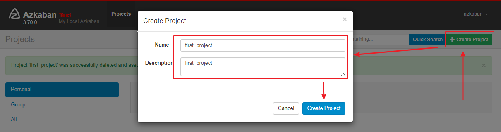

### 2.2 任务配置

新建任务配置文件 `Hello-Azkaban.job`，内容如下。这里的任务很简单，就是输出一句 `'Hello Azkaban!'` ：

```shell
#command.job
type=command
command=echo 'Hello Azkaban!'
```

### 2.3 打包上传

将 `Hello-Azkaban.job ` 打包为 `zip` 压缩文件：


通过 Web UI 界面上传：

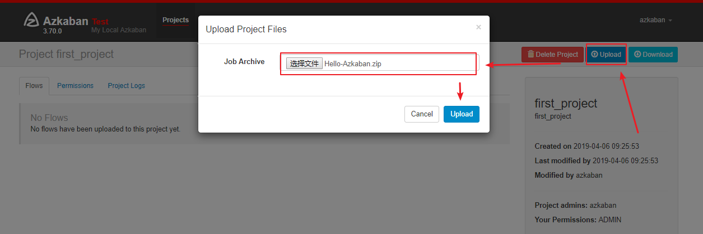

上传成功后可以看到对应的 Flows：

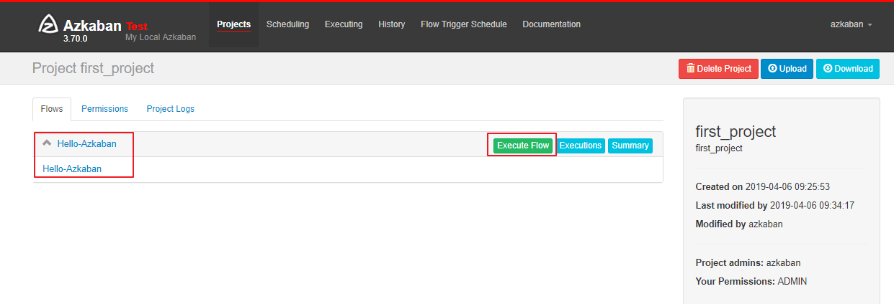

### 2.4 执行任务

点击页面上的 `Execute Flow` 执行任务：

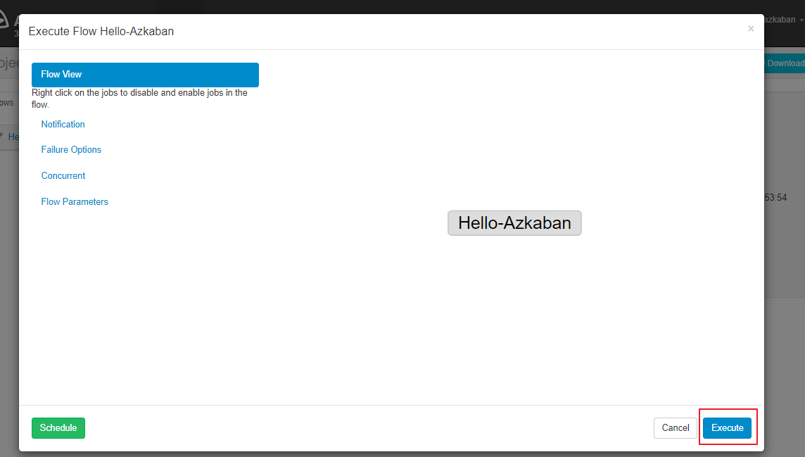

### 2.5 执行结果

点击 `detail` 可以查看到任务的执行日志：

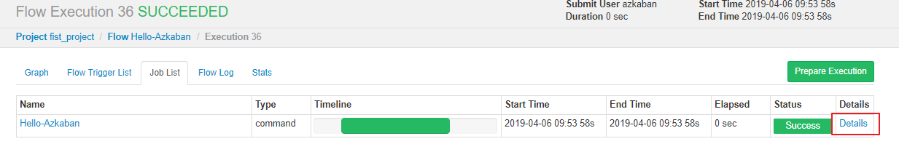


## 三、多任务调度

### 3.1 依赖配置

这里假设我们有五个任务（TaskA——TaskE）,D 任务需要在 A，B，C 任务执行完成后才能执行，而 E 任务则需要在 D 任务执行完成后才能执行，这种情况下需要使用 `dependencies` 属性定义其依赖关系。各任务配置如下：

**Task-A.job**   :

```shell
type=command
command=echo 'Task A'
```

**Task-B.job**   :

```shell
type=command
command=echo 'Task B'
```

**Task-C.job**   :

```shell
type=command
command=echo 'Task C'
```

**Task-D.job**   : 

```shell
type=command
command=echo 'Task D'
dependencies=Task-A,Task-B,Task-C
```

**Task-E.job**   :

```shell
type=command
command=echo 'Task E'
dependencies=Task-D
```

### 3.2 压缩上传

压缩后进行上传，这里需要注意的是一个 Project 只能接收一个压缩包，这里我还沿用上面的 Project，默认后面的压缩包会覆盖前面的压缩包：


### 3.3 依赖关系

多个任务存在依赖时，默认采用最后一个任务的文件名作为 Flow 的名称，其依赖关系如图：

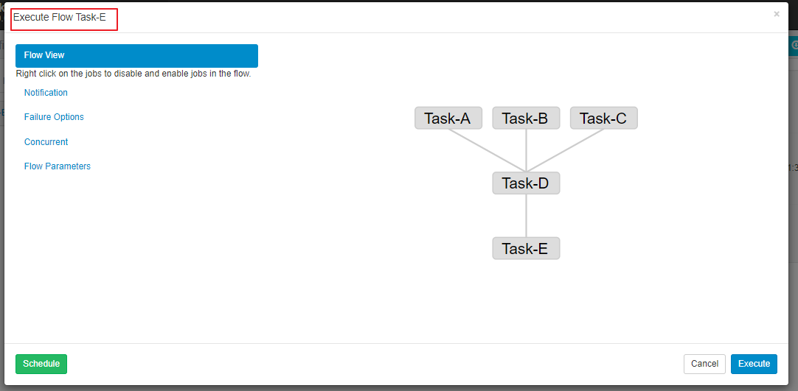

### 3.4 执行结果

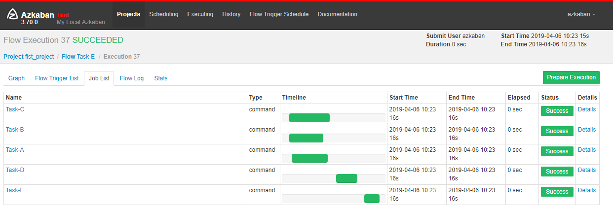

从这个案例可以看出，Flow1.0 无法通过一个 job 文件来完成多个任务的配置，但是 Flow 2.0 就很好的解决了这个问题。

## 四、调度HDFS作业

步骤与上面的步骤一致，这里以查看 HDFS 上的文件列表为例。命令建议采用完整路径，配置文件如下：

```shell
type=command
command=/usr/app/hadoop-2.6.0-cdh5.15.2/bin/hadoop fs -ls /
```

执行结果：

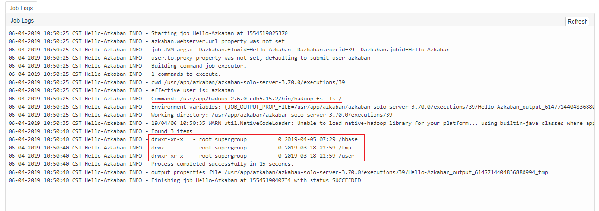

## 五、调度MR作业

MR 作业配置：

```shell
type=command
command=/usr/app/hadoop-2.6.0-cdh5.15.2/bin/hadoop jar /usr/app/hadoop-2.6.0-cdh5.15.2/share/hadoop/mapreduce/hadoop-mapreduce-examples-2.6.0-cdh5.15.2.jar pi 3 3
```

执行结果：

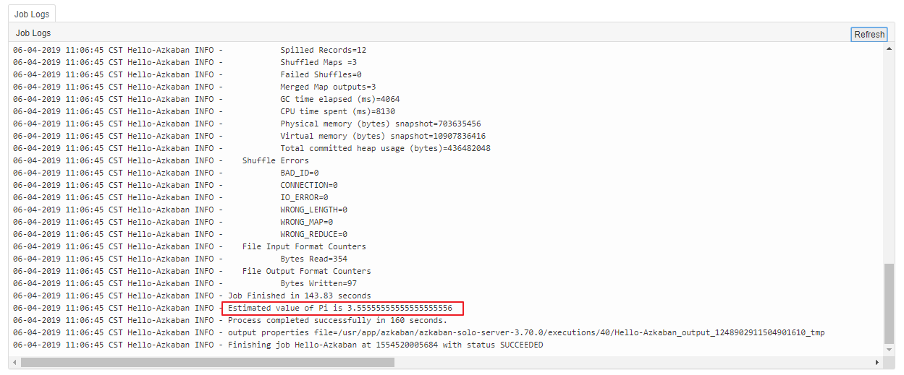

## 六、调度Hive作业

作业配置：

```shell
type=command
command=/usr/app/hive-1.1.0-cdh5.15.2/bin/hive -f 'test.sql'
```

其中 `test.sql` 内容如下，创建一张雇员表，然后查看其结构：

```sql
CREATE DATABASE IF NOT EXISTS hive;
use hive;
drop table if exists emp;
CREATE TABLE emp(
empno int,
ename string,
job string,
mgr int,
hiredate string,
sal double,
comm double,
deptno int
) ROW FORMAT DELIMITED FIELDS TERMINATED BY '\t';
-- 查看 emp 表的信息
desc emp;
```

打包的时候将 `job` 文件与 `sql` 文件一并进行打包：


执行结果如下：

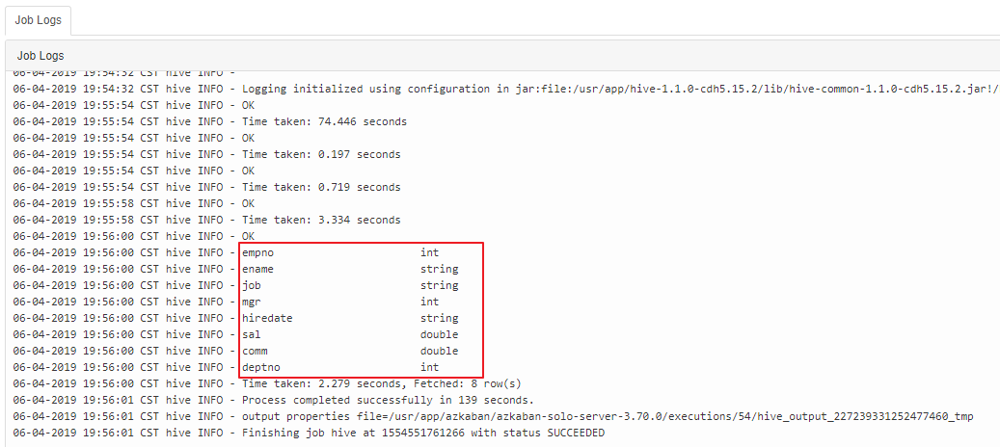

## 七、在线修改作业配置

在测试时，我们可能需要频繁修改配置，如果每次修改都要重新打包上传，这会比较麻烦。所以 Azkaban 支持配置的在线修改，点击需要修改的 Flow，就可以进入详情页面：

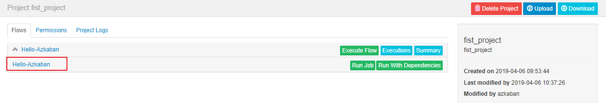

在详情页面点击 `Eidt` 按钮可以进入编辑页面：

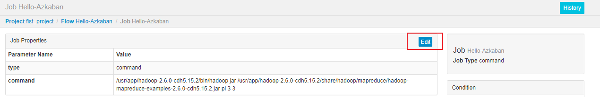

在编辑页面可以新增配置或者修改配置：

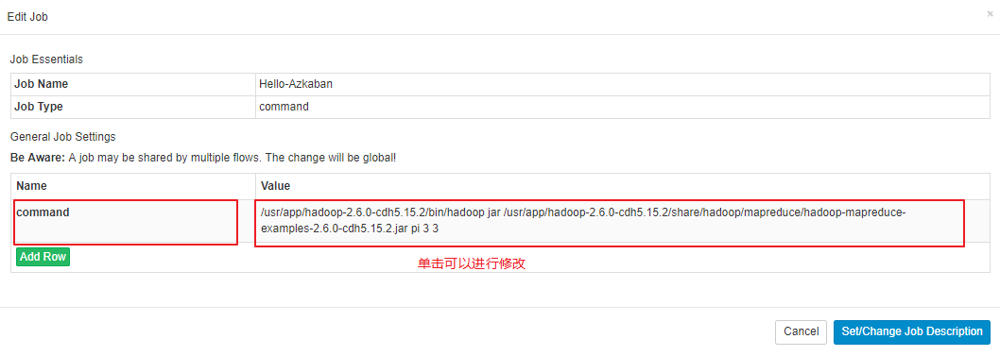

## 附：可能出现的问题

如果出现以下异常，多半是因为执行主机内存不足，Azkaban 要求执行主机的可用内存必须大于 3G 才能执行任务：

```shell
Cannot request memory (Xms 0 kb, Xmx 0 kb) from system for job
```

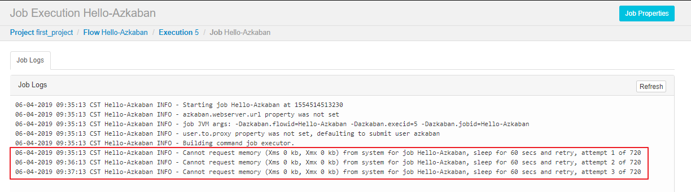

如果你的执行主机没办法增大内存，那么可以通过修改 `plugins/jobtypes/` 目录下的 `commonprivate.properties` 文件来关闭内存检查，配置如下：

```shell
memCheck.enabled=false
```


