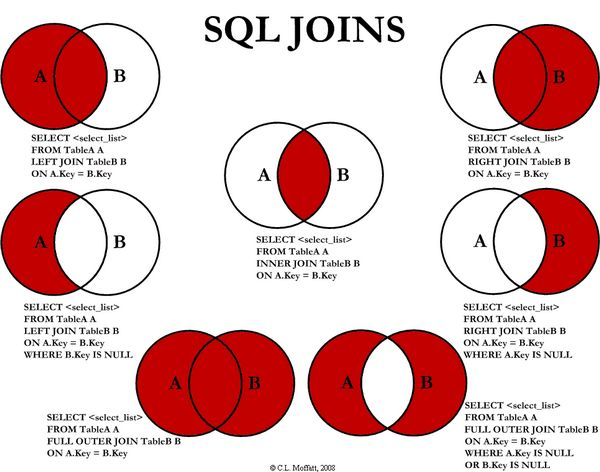
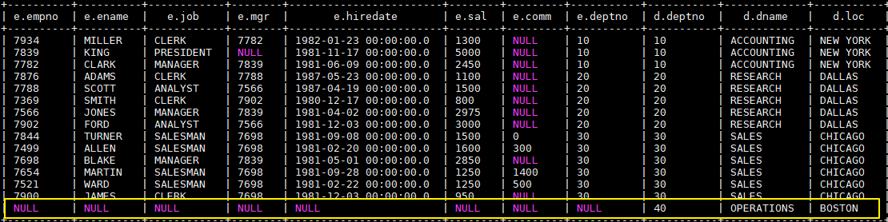

# Hive数据查询详解

<nav>
<a href="#一数据准备">一、数据准备</a><br/>
<a href="#二单表查询">二、单表查询</a><br/>
&nbsp;&nbsp;&nbsp;&nbsp;&nbsp;&nbsp;&nbsp;&nbsp;<a href="#21-SELECT">2.1 SELECT</a><br/>
&nbsp;&nbsp;&nbsp;&nbsp;&nbsp;&nbsp;&nbsp;&nbsp;<a href="#22-WHERE">2.2 WHERE</a><br/>
&nbsp;&nbsp;&nbsp;&nbsp;&nbsp;&nbsp;&nbsp;&nbsp;<a href="#23--DISTINCT">2.3  DISTINCT</a><br/>
&nbsp;&nbsp;&nbsp;&nbsp;&nbsp;&nbsp;&nbsp;&nbsp;<a href="#24-分区查询">2.4 分区查询</a><br/>
&nbsp;&nbsp;&nbsp;&nbsp;&nbsp;&nbsp;&nbsp;&nbsp;<a href="#25-LIMIT">2.5 LIMIT</a><br/>
&nbsp;&nbsp;&nbsp;&nbsp;&nbsp;&nbsp;&nbsp;&nbsp;<a href="#26-GROUP-BY">2.6 GROUP BY</a><br/>
&nbsp;&nbsp;&nbsp;&nbsp;&nbsp;&nbsp;&nbsp;&nbsp;<a href="#27-ORDER-AND-SORT">2.7 ORDER AND SORT</a><br/>
&nbsp;&nbsp;&nbsp;&nbsp;&nbsp;&nbsp;&nbsp;&nbsp;<a href="#28-HAVING">2.8 HAVING</a><br/>
&nbsp;&nbsp;&nbsp;&nbsp;&nbsp;&nbsp;&nbsp;&nbsp;<a href="#29-DISTRIBUTE-BY">2.9 DISTRIBUTE BY</a><br/>
&nbsp;&nbsp;&nbsp;&nbsp;&nbsp;&nbsp;&nbsp;&nbsp;<a href="#210-CLUSTER-BY">2.10 CLUSTER BY</a><br/>
<a href="#三多表联结查询">三、多表联结查询</a><br/>
&nbsp;&nbsp;&nbsp;&nbsp;&nbsp;&nbsp;&nbsp;&nbsp;<a href="#31-INNER-JOIN">3.1 INNER JOIN</a><br/>
&nbsp;&nbsp;&nbsp;&nbsp;&nbsp;&nbsp;&nbsp;&nbsp;<a href="#32-LEFT-OUTER--JOIN">3.2 LEFT OUTER  JOIN </a><br/>
&nbsp;&nbsp;&nbsp;&nbsp;&nbsp;&nbsp;&nbsp;&nbsp;<a href="#33-RIGHT-OUTER--JOIN">3.3 RIGHT OUTER  JOIN</a><br/>
&nbsp;&nbsp;&nbsp;&nbsp;&nbsp;&nbsp;&nbsp;&nbsp;<a href="#34-FULL-OUTER--JOIN">3.4 FULL OUTER  JOIN </a><br/>
&nbsp;&nbsp;&nbsp;&nbsp;&nbsp;&nbsp;&nbsp;&nbsp;<a href="#35-LEFT-SEMI-JOIN">3.5 LEFT SEMI JOIN</a><br/>
&nbsp;&nbsp;&nbsp;&nbsp;&nbsp;&nbsp;&nbsp;&nbsp;<a href="#36-JOIN">3.6 JOIN</a><br/>
<a href="#四JOIN优化">四、JOIN优化</a><br/>
&nbsp;&nbsp;&nbsp;&nbsp;&nbsp;&nbsp;&nbsp;&nbsp;<a href="#41-STREAMTABLE">4.1 STREAMTABLE</a><br/>
&nbsp;&nbsp;&nbsp;&nbsp;&nbsp;&nbsp;&nbsp;&nbsp;<a href="#42-MAPJOIN">4.2 MAPJOIN</a><br/>
<a href="#五SELECT的其他用途">五、SELECT的其他用途</a><br/>
<a href="#六本地模式">六、本地模式</a><br/>
</nav>


## 一、数据准备

为了演示查询操作，这里需要预先创建三张表，并加载测试数据。

> 数据文件 emp.txt 和 dept.txt 可以从本仓库的[resources](https://github.com/heibaiying/BigData-Notes/tree/master/resources) 目录下载。

### 1.1 员工表

```sql
 -- 建表语句
 CREATE TABLE emp(
     empno INT,     -- 员工表编号
     ename STRING,  -- 员工姓名
     job STRING,    -- 职位类型
     mgr INT,   
     hiredate TIMESTAMP,  --雇佣日期
     sal DECIMAL(7,2),  --工资
     comm DECIMAL(7,2),
     deptno INT)   --部门编号
    ROW FORMAT DELIMITED FIELDS TERMINATED BY "\t";

  --加载数据
LOAD DATA LOCAL INPATH "/usr/file/emp.txt" OVERWRITE INTO TABLE emp;
```

### 1.2 部门表

```sql
 -- 建表语句
 CREATE TABLE dept(
     deptno INT,   --部门编号
     dname STRING,  --部门名称
     loc STRING    --部门所在的城市
 )
 ROW FORMAT DELIMITED FIELDS TERMINATED BY "\t";
 
 --加载数据
 LOAD DATA LOCAL INPATH "/usr/file/dept.txt" OVERWRITE INTO TABLE dept;
```

### 1.3 分区表

这里需要额外创建一张分区表，主要是为了演示分区查询：

```sql
CREATE EXTERNAL TABLE emp_ptn(
      empno INT,
      ename STRING,
      job STRING,
      mgr INT,
      hiredate TIMESTAMP,
      sal DECIMAL(7,2),
      comm DECIMAL(7,2)
  )
 PARTITIONED BY (deptno INT)   -- 按照部门编号进行分区
 ROW FORMAT DELIMITED FIELDS TERMINATED BY "\t";


--加载数据
LOAD DATA LOCAL INPATH "/usr/file/emp.txt" OVERWRITE INTO TABLE emp_ptn PARTITION (deptno=20)
LOAD DATA LOCAL INPATH "/usr/file/emp.txt" OVERWRITE INTO TABLE emp_ptn PARTITION (deptno=30)
LOAD DATA LOCAL INPATH "/usr/file/emp.txt" OVERWRITE INTO TABLE emp_ptn PARTITION (deptno=40)
LOAD DATA LOCAL INPATH "/usr/file/emp.txt" OVERWRITE INTO TABLE emp_ptn PARTITION (deptno=50)
```


## 二、单表查询

### 2.1 SELECT

```sql
-- 查询表中全部数据
SELECT * FROM emp;
```


### 2.2 WHERE

```sql
-- 查询 10 号部门中员工编号大于 7782 的员工信息 
SELECT * FROM emp WHERE empno > 7782 AND deptno = 10;
```


### 2.3  DISTINCT

Hive 支持使用 DISTINCT 关键字去重。

```sql
-- 查询所有工作类型
SELECT DISTINCT job FROM emp;
```


### 2.4 分区查询

分区查询 (Partition Based Queries)，可以指定某个分区或者分区范围。

```sql
-- 查询分区表中部门编号在[20,40]之间的员工
SELECT emp_ptn.* FROM emp_ptn
WHERE emp_ptn.deptno >= 20 AND emp_ptn.deptno <= 40;
```


### 2.5 LIMIT

```sql
-- 查询薪资最高的 5 名员工
SELECT * FROM emp ORDER BY sal DESC LIMIT 5;
```


### 2.6 GROUP BY

Hive 支持使用 GROUP BY 进行分组聚合操作。

```sql
set hive.map.aggr=true;

-- 查询各个部门薪酬综合
SELECT deptno,SUM(sal) FROM emp GROUP BY deptno;
```

`hive.map.aggr` 控制程序如何进行聚合。默认值为 false。如果设置为 true，Hive 会在 map 阶段就执行一次聚合。这可以提高聚合效率，但需要消耗更多内存。


### 2.7 ORDER AND SORT

可以使用 ORDER BY 或者 Sort BY 对查询结果进行排序，排序字段可以是整型也可以是字符串：如果是整型，则按照大小排序；如果是字符串，则按照字典序排序。ORDER BY 和 SORT BY 的区别如下：

+ 使用 ORDER BY 时会有一个 Reducer 对全部查询结果进行排序，可以保证数据的全局有序性；
+ 使用 SORT BY 时只会在每个 Reducer 中进行排序，这可以保证每个 Reducer 的输出数据是有序的，但不能保证全局有序。

由于 ORDER BY 的时间可能很长，如果你设置了严格模式 (hive.mapred.mode = strict)，则其后面必须再跟一个 `limit` 子句。

> 注 ：hive.mapred.mode 默认值是 nonstrict ，也就是非严格模式。

```sql
-- 查询员工工资，结果按照部门升序，按照工资降序排列
SELECT empno, deptno, sal FROM emp ORDER BY deptno ASC, sal DESC;
```


### 2.8 HAVING

可以使用 HAVING 对分组数据进行过滤。

```sql
-- 查询工资总和大于 9000 的所有部门
SELECT deptno,SUM(sal) FROM emp GROUP BY deptno HAVING SUM(sal)>9000;
```


### 2.9 DISTRIBUTE BY

默认情况下，MapReduce 程序会对 Map 输出结果的 Key 值进行散列，并均匀分发到所有 Reducer 上。如果想要把具有相同 Key 值的数据分发到同一个 Reducer 进行处理，这就需要使用 DISTRIBUTE BY 字句。

需要注意的是，DISTRIBUTE BY 虽然能保证具有相同 Key 值的数据分发到同一个 Reducer，但是不能保证数据在 Reducer 上是有序的。情况如下：

把以下 5 个数据发送到两个 Reducer 上进行处理：

```properties
k1
k2
k4
k3
k1
```

Reducer1 得到如下乱序数据：

```properties
k1
k2
k1
```


Reducer2 得到数据如下：

```properties
k4
k3
```

如果想让 Reducer 上的数据时有序的，可以结合 `SORT BY` 使用 (示例如下)，或者使用下面我们将要介绍的 CLUSTER BY。

```sql
-- 将数据按照部门分发到对应的 Reducer 上处理
SELECT empno, deptno, sal FROM emp DISTRIBUTE BY deptno SORT BY deptno ASC;
```


### 2.10 CLUSTER BY

如果 `SORT BY` 和 `DISTRIBUTE BY` 指定的是相同字段，且 SORT BY 排序规则是 ASC，此时可以使用 `CLUSTER BY` 进行替换，同时 `CLUSTER BY` 可以保证数据在全局是有序的。

```sql
SELECT empno, deptno, sal FROM emp CLUSTER  BY deptno ;
```


## 三、多表联结查询

Hive 支持内连接，外连接，左外连接，右外连接，笛卡尔连接，这和传统数据库中的概念是一致的，可以参见下图。

需要特别强调：JOIN 语句的关联条件必须用 ON 指定，不能用 WHERE 指定，否则就会先做笛卡尔积，再过滤，这会导致你得不到预期的结果 (下面的演示会有说明)。

<div align="center">  </div>

### 3.1 INNER JOIN

```sql
-- 查询员工编号为 7369 的员工的详细信息
SELECT e.*,d.* FROM 
emp e JOIN dept d
ON e.deptno = d.deptno 
WHERE empno=7369;

--如果是三表或者更多表连接，语法如下
SELECT a.val, b.val, c.val FROM a JOIN b ON (a.key = b.key1) JOIN c ON (c.key = b.key1)
```

### 3.2 LEFT OUTER  JOIN 

LEFT OUTER  JOIN 和 LEFT  JOIN 是等价的。 

```sql
-- 左连接
SELECT e.*,d.*
FROM emp e LEFT OUTER  JOIN  dept d
ON e.deptno = d.deptno;
```

### 3.3 RIGHT OUTER  JOIN

```sql
--右连接
SELECT e.*,d.*
FROM emp e RIGHT OUTER JOIN  dept d
ON e.deptno = d.deptno;
```

执行右连接后，由于 40 号部门下没有任何员工，所以此时员工信息为 NULL。这个查询可以很好的复述上面提到的——JOIN 语句的关联条件必须用 ON 指定，不能用 WHERE 指定。你可以把 ON 改成 WHERE，你会发现无论如何都查不出 40 号部门这条数据，因为笛卡尔运算不会有 (NULL, 40) 这种情况。

<div align="center">  </div>
### 3.4 FULL OUTER  JOIN 

```sql
SELECT e.*,d.*
FROM emp e FULL OUTER JOIN  dept d
ON e.deptno = d.deptno;
```

### 3.5 LEFT SEMI JOIN

LEFT SEMI JOIN （左半连接）是 IN/EXISTS 子查询的一种更高效的实现。

+ JOIN 子句中右边的表只能在 ON 子句中设置过滤条件;
+ 查询结果只包含左边表的数据，所以只能 SELECT 左表中的列。

```sql
-- 查询在纽约办公的所有员工信息
SELECT emp.*
FROM emp LEFT SEMI JOIN dept 
ON emp.deptno = dept.deptno AND dept.loc="NEW YORK";

--上面的语句就等价于
SELECT emp.* FROM emp
WHERE emp.deptno IN (SELECT deptno FROM dept WHERE loc="NEW YORK");
```

### 3.6 JOIN

笛卡尔积连接，这个连接日常的开发中可能很少遇到，且性能消耗比较大，基于这个原因，如果在严格模式下 (hive.mapred.mode = strict)，Hive 会阻止用户执行此操作。

```sql
SELECT * FROM emp JOIN dept;
```


## 四、JOIN优化

### 4.1 STREAMTABLE

在多表进行联结的时候，如果每个 ON 字句都使用到共同的列（如下面的 `b.key`），此时 Hive 会进行优化，将多表 JOIN 在同一个 map / reduce 作业上进行。同时假定查询的最后一个表（如下面的 c 表）是最大的一个表，在对每行记录进行 JOIN 操作时，它将尝试将其他的表缓存起来，然后扫描最后那个表进行计算。因此用户需要保证查询的表的大小从左到右是依次增加的。

```sql
`SELECT a.val, b.val, c.val FROM a JOIN b ON (a.key = b.key) JOIN c ON (c.key = b.key)`
```

然后，用户并非需要总是把最大的表放在查询语句的最后面，Hive 提供了 `/*+ STREAMTABLE() */` 标志，用于标识最大的表，示例如下：

```sql
SELECT /*+ STREAMTABLE(d) */  e.*,d.* 
FROM emp e JOIN dept d
ON e.deptno = d.deptno
WHERE job='CLERK';
```


### 4.2 MAPJOIN

如果所有表中只有一张表是小表，那么 Hive 把这张小表加载到内存中。这时候程序会在 map 阶段直接拿另外一个表的数据和内存中表数据做匹配，由于在 map 就进行了 JOIN 操作，从而可以省略 reduce 过程，这样效率可以提升很多。Hive 中提供了 `/*+ MAPJOIN() */` 来标记小表，示例如下：

```sql
SELECT /*+ MAPJOIN(d) */ e.*,d.* 
FROM emp e JOIN dept d
ON e.deptno = d.deptno
WHERE job='CLERK';
```


## 五、SELECT的其他用途

查看当前数据库：

```sql
SELECT current_database()
```


## 六、本地模式

在上面演示的语句中，大多数都会触发 MapReduce, 少部分不会触发，比如 `select * from emp limit 5` 就不会触发 MR，此时 Hive 只是简单的读取数据文件中的内容，然后格式化后进行输出。在需要执行 MapReduce 的查询中，你会发现执行时间可能会很长，这时候你可以选择开启本地模式。

```sql
--本地模式默认关闭，需要手动开启此功能
SET hive.exec.mode.local.auto=true;
```

启用后，Hive 将分析查询中每个 map-reduce 作业的大小，如果满足以下条件，则可以在本地运行它：

- 作业的总输入大小低于：hive.exec.mode.local.auto.inputbytes.max（默认为 128MB）；
- map-tasks 的总数小于：hive.exec.mode.local.auto.tasks.max（默认为 4）；
- 所需的 reduce 任务总数为 1 或 0。

因为我们测试的数据集很小，所以你再次去执行上面涉及 MR 操作的查询，你会发现速度会有显著的提升。


## 参考资料

1. [LanguageManual Select](https://cwiki.apache.org/confluence/display/Hive/LanguageManual+Select)
2. [LanguageManual Joins](https://cwiki.apache.org/confluence/display/Hive/LanguageManual+Joins)
3. [LanguageManual GroupBy](https://cwiki.apache.org/confluence/display/Hive/LanguageManual+GroupBy)
4. [LanguageManual SortBy](https://cwiki.apache.org/confluence/display/Hive/LanguageManual+SortBy)